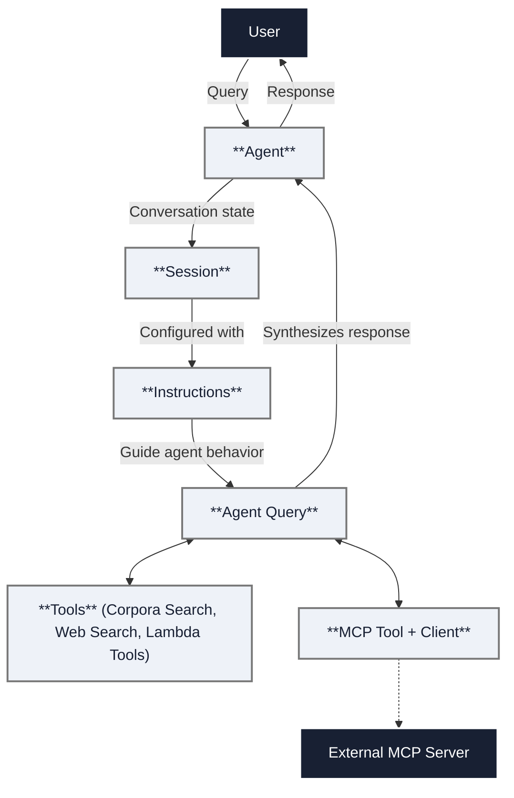

import CodePanel from '@site/src/theme/CodePanel';

Agents are autonomous systems that understand natural language and use tools 
and reasoning to accomplish tasks.

1. [**Create an agent**](/docs/rest-api/create-agent): Define the agent's name, description, and available 
   tools.
2. [**Write instructions**](/docs/rest-api/create-instruction): Create templates that guide the agent's behavior.
3. [**Configure tools**](/docs/rest-api/list-tools): Set up corpus access permissions and any external 
   integrations.
4. [**Test agents with sessions**](/docs/rest-api/create-agent-session): Start conversations and iterate on your 
   configuration.

:::tip Quick Start
To build your first agent, see the [**Agent quick start**](/docs/agents/agents-quickstart). 
Or, check out our [**Agents APIs**](/docs/rest-api/agents).
:::

## Concepts

The core concept to understand about agents is that their behavior is defined 
by instructions. The agent uses these instructions alongside information from 
a conversation session to determine how to respond to user input, including 
which tools to use.

These are the other core concepts when it comes to agents:

* **Tools:** Tools provide agents with capabilities to interact with data and 
  external systems.
* **Sessions:** Sessions preserve context throughout a conversation so the agent 
  can consider prior information when responding to a query.

## Example: Research assistant agent with web search

Here's how to create a research assistant agent that can search the web for
current information. This agent completes the following tasks:
- Search the web when users ask questions requiring current information
- Limit search results to 20 for comprehensive responses
- Use a lower temperature (0.3) for more consistent, factual responses
- Follow instructions to cite sources and admit uncertainty when appropriate
- Configure retry logic to handle transient API failures gracefully

This example requires no corpus setup, making it perfect for immediate testing.

<CodePanel
  title="Create a research assistant agent"
  snippets={[
    {
      language: 'bash',
      code: `curl -X POST https://api.vectara.io/v2/agents \\
  -H "Authorization: Bearer YOUR_API_KEY" \\
  -H "Content-Type: application/json" \\
  -d '{
    "name": "research-assistant",
    "description": "A research assistant that can search the web for current information",
    "tool_configurations": {
      "web_search": {
        "type": "web_search"
      }
    },
    "first_step": {
      "type": "conversational",
      "instructions": [{
        "type": "inline",
        "name": "Research Assistant",
        "template": "You are a helpful research assistant. When users ask questions, search the web for current and accurate information. ALWAYS CITE YOUR SOURCES. BE HONEST IF YOU CANNOT FIND RELIABLE INFORMATION."
      }],
      "output_parser": {
        "type": "default"
      }
    },
    "model": {
      "name": "gpt-5",
      "parameters": {
        "temperature": 0.3,
        "max_tokens": 1000
      },
      "retry_configuration": {
        "enabled": true,
        "max_retries": 3,
        "initial_backoff_ms": 1000,
        "max_backoff_ms": 30000,
        "backoff_factor": 2.0
      }
    }
  }'`
    }
  ]}
  annotations={{
    bash: [
      { line: 1, text: 'POST request to create a new agent' },
      { line: 2, text: 'Authorization header with your API key' },
      { line: 3, text: 'Content type for JSON payload' },
      { line: 5, text: 'Unique identifier name for the agent' },
      { line: 6, text: 'Human-readable description of agent purpose' },
      { line: 7, text: 'Tool configurations defining available capabilities' },
      { line: 8, text: 'Web search tool for real-time information' },
      { line: 9, text: 'Tool type identifier for web search' },
      { line: 12, text: 'First step configuration for agent entry point' },
      { line: 13, text: 'Conversational type for interactive chat behavior' },
      { line: 14, text: 'Instructions array defining agent behavior' },
      { line: 15, text: 'Inline instruction type for embedded prompts' },
      { line: 16, text: 'Name identifier for this instruction set' },
      { line: 17, text: 'Template defining agent personality and guidelines' },
      { line: 23, text: 'Model configuration for LLM settings' },
      { line: 24, text: 'Specify gpt-5 as the reasoning model' },
      { line: 26, text: 'Temperature 0.3 for consistent, factual responses' },
      { line: 27, text: 'Maximum token limit for responses' },
      { line: 29, text: 'Retry configuration for handling transient failures' },
      { line: 30, text: 'Enable automatic retry logic' },
      { line: 31, text: 'Maximum of 3 retry attempts on failure' },
      { line: 32, text: 'Initial 1 second delay before first retry' },
      { line: 33, text: 'Maximum 30 second delay between retries' },
      { line: 34, text: 'Exponential backoff factor of 2.0 between retries' }
    ]
  }}
  layout="stacked"
/>

To chat with your agent, read on about [Sessions](/docs/agents/sessions).

## Model Context Protocol (MCP)

The Model Context Protocol (MCP) is an emerging and rapidly changing standard 
for communication between agents and tools. Introduced by Anthropic and now 
adopted across multiple agentic ecosystems, MCP defines a structured way for 
agents to invoke external tools, pass contextual input, and receive structured 
responses. MCP acts as a universal connector between AI agents and enterprise 
services.

In the tech preview of Agents, Vectara only supports MCP as a 
client. This means Vectara agents can call MCP-enabled tools and services 
hosted on external MCP servers. 

:::note 
You can run your own MCP server to expose your tools and data within the Vectara 
platform. To help you get started, we provide an unsupported 
[open-source MCP server implementation](https://github.com/vectara/py-vectara-agentic). 
Please note that while you can connect your self-hosted MCP server to Vectara, 
you are responsible for its management and maintenance.
:::

## Why MCP is important

MCP eliminates the need for custom integrations by providing a universal 
protocol that any AI system can use to access external capabilities. 
Instead of building custom integrations for every tool or service, MCP 
creates a standardized interface that works across different LLM providers 
and enterprise systems. MCP provides the following benefits:

| Benefit | Description | 
| ------ | ------- | 
| Standardized tool access | Access tools through a common schema and interface.
| Dynamic tool discovery | Agents can discover tools available at a registered MCP server.
| Enterprise integration | Tools can represent internal APIs, RAG systems, databases, or even other agents.
| Auditability and security | Permissions and access control can be managed per tool, enabling secure orchestration.
| Model-agnostic | MCP works across agent platforms (Vectara, Claude, OpenAI SDK, Google Gemini, and so on).

