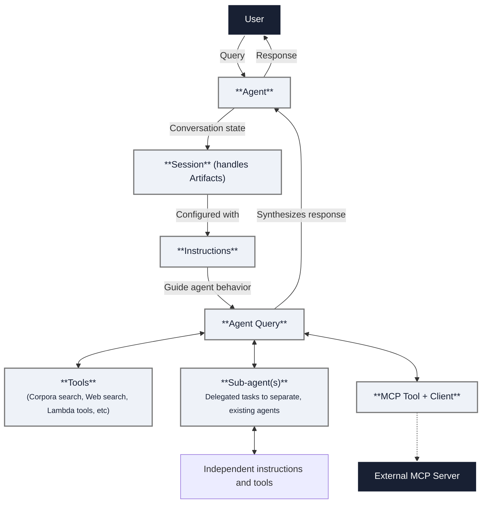

import CodePanel from '@site/src/theme/CodePanel';
import { Spacer } from "@site/src/components/ui/Spacer";

Agents are autonomous systems that understand natural language and use tools 
and reasoning to accomplish tasks. They maintain conversation context through 
sessions and can handle multi-turn interactions.

To build your first agent, see the 
[**Agent quick start**](/docs/agents/agents-quickstart). Or, check out our [**Agents APIs**](/docs/rest-api/agents).

## How agents work

<Spacer size="l" />

An agent consists of these primary components that define its behavior and
capabilities.

* **Instructions** serve as the system prompt for the agent and define its
  behavior, how to respond to user input, and which tools to use. 
* **Tools** provide agents with capabilities to interact with data and external
  systems including corpora search, web search, artifacts (uploaded files),
  and MCP servers.
* **Sub-agents** enable you to create modular agent systems. The parent agent 
  can delegate domain-specific tasks to an existing agent. This sub-agent then 
  executes its own reasoning loop and returns the result   to the parent agent.
* **Sessions** preserve context throughout a conversation so the agent can
  consider all prior information when responding to a query.
* **Artifacts:** define uploaded documents and files within a session for the 
  agent to analyze without indexing them into a permanent corpus. You can also 
  generate new documents from these artifacts and upload to a corpus for 
  future use.

To chat with your agent, read on about [Sessions](/docs/agents/sessions).

