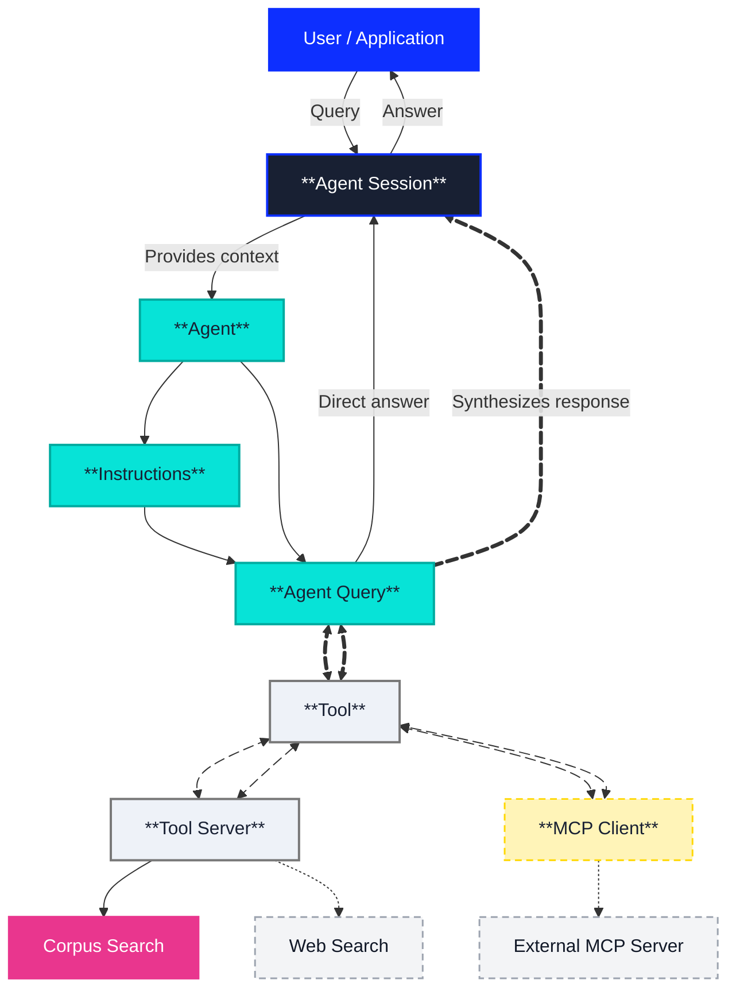

The Vectara Agentic Platform enables enterprises to build sophisticated, 
enterprise-grade intelligent, applications that go beyond basic question 
answering. Agents interpret user input, reason through context, 
leverage external tools, and maintain continuity across multi-turn 
interactions. Unlike traditional RAG systems that simply retrieve documents 
and pass them to a language model, Vectara agents provide orchestrated workflows 
capable of taking action, retrieving information, invoking APIs, or maintaining 
user sessions.

## What is the Vectara Agentic Platform?

The Agentic Platform is a comprehensive framework for building AI-powered 
applications that can:

- **Understand Context**: Maintain conversation history across multiple interactions.
- **Use Tools**: Access and manipulate data through a variety of tools including corpus search and web search.
- **Follow Instructions**: Execute complex workflows based on customizable instructions and templates.
- **Stream Responses**: Provide real-time updates as agents process requests.

## **What agents can accomplish**

| **Desired Outcome** | **Workflow** |
|---|---|
| **Automate customer support workflows** | Agent handles L1 support, searches knowledge bases, escalates complex issues, creates tickets |
| **Build intelligent research assistants** | Agent searches multiple data sources, synthesizes findings, maintains research context across sessions |
| **Create workflow automation systems** | Agent triggers business processes, sends notifications, updates CRM systems based on natural language requests |
| **Develop conversational enterprise tools** | Agent maintains context, handles multi-step processes, integrates with existing business systems |
| **Deploy autonomous business processes** | Agent monitors conditions, makes decisions, executes actions without human intervention |

## How Vectara agents work

Agents do not access corpora directly. Instead, all corpus access occurs with 
**tools**. Each tool is configured with explicit permissions to one or more 
corpora. When creating or configuring an agent, you select which tools the 
agent can use. This ensures:

* Clear separation between orchestration logic (agents) and data access 
  (tools/corpora).
* Audible permissions for every retrieval or external action
* Reusable tools that can serve multiple agents

## Vectara agentic components

The Vectara Agentic Platform is built around the following core concepts:

### Agents

Agents act as the orchestration layer of the platform:
- Coordinate between different tools and data sources.
- Maintain conversation context through sessions.
- Follow customizable instructions to guide behavior.
- Support streaming responses for real-time interaction.

### Tools

Tools provide agents with capabilities to interact with data and external systems:
- **Corpus Search Tool**: Query your Vectara corpora with semantic search.
- **Web Search Tool**: Access current information from the internet.
- **MCP Tools**: Integrate with external services through the Model Context Protocol (MCP).

### Sessions

Sessions maintain the state of conversations:
- Track all interactions (also known as events) within a conversation.
- Preserve context across multiple turns.
- Enable multi-turn reasoning and follow-up questions.

### Instructions

Instructions guide agent behavior using Velocity templates:
- Define the agent's persona and objectives.
- Customize responses based on context.
- Support dynamic variable substitution.

## Getting Started

To build your first agent:

1. [**Create an agent**](/docs/console-ui/agents/create-an-agent): Define the agent's name, description, and available tools.
2. **Configure Tools**: Set up corpus access permissions and any external integrations.
3. **Write Instructions**: Create templates that guide the agent's behavior.
4. **Test with Sessions**: Start conversations and iterate on your configuration.

## Platform Benefits

- **Rapid Development**: Build sophisticated AI applications without managing infrastructure
- **Enterprise Security**: Role-based access control and audit trails
- **Scalability**: Handle thousands of concurrent conversations
- **Flexibility**: Customize every aspect of agent behavior
- **Integration Ready**: Connect with existing systems through APIs and connectors
