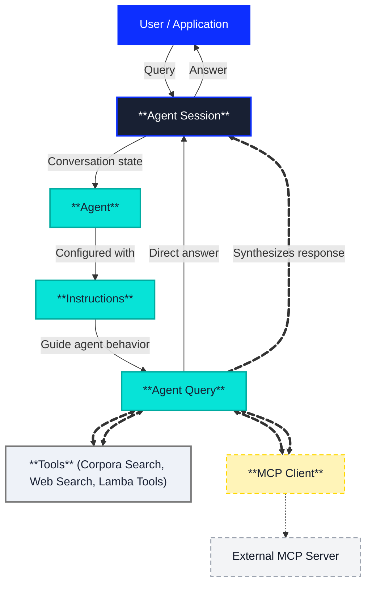

[AI agents](/docs/learn/ai-agents) are autonomous systems or programs that understand natural language 
and use tools to accomplish tasks. Vectara Agents enable enterprises to build 
production-ready intelligent applications. Agents interpret user input, reason 
through context, leverage tools, and maintain continuity across multi-turn 
interactions.

Vectara agents follow a structured flow where **instructions** define the
behavior for agents to follow. Instructions are the most important component 
to configure. The agent combines these instructions with conversation state 
from sessions to determine how to respond and which tools to use. 

---

- **Instructions guide agent behavior**: Instructions define the agent's persona,
  objectives, and how it should respond. In other systems, instructions are often 
  called a system prompt.
- **Sessions provide context**: When you create a session, you can attach
  metadata (like user preferences, permissions, or identifiers). This
  metadata is available throughout the conversation.
- **Templates enable dynamic behavior**: Instructions use Velocity templates
  to access session metadata.  
  For example, `${session.metadata.user_role}`
  lets you customize instructions based on who is talking to the agent.
- **Tools use dynamic references**: Tools can use `argument_override` to
  dynamically reference session metadata. This allows tools to filter data or
  customize behavior based on the current user or context, giving the agent a 
  restricted tool fit for purpose.

Each tool provides a specific capability, such as searching a specific
corpus, accessing a web page, or running custom logic. When configuring an
agent, you select which tools it can use. This ensures a clear separation 
between orchestration logic (the agent) and the capabilities provided by 
tools, auditable permissions for every data retrieval or external action, 
and reusable tools that can serve multiple agents.

## Agents

Agents act as the orchestration layer of the platform. They coordinate
between different tools and data sources, maintain conversation context
through sessions, follow customizable instructions to guide behavior, and
support streaming responses for real-time interaction.

Both agents and sessions use unique keys for identification:

  - **Agent keys**: You can specify a custom key like
    `customer_support` or let Vectara generate one automatically (`agt_*`). Custom
    keys make it easier to reference agents consistently across environments
    and in your code.
  - **Session keys** (pattern: custom or auto-generated): Custom session keys
    are useful when you need to resume conversations, reference specific
    sessions, or integrate with existing session management.

[**Learn more about Agents →**](/docs/agents/agents)

## Instructions

Instructions guide agent behavior using Velocity templates. They define the
agent's persona and objectives, customize responses based on context, and
support dynamic variable substitution from session metadata.

Instructions are the most important component to configure. Start here when
building your agent.

[**Learn more about Instructions →**](/docs/agents/instructions)

## Tools

Tools provide agents with capabilities to interact with data and external
systems. Vectara provides the following built-in tools:

- **Corpus Search**: Search and retrieve information from your Vectara
  corpora using semantic search. This is the primary tool for RAG-powered
  agents that need to answer questions based on your private data.
- **Web Search**: Access current information from the public internet. Use
  this tool when agents need real-time data or information beyond your
  corpora.
- **Lambda Tools**: Create custom Python functions that run in a secure
  sandbox. Use these for calculations, data transformations, or business
  logic.
- **MCP Tools**: Integrate with external services through the Model Context
  Protocol (MCP). Connect to APIs, databases, and third-party systems to
  extend agent capabilities.

[**Learn more about Tools →**](/docs/agents/tools)

## Sessions

Sessions maintain the state of conversations. They track all interactions
(also known as events) within a conversation, preserve context across
multiple turns, and enable multi-turn reasoning and follow-up questions.

Sessions also support metadata for personalization, access control, and
dynamic behavior throughout the conversation.

[**Learn more about Sessions →**](/docs/agents/sessions)

## Getting Started

To build your first agent:

1. [**Create an agent**](/docs/console-ui/agents/create-an-agent): Define the agent's name, description, and available tools.
2. [**Configure tools**](/docs/console-ui/agents/create-an-agent#tools): Set up corpus access permissions and any external integrations.
3. [**Write instructions**](/docs/console-ui/agents/create-an-agent#instructions): Create templates that guide the agent's behavior.
4. [**Test agents with sessions**](/docs/console-ui/agents/use-agents): Start conversations and iterate on your configuration.
