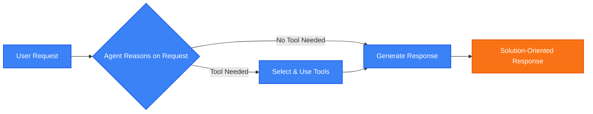
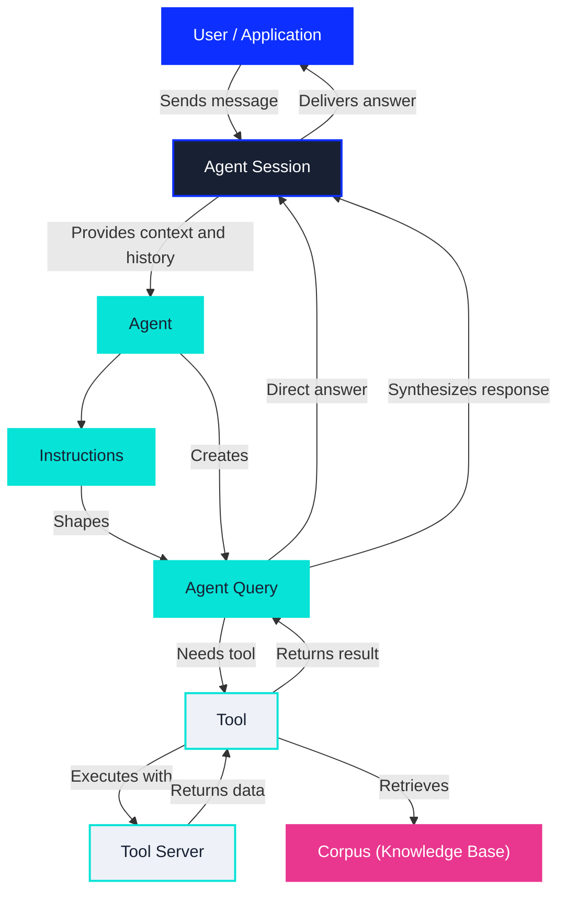
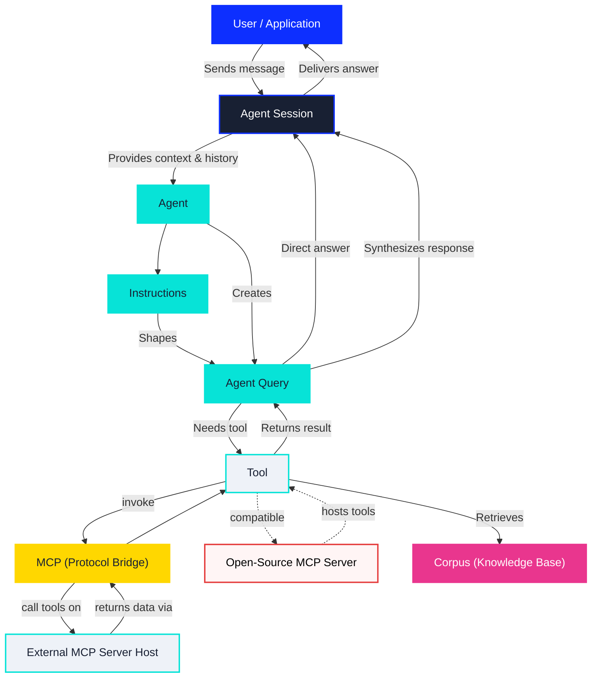
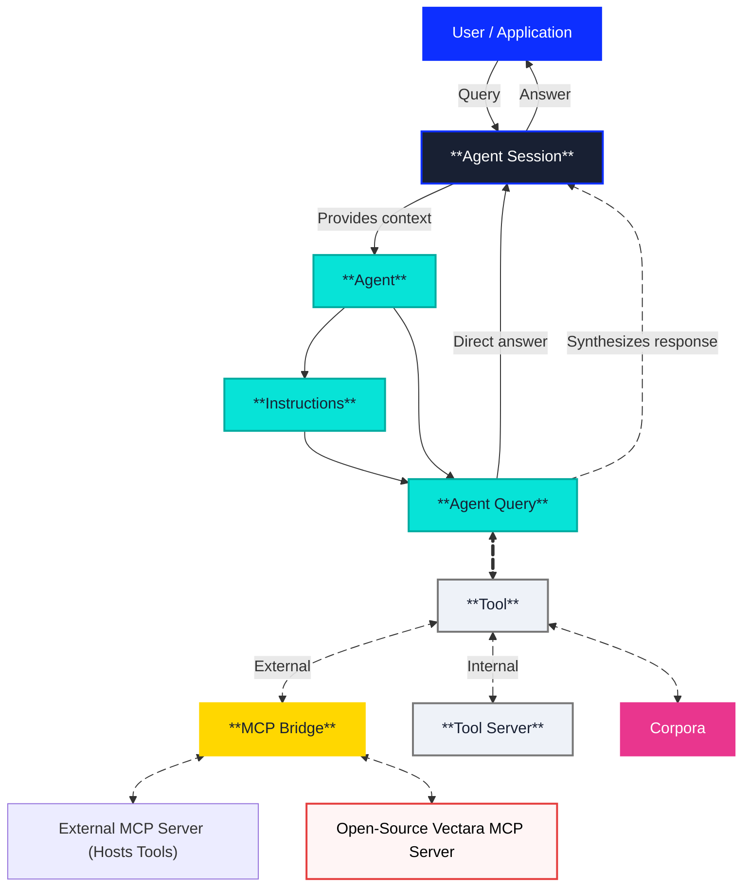

The Vectara Agentic Platform enables enterprises to build intelligent, agentic 
applications that go beyond basic question answering. Configurable, 
decision-making entities called **agents** power these applications. Agents 
interpret user input, reason through context, leverage external tools, and 
maintain continuity across multi-turn interactions.

Unlike traditional RAG systems that simply retrieve documents and pass them to
a language model, Vectara agents provide orchestrated workflows capable of 
taking action, retrieving information, invoking APIs, or maintaining user 
sessions.

## **What agents can accomplish**

| **Desired Outcome** | **Workflow** |
|---|---|
| **Automate customer support workflows** | Agent handles L1 support, searches knowledge bases, escalates complex issues, creates tickets |
| **Build intelligent research assistants** | Agent searches multiple data sources, synthesizes findings, maintains research context across sessions |
| **Create workflow automation systems** | Agent triggers business processes, sends notifications, updates CRM systems based on natural language requests |
| **Develop conversational enterprise tools** | Agent maintains context, handles multi-step processes, integrates with existing business systems |
| **Deploy autonomous business processes** | Agent monitors conditions, makes decisions, executes actions without human intervention |

## How Vectara agents work

Agents do not access corpora directly. Instead, all corpus access occurs with 
**tools**. Each tool is configured with explicit permissions to one or more 
corpora. When creating or configuring an agent, you select which tools the 
agent can use. These tools determine the scope of knowledge and retrieval 
operations available to the agent. This enforces a clear, auditable separation 
between orchestration logic (agents) and data access (tools/corpora).

The Agentic Platform lets you build applications that do the following: 

* **Respond adaptively to complex user input:** Agents understand the nuances of 
  human language and respond in a way that is relevant and helpful.
* **Call tools for external actions:** Agents interact with other systems and 
  services, such as sending emails, creating support tickets, or triggering workflows.
* **Retrieve relevant data from corpora or APIs:** Agents access and process 
  information from a variety of sources to enrich their responses.
* **Maintain session memory for statefful, multi-step conversations:** Agents remember 
  the context of a conversation to provide more personalized and relevant 
  responses over time.

Agents are not limited to reactive question-answering. They are proactive, 
configurable digital workers, capable of executing multi-turn tasks and 
integrating with enterprise systems.

## Core Components

---

---

The Vectara Agentic Platform is built around the following core concepts:

* **Agents:** An agent is the core orchestration unit in our agentic platform. Agents 
  decide how to respond to user input, when to invoke tools, and how to manage 
  new information and conversation state.
* **Tools:** Tools are external or internal capabilities that agents can invoke dynamically. 
  Tools perform actions such as retrieving information from a corpus, sending an 
  email, or creating a support ticket.
* **Instructions:** Instructions are reusable blocks of system prompt logic. They guide the 
  agent’s reasoning in each step by setting expectations, tone, or rules for the LLM.
* **Corpora:** Corpora provide the knowledge data that can be retrieved 
  and injected into the generative response process.
* **Agent Sessions:** A session is a contextual container for a conversation between a user 
  (or application) and an agent. It provides continuity across multiple interactions.
* **Agent Queries:** Each session contains one or more queries, representing individual 
  user-agent exchanges.

Agents shift the design from reactive Q&A systems to proactive, configurable 
digital workers. Agents enable developers to deliver outcomes across use cases 
like support automation, research assistants, internal tools, and customer 
service.

## Machine Capability Protocol (MCP) Compatibility

Vectara's Agentic Platform is designed to be compatible with the 
Machine Capability Protocol (MCP), a rapidly evolving standard for 
agent-to-agent communication. This ensures that agents built on the Vectara 
platform can, in the future, interoperate with other MCP-compatible agents and 
tools.

MCP compatibility is primarily internal and future releases will enable you 
to invoke external MCP tools and services.

### Security and Access Control

The Vectara implementation of MCP includes robust security and access control 
mechanisms. All tool calls, whether internal or external, are subject to the 
same permission model. This ensures that agents can only access the resources 
and perform the actions that they have been explicitly granted permission to 
use. This provides a secure and auditable way to manage agent capabilities.
