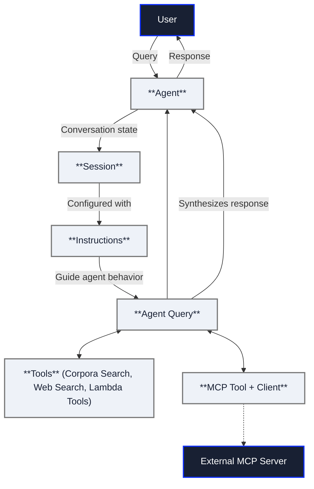

Agents are autonomous systems that understand natural language and use tools 
and reasoning to accomplish tasks. 

## Getting Started

To build your first agent:

1. [**Create an agent**](/docs/console-ui/agents/create-an-agent): Define the agent's name, description, and available tools.
2. [**Write instructions**](/docs/console-ui/agents/create-an-agent#instructions): Create templates that guide the agent's behavior.
3. [**Configure tools**](/docs/console-ui/agents/create-an-agent#tools): Set up corpus access permissions and any external integrations.
4. [**Test agents with sessions**](/docs/console-ui/agents/use-agents): Start conversations and iterate on your configuration.

## Concepts

The core concept to understand about agents is that their behavior is defined 
by instructions. The agent uses these instructions alongside information from 
a conversation session to determine how to respond to user input, including 
which tools to use.

These are the other core concepts when it comes to agents:

* **Tools:** Tools provide agents with capabilities to interact with data and 
  external systems.
* **Sessions:** Sessions preserve context throughout a conversation so the agent 
  can consider prior information when responding to a query.

