import CodePanel from '@site/src/theme/CodePanel';

Vectara Agents are AI assistants that can use tools, follow instructions, and 
maintain conversation context. This guide shows you how to create and interact 
with a Vectara agent using the API. We'll walk through the workflow from agent 
creation to having a conversation. Here is some information about using agents:

- **Sessions are required**: You cannot chat with an agent directly. You must 
  create a session first.
- **Sessions maintain context**: All messages within a session share 
  conversation history.
- **One agent, many sessions**: Multiple users can have separate conversations with 
  the same agent.
- **Event-based architecture**: All interactions are tracked as events for 
  full auditability.

The agent workflow follows these steps:

1. **Create an agent** - Configure your AI assistant with tools and instructions.
2. **Create a session** - Start a conversation context for message history  .
3. **Send messages** - Chat with the agent through the session.

Let's walk through each step with working examples.

```mermaid
flowchart LR
    A[👤 User] --> B{Step 1:<br/>Create Agent}
    B -->|Console UI| C[🖥️ Configure Agent]
    B -->|API| D[⚡ POST /v2/agents]
    C --> E[🤖 Agent Created]
    D --> E
    E --> F[🔗 Step 2:<br/>Create Session]
    F --> G[💬 Step 3:<br/>Chat with Agent]
    
    classDef userNode fill:#F8FAFC,stroke:#334155,stroke-width:3px,color:#1E293B
    classDef actionNode fill:#3B82F6,stroke:#1D4ED8,stroke-width:3px,color:#fff
    classDef configNode fill:#10B981,stroke:#047857,stroke-width:3px,color:#fff
    classDef resultNode fill:#F59E0B,stroke:#D97706,stroke-width:3px,color:#fff
    classDef chatNode fill:#EC4899,stroke:#BE185D,stroke-width:3px,color:#fff
    
    class A userNode
    class B,F actionNode
    class C,D configNode
    class E resultNode
    class G chatNode
```

## Step 1: Create an Agent

First, let's create a simple research assistant agent that can search the web. 
This example requires no corpus setup, so you can follow along immediately.

### Create an agent with the console UI (Recommended)

For your first agent, we recommend using the Console UI. If you need more 
detailed UI instructions, see [Create an Agent](/docs/console-ui/agents/create-an-agent).

1. Navigate to **Agents** in the sidebar.
2. Click **Add Agent** .
3. Configure each step:
   - **General**: Name: `research-assistant` and description: `A research assistant that can search the web for current information`
   - **Model**: Select `gpt-5`, and set `{"temperature":0.3}` for factual responses
   - **Instructions**: `You are a helpful research assistant. When users ask questions, search the web 
  for current and accurate information. Always cite your sources and be honest if you cannot find reliable information.`
   - **Tools**: Add Web Search tool with the argument override: `{"limit": 10}`.
   - **Advanced**: Add `{"category": "research"}`.
4. Click **Create Agent**.

### Create an agent with the API

Alternatively, create the same agent programmatically:

:::tip Curl Command Format
If you have issues with copy-pasting multi-line command, use a single-line version.
:::

<CodePanel
  title="Create a research assistant agent"
  snippets={[
    {
      language: 'bash',
      code: `curl -X POST https://api.vectara.io/v2/agents \\
  -H "Authorization: Bearer YOUR_API_KEY" \\
  -H "Content-Type: application/json" \\
  -d '{
    "name": "research-assistant",
    "description": "A research assistant that can search the web for current information",
    "tool_configurations": {
      "web_search": {
        "type": "web_search"
      }
    },
    "first_step": {
      "type": "conversational",
      "instructions": [{
        "type": "inline",
        "name": "Research Assistant",
        "template": "You are a helpful research assistant. When users ask questions, search the web for current and accurate information. Always cite your sources and be honest if you cannot find reliable information."
      }],
      "output_parser": {
        "type": "default"
      }
    },
    "model": {
      "name": "gpt-5",
      "parameters": {
        "temperature": 0.3,
        "max_tokens": 1000
      }
    }
  }'`
    }
  ]}
  annotations={{
    bash: [
      { line: 1, text: 'Use backslashes for line continuation in bash' },
      { line: 2, text: 'Replace YOUR_API_KEY with your actual API key' },
      { line: 5, text: 'Unique name for your agent' },
      { line: 6, text: 'Human-readable description' },
      { line: 8, text: 'Configure available tools' },
      { line: 9, text: 'Enable web search tool' },
      { line: 14, text: 'Define conversational behavior' },
      { line: 16, text: 'Instruction type must be "inline"' },
      { line: 17, text: 'Name is required for inline instructions' },
      { line: 18, text: 'Agent personality and guidelines' },
      { line: 24, text: 'Model configuration' },
      { line: 25, text: 'Using gpt-5 model' },
      { line: 27, text: 'Lower temperature for factual responses' },
      { line: 28, text: 'Maximum response length' }
    ]
  }}
  layout="stacked"
/>

This creates an agent with an auto-generated key like `agt_research-assistant_abc123`.

<CodePanel
  title="Response example"
  snippets={[
    {
      language: 'json',
      code: `{
  "key": "agt_research-assistant_0cec",
  "name": "research-assistant",
  "description": "A research assistant that can search the web for current information",
  "tool_configurations": {
    "web_search": {
      "type": "web_search",
      "argument_override": {}
    }
  },
  "model": {
    "name": "gpt-5",
    "parameters": {
      "temperature": 0.3,
      "max_tokens": 1000
    }
  },
  "enabled": true,
  "created_at": "2025-09-12T21:49:02.000Z"
}`
    }
  ]}
  annotations={{
    json: [
      { line: 2, text: 'Auto-generated unique agent key' },
      { line: 3, text: 'The name you provided' },
      { line: 17, text: 'Agent is enabled by default' },
      { line: 18, text: 'Timestamp of creation' }
    ]
  }}
  layout="stacked"
/>

## Step 2: Create a Session

First, create a session to maintain conversation context:

<CodePanel
  title="Create a session"
  snippets={[
    {
      language: 'bash',
      code: `POST /v2/agents/{agent_key}/sessions`
    },
    {
      language: 'json',
      code: `{
  "name": "My first conversation",
  "description": "Testing agent chat functionality"
}`
    }
  ]}
  annotations={{
    json: [
      { line: 2, text: 'Human-readable name for the session' },
      { line: 3, text: 'Optional description of the session purpose' }
    ]
  }}
  layout="stacked"
/>

This returns a session object with a `key` ( `ase_12345`) that you need in 
the next step.

## Step 3: Chat with the Agent

Send user input by creating an event in the session:

<CodePanel
  title="Chat with the agent"
  snippets={[
    {
      language: 'bash',
      code: `POST /v2/agents/{agent_key}/sessions/{session_key}/events`
    },
    {
      language: 'json',
      code: `{
  "type": "input_message",
  "messages": [
    {
      "type": "text",
      "content": "Hello, can you help me with my password reset?"
    }
  ]
}`
    }
  ]}
  annotations={{
    json: [
      { line: 2, text: 'Must be "input_message" for user input' },
      { line: 3, text: 'Array of message objects' },
      { line: 5, text: 'Currently only "text" type is supported' },
      { line: 6, text: 'The actual user message content' }
    ]
  }}
  layout="stacked"
/>

## Complete Example

Here's a complete example using curl:

<CodePanel
  title="Complete agent chat example"
  snippets={[
    {
      language: 'bash',
      code: `# 1. Create an agent (if not already created)
AGENT_KEY=$(curl -X POST https://api.vectara.io/v2/agents \\
  -H "Authorization: Bearer YOUR_API_KEY" \\
  -H "Content-Type: application/json" \\
  -d '{
    "name": "research-assistant",
    "description": "A research assistant that can search the web for current information",
    "tool_configurations": {
      "web_search": {
        "type": "web_search"
      }
    },
    "first_step": {
      "type": "conversational",
      "instructions": [{
        "type": "inline",
        "name": "Research Assistant",
        "template": "You are a helpful research assistant. When users ask questions, search the web for current and accurate information. Always cite your sources and be honest if you cannot find reliable information."
      }],
      "output_parser": {
        "type": "default"
      }
    },
    "model": {
      "name": "gpt-5",
      "parameters": {
        "temperature": 0.3,
        "max_tokens": 1000
      }
    }
  }' | jq -r '.key')

echo "Agent created with key: $AGENT_KEY"

# 2. Create a session
SESSION_KEY=$(curl -X POST https://api.vectara.io/v2/agents/$AGENT_KEY/sessions \\
  -H "Authorization: Bearer YOUR_API_KEY" \\
  -H "Content-Type: application/json" \\
  -d '{
    "name": "Research session",
    "description": "Testing agent chat"
  }' | jq -r '.key')

echo "Session created with key: $SESSION_KEY"

# 3. Chat with the agent
curl -X POST https://api.vectara.io/v2/agents/$AGENT_KEY/sessions/$SESSION_KEY/events \\
  -H "Authorization: Bearer YOUR_API_KEY" \\
  -H "Content-Type: application/json" \\
  -d '{
    "type": "input_message",
    "messages": [{
      "type": "text",
      "content": "What are the main benefits of solar energy for average Texas homes?"
    }]
  }'`
    }
  ]}
  annotations={{
    bash: [
      { line: 1, text: 'Step 1: Create the agent with all configurations' },
      { line: 2, text: 'Capture the agent key for use in next steps' },
      { line: 5, text: 'Unique agent identifier' },
      { line: 6, text: 'Description for documentation' },
      { line: 8, text: 'Enable web search capabilities' },
      { line: 16, text: 'Inline instruction configuration' },
      { line: 17, text: 'Required name for the instruction' },
      { line: 18, text: 'Agent behavior template' },
      { line: 25, text: 'Model selection and parameters' },
      { line: 27, text: 'Lower temperature for accuracy' },
      { line: 30, text: 'Extract key from JSON response' },
      { line: 34, text: 'Step 2: Create a conversation session' },
      { line: 35, text: 'Sessions maintain chat context' },
      { line: 38, text: 'Session configuration' },
      { line: 39, text: 'Descriptive session name' },
      { line: 40, text: 'Optional session description' },
      { line: 41, text: 'Extract session key' },
      { line: 45, text: 'Step 3: Send a message to the agent' },
      { line: 46, text: 'Events endpoint for all interactions' },
      { line: 49, text: 'Event type for user messages' },
      { line: 50, text: 'Messages array (supports multiple)' },
      { line: 52, text: 'Your question to the agent' }
    ]
  }}
  layout="stacked"
/>

## Test your agent with the console UI

1. In the agent details page, click the **Chat** tab.
2. Try asking: `"What are the main benefits of solar energy?"`
3. You should see the agent search the web and provide a cited response.

### Expected response

The agent acts as follows:
1. Uses web search to find current information.
2. Provides a summary with key points.
3. Includes source citations.
4. Shows tool usage in the response events.

## Response format

The agent responds with events that include:
- `input_message`: Your original message
- `thinking`: The agent's reasoning process (optional)
- `tool_input`/`tool_output`: Web search execution and results
- `agent_output`: The final response with citations.

