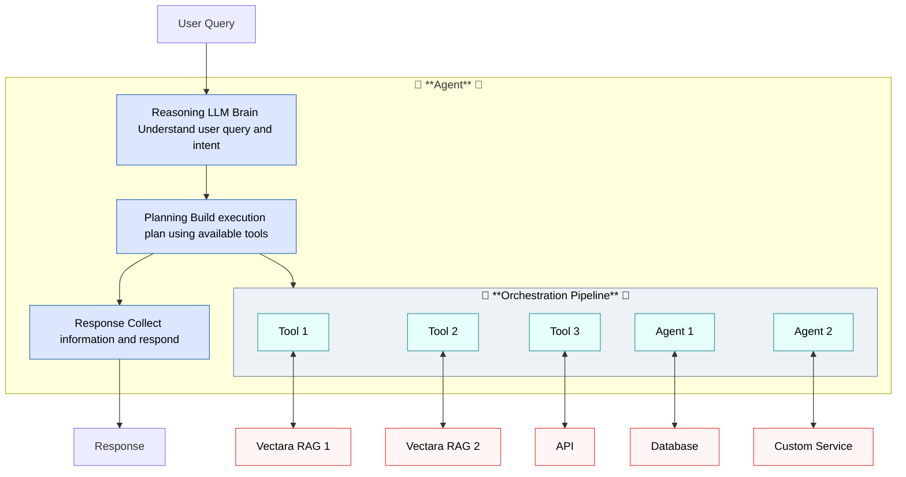

import CodePanel from '@site/src/theme/CodePanel';

Agents are the core orchestration unit in the Vectara platform. The 
agent decides how to respond to user input, when to invoke tools, and how to 
manage conversation state.

Each agent is configured with:

* A unique key and name following the pattern agt_[identifier]. If you do not 
  provide a key, Vectara generates one automatically based on the name.
* A human-readable description
* Optional instructions
* A list of available tools (referenced by name or ID)
* Optional tool configurations, for example Corpora Search tools configured 
  to grant access to various corpora
* Metadata and versioning controls
* A _first_step_ definition that encompasses optional instructions for the 
  agent's behavior.

Agents operate through a conversational step architecture, processing user 
input through reasoning, tool execution, and response generation phases. 
The step-based design enables complex multi-turn workflows and intelligent 
tool orchestration.

## Example agent definition

<CodePanel
  title="Agent example"
  snippets={[
    {
      language: 'json',
      code: `{
   "name": "customer-support-agent",
   "description": "A customer support agent that can answer questions and create tickets.",
   "tool_configurations": {
     "search_support_tickets": {
       "type": "corpus_search",
       "query_configuration": {
         "search": {
           "corpora": ["support_tickets_corpus"]
         }
       }
     }
   },
   "first_step": {
     "type": "conversational",
     "instructions": [
       {
         "type": "inline",
         "name": "Be concise",
         "template": "Keep your responses brief and to the point. Use as few words as possible."
       }
     ],
     "output_parser": {
       "type": "default"
     }
   }
}`
    }]}  
  annotations={{
    json: [
      { line: 2, text: 'The name of the customer support agent' },
      { line: 3, text: 'A description about the customer support agent.' },
      { line: 4, text: 'Configuration for tools used by this agent.' },
      { line: 5, text: 'Named tool configuration for searching support tickets.' },
      { line: 6, text: 'Specifies this tool performs corpus search operations.' },
      { line: 9, text: 'The corpus to search within for support tickets.' },
      { line: 14, text: 'The definition that configures the entry point of the agent.' },
      { line: 20, text: 'The template text that provides specific instructions for this step.' }
    ]
  }}
  layout="stacked"
/>

## Model configuration

Agents use large language models for reasoning and response generation. You 
can configure:

- **Model**: Choose from available models like GPT-4o.
- **Parameters**: Adjust temperature, max tokens, and other model-specific settings
- **Cost optimization**: Balance performance with token usage

## Create an agent

You can create an agent in the [UI wizard](/docs/console-ui/agents/create-an-agent), or you can use the API.

### Example: Research assistant with web search

Here's how to create a research assistant agent that can search the web for 
current information. This agent completes the following tasks:
- Search the web when users ask questions requiring current information
- Limit search results to 5 for more focused responses  
- Use a lower temperature (0.3) for more consistent, factual responses
- Follow instructions to cite sources and admit uncertainty when appropriate

<CodePanel
  title="Create a research assistant agent"
  snippets={[
    {
      language: 'bash',
      code: `curl -X POST https://api.vectara.io/v2/agents \
  -H "Authorization: Bearer YOUR_API_KEY" \
  -H "Content-Type: application/json" \
  -d '{
    "name": "research-assistant",
    "description": "A research assistant that can search the web for current information",
    "tool_configurations": {
      "web_search": {
        "type": "web_search",
        "argument_override": {
          "limit": 20
        }
      }
    },
    "first_step": {
      "type": "conversational",
      "instructions": [{
        "type": "initial",
        "template": "You are a helpful research assistant. When users ask questions, search the web for current and accurate information. Always cite your sources and be honest if you cannot find reliable information."
      }],
      "output_parser": {
        "type": "default"
      }
    },
    "model": {
      "name": "gpt-4",
      "parameters": {
        "temperature": 0.3,
        "max_tokens": 1000
      }
    }
  }'`
    }
  ]}
  annotations={{
    bash: [
      { line: 5, text: 'Unique name for the agent' },
      { line: 6, text: 'Human-readable description' },
      { line: 7, text: 'Configuration for available tools' },
      { line: 8, text: 'Web search tool configuration' },
      { line: 11, text: 'Limit search results to 5 for focused responses' },
      { line: 15, text: 'First step defines agent behavior' },
      { line: 17, text: 'Instructions run before user messages' },
      { line: 18, text: 'Template with agent personality and guidelines' },
      { line: 25, text: 'Model configuration' },
      { line: 26, text: 'Model name (not generation preset)' },
      { line: 28, text: 'Lower temperature for focused responses' },
      { line: 29, text: 'Maximum response length' }
    ]
  }}
  layout="stacked"
/>

## Chat with your agent

After creating an agent, you can interact with it by creating a session and sending messages:

### 1. Create a session

Sessions provide conversation context and are required for all agent interactions:

<CodePanel
  title="Create a session"
  snippets={[
    {
      language: 'bash',
      code: `POST /v2/agents/{agent_key}/sessions`
    },
    {
      language: 'json',
      code: `{
  "name": "Customer support session",
  "description": "Help with password reset"
}`
    }
  ]}
  annotations={{
    json: [
      { line: 2, text: 'Human-readable name for the session' },
      { line: 3, text: 'Optional description of the session purpose' }
    ]
  }}
  layout="stacked"
/>

### 2. Send messages to the agent

Once you have a session, send messages using the events endpoint:

<CodePanel
  title="Send a message"
  snippets={[
    {
      language: 'bash',
      code: `POST /v2/agents/{agent_key}/sessions/{session_key}/events`
    },
    {
      language: 'json',
      code: `{
  "type": "input_message",
  "messages": [{
    "type": "text",
    "content": "I forgot my password. Can you help?"
  }]
}`
    }
  ]}
  annotations={{
    json: [
      { line: 2, text: 'Must be "input_message" for user input' },
      { line: 3, text: 'Array of message objects' },
      { line: 5, text: 'The user message content' }
    ]
  }}
  layout="stacked"
/>

The agent will respond with events including its reasoning, tool usage, and final response.

:::tip Quick Start
For a complete step-by-step guide with code examples, see [Agent Quick Start](/docs/agents/agents-quickstart).
:::