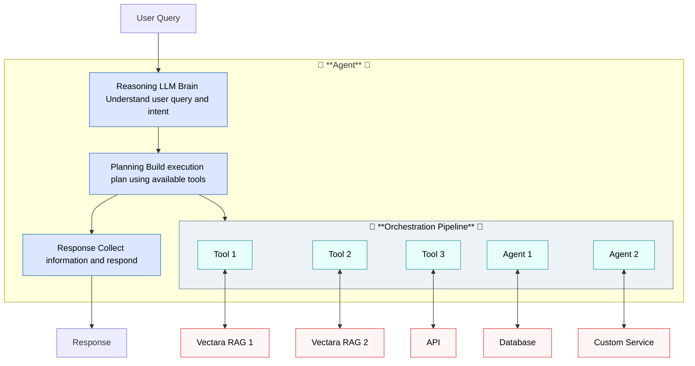

import CodePanel from '@site/src/theme/CodePanel';

Agents are the core orchestration unit in the Vectara platform. The 
agent decides how to respond to user input, when to invoke tools, and how to 
manage conversation state.

Each agent is configured as follows:

* A unique `key` and `name` following the pattern agt_[*identifier*]. If you do not 
  provide a key, Vectara generates one based on the name automatically.
* A human-readable description
* Optional instructions (prompts)
* A list of available tools (referenced by name or ID)
   :::tip Note
   When using the corpora search tool
   :::
* Metadata and versioning controls
* A _first_step_ definition that encompasses optional instructions for the 
  agent's behavior.

Agents operate through a conversational step architecture, processing user
input through reasoning, tool execution, and response generation phases.
The step-based design enables complex multi-turn workflows and intelligent
tool orchestration.

:::tip Create an agent
You can create an agent in the [**Vectara Console**](/docs/console-ui/agents/create-an-agent), or you can use the
API. For more information, check out our [**Agents Quick Start**](/docs/agents/agents-quickstart).
:::

## Configure agent search behavior

You configure search behavior for Vectara agents using the 
`query_configuration` parameter within the `corpora_search` tool. This 
parameter uses the same `search` object formatting as the [Query API](/docs/api-reference/search-apis/search). Before 
using this tool, ensure that you have at least one indexed corpus with 
data. The LLM cannot modify these predefined search parameters during
conversation.

This example demonstrates a basic configuration.

<CodePanel
  title="Basic query configuration example"
  snippets={[
    {
      language: 'json',
      code: `{
   "tool_configurations": {
     "knowledge_base_search": {
       "type": "corpora_search",
       "query_configuration": {
         "search": {
           "corpora": [
             {
               "corpus_key": "customer-guides"
             }
           ]
         },
         "generation": {
           "enabled": true,
           "generation_preset_name": "mockingbird-2.0",
           "max_used_search_results": 10
         }
       }
     }
   }
}`
    }
  ]}
  annotations={{
    json: [
      { line: 2, text: 'Tool configurations object containing all agent tools' },
      { line: 3, text: 'Custom name for this knowledge base search tool' },
      { line: 4, text: 'Tool type for searching Vectara corpora' },
      { line: 5, text: 'Query configuration with search and generation settings' },
      { line: 6, text: 'Search configuration defining which corpora to query' },
      { line: 9, text: 'Unique corpus identifier to search' },
      { line: 13, text: 'Generation settings for creating responses' },
      { line: 14, text: 'Enable AI-generated responses from search results' },
      { line: 15, text: 'Use the mockingbird-2.0 preset for response generation' },
      { line: 16, text: 'Number of search results to use for generating responses' }
    ]
  }}
  layout="stacked"
/>

This example demonstrates a complete `tool_configurations` object for a
customer support agent with optimized search behavior:

<CodePanel
  title="Complete Agent Configuration Example"
  snippets={[
    {
      language: 'json',
      code: `{
  "tool_configurations": {
    "knowledge_base_search": {
      "type": "corpora_search",
      "query_configuration": {
        "search": {
          "corpora": [
            {
              "corpus_key": "customer-guides",
              "metadata_filter": "doc.year = '2024'",
              "lexical_interpolation": 0.025
            }
          ],
          "limit": 15
        },
        "context_configuration": {
          "sentences_before": 2,
          "sentences_after": 2
        },
        "reranker": {
          "type": "customer_reranker",
          "reranker_name": "Rerank_Multilingual_v1",
        },
        "generation": {
          "enabled": true,
          "generation_preset_name": "mockingbird-2.0",
          "max_used_search_results": 10,
          "response_language": "eng",
          "citations": {
            "style": "markdown",
            "url_pattern": "https://support.example.com/docs/{doc.id}",
            "text_pattern": "Source: {doc.title}"
          }
        },
        "enable_factual_consistency_score": true
      }
    }
  }
}`
    }
  ]}
  annotations={{
    json: [
      { line: 2, text: 'Tool configurations object containing all agent tools' },
      { line: 3, text: 'Custom name for this knowledge base search tool' },
      { line: 4, text: 'Tool type for searching Vectara corpora' },
      { line: 5, text: 'Query configuration with advanced search settings' },
      { line: 6, text: 'Search configuration defining corpora and filters' },
      { line: 9, text: 'Corpus identifier for customer guides' },
      { line: 10, text: 'Filter to only search 2024 documents' },
      { line: 11, text: 'Balance between semantic and keyword search' },
      { line: 14, text: 'Maximum number of results to retrieve' },
      { line: 16, text: 'Context configuration for surrounding text' },
      { line: 17, text: 'Include 2 sentences before each result' },
      { line: 18, text: 'Include 2 sentences after each result' },
      { line: 20, text: 'Reranker configuration for result quality' },
      { line: 21, text: 'Use customer reranker for multilingual support' },
      { line: 22, text: 'Specify Rerank_Multilingual_v1 model' },
      { line: 24, text: 'Generation settings for creating AI responses' },
      { line: 27, text: 'Use top 10 results for response generation' },
      { line: 28, text: 'Generate responses in English' },
      { line: 29, text: 'Citation configuration for source attribution' },
      { line: 30, text: 'Use markdown format for citations' },
      { line: 35, text: 'Enable factual consistency scoring' }
    ]
  }}
  layout="stacked"
/>

### Search configuration

The `search` object controls which corpora to search and how to filter and
retrieve results:

- **corpus_key** (required): Unique identifier for the corpus to search.
- **metadata_filter**: SQL-like filter to narrow results (`doc.year = '2024'`).
- **lexical_interpolation**: Balance between semantic (`0.0`) and keyword
  (`1.0`) search. **Default:** `0.025`.
- **limit**: Maximum results to retrieve before reranking. **Default:** `10`.
- **offset**: Number of results to skip for pagination.
- **semantics**: Query interpretation mode ("`query`", "`response`", or
  "`default`").

### Context configuration

The `context_configuration` object controls how much surrounding text is
included with each search result:

- **sentences_before/sentences_after**: Number of sentences to include
  before/after matching text.
- **characters_before/characters_after**: Alternative character-based
  boundaries for precise control.
- **start_tag/end_tag**: HTML tags for highlighting matching text in
  results.

### Reranker configuration

Rerankers improve result quality by reordering search results to place the
most relevant content first:

- **type**: Reranker type
  - `customer_reranker`: Default multilingual reranker (recommended).
  - `mmr`: Maximal Marginal Relevance to reduce redundancy.
  - `none`: Disables reranking (not recommended).
- **reranker_name**: Specific reranker model (`Rerank_Multilingual_v1`).
- **limit**: Maximum results after reranking.
- **cutoff**: Minimum relevance score (`0.0-1.0`) for result inclusion.
  Typically `0.3-0.7`.
- **include_context**: Use surrounding context text for more accurate
  scoring.

### Generation configuration

The `generation` object controls how the agent creates natural language
responses:

- **enabled**: Enable or disable generative summarization.
- **generation_preset_name**: Pre-configured prompt and model bundle (`mockingbird-2.0`).
- **max_used_search_results**: Number of top results to send to the LLM..
  **Default:** `5`
- **max_response_characters**: Soft limit for response length.
- **response_language**: Response language code (`auto`, `eng`, `spa`, etc.).
- **citations**: Citation formatting.
  - **style**: Citation format (`numeric`, `html`, `markdown`, or `none`).
  - **url_pattern**: URL template using metadata variables 
  (`https://docs.example.com/{doc.id}`).
  - **text_pattern**: Display text template (`[{doc.title}]`).
- **prompt_template**: Override default prompt using Apache Velocity syntax.
- **model_parameters**: LLM settings (temperature, max_tokens, etc.).
- **enable_factual_consistency_score**: Validate factual consistency of
  responses.

## Example agent definition

This example shows a basic customer support agent configured with corpus 
search capabilities and inline instructions. The agent demonstrates the core 
components: tool configurations for searching support tickets, and a 
conversational first step with behavior guidelines.

<CodePanel
  title="Agent example"
  snippets={[
    {
      language: 'json',
      code: `{
   "name": "customer-support-agent",
   "description": "A customer support agent that can answer questions and create tickets.",
   "tool_configurations": {
     "search_support_tickets": {
       "type": "corpora_search",
       "query_configuration": {
         "search": {
           "corpora": ["support_tickets_corpus"]
         }
       }
     }
   },
   "first_step": {
     "type": "conversational",
     "instructions": [
       {
         "type": "inline",
         "name": "Be concise",
         "template": "Keep your responses brief and to the point. Use as few words as possible."
       }
     ],
     "output_parser": {
       "type": "default"
     }
   }
}`
    }]}  
  annotations={{
    json: [
      { line: 2, text: 'Agent name identifier' },
      { line: 3, text: 'Human-readable description of agent capabilities' },
      { line: 4, text: 'Tool configurations available to this agent' },
      { line: 5, text: 'Custom name for the support ticket search tool' },
      { line: 6, text: 'Tool type for searching a single corpus' },
      { line: 7, text: 'Query configuration for the search tool' },
      { line: 9, text: 'Corpus key for support tickets data' },
      { line: 14, text: 'First step defines the agent entry point behavior' },
      { line: 15, text: 'Conversational type for interactive responses' },
      { line: 16, text: 'Instructions array for agent behavior guidelines' },
      { line: 18, text: 'Inline instruction type for embedded prompts' },
      { line: 19, text: 'Name identifier for this instruction' },
      { line: 20, text: 'Template containing the agent behavior prompt' }
    ]
  }}
  layout="stacked"
/>

## Model configuration

Agents use large language models for reasoning and response generation. You
can configure:

- **Model**: Choose from available models like GPT-4o.
- **Parameters**: Adjust temperature, max tokens, and other model-specific settings.
- **Cost optimization**: Balance performance with token usage.
- **Retry configuration**: Configure automatic retry behavior for transient failures.

### Retry configuration

When agents interact with LLMs, transient failures may occur that interrupt
the conversation flow, including network timeouts, temporary server issues,
or reaching API rate limits. Without a retry mechanism, these temporary
issues cause your agent to fail immediately, resulting in a poor user
experience.

Vectara provides a retry configuration option for agents which detects these
recoverable failures and retries the request with exponential backoff
automatically.

The `RetryConfiguration` object controls the retry behavior for your agent's
interactions with the LLM. You define these settings when creating or
updating your agent model, and they apply to all LLM requests made by that
agent.

### Retry configuration parameters

- **enabled**: The boolean flag to enable or disable retry logic.
  - Default: `true`
- **max_retries**: The maximum number of retry attempts after the initial failure.
  - Range: 0-10
  - Default: `3`
- **initial_backoff_ms**: The initial delay in milliseconds before the first retry.
  - Range: 100-60000ms
  - Default: `1000ms`
- **max_backoff_ms**: The maximum delay in milliseconds between retries.
  - Range: 1000-300000ms
  - Default: `30000ms`
- **backoff_factor**: The exponential multiplier for calculating backoff delays.
  - Range: 1.0-10.0
  - Default: `2.0`

### Exponential backoff

Exponential backoff progressively increases the delay between retry attempts
to avoid overwhelming a recovering service. For example, with default
settings (initial: 1000ms, factor: 2.0, max: 30000ms):

- Attempt 1: 1000ms delay
- Attempt 2: 2000ms delay
- Attempt 3: 4000ms delay
- Attempt 4: 8000ms delay

The delay continues to grow exponentially until it reaches the
`max_backoff_ms` value, at which point it remains constant for any remaining
retry attempts.

### Example: Research assistant with web search

Here's how to create a research assistant agent that can search the web for
current information. This agent completes the following tasks:
- Search the web when users ask questions requiring current information
- Limit search results to 20 for comprehensive responses
- Use a lower temperature (0.3) for more consistent, factual responses
- Follow instructions to cite sources and admit uncertainty when appropriate
- Configure retry logic to handle transient API failures gracefully

This example requires no corpus setup, making it perfect for immediate testing.

<CodePanel
  title="Create a research assistant agent"
  snippets={[
    {
      language: 'bash',
      code: `curl -X POST https://api.vectara.io/v2/agents \\
  -H "Authorization: Bearer YOUR_API_KEY" \\
  -H "Content-Type: application/json" \\
  -d '{
    "name": "research-assistant",
    "description": "A research assistant that can search the web for current information",
    "tool_configurations": {
      "web_search": {
        "type": "web_search"
      }
    },
    "first_step": {
      "type": "conversational",
      "instructions": [{
        "type": "inline",
        "name": "Research Assistant",
        "template": "You are a helpful research assistant. When users ask questions, search the web for current and accurate information. Always cite your sources and be honest if you cannot find reliable information."
      }],
      "output_parser": {
        "type": "default"
      }
    },
    "model": {
      "name": "gpt-5",
      "parameters": {
        "temperature": 0.3,
        "max_tokens": 1000
      },
      "retry_configuration": {
        "enabled": true,
        "max_retries": 3,
        "initial_backoff_ms": 1000,
        "max_backoff_ms": 30000,
        "backoff_factor": 2.0
      }
    }
  }'`
    }
  ]}
  annotations={{
    bash: [
      { line: 1, text: 'POST request to create a new agent' },
      { line: 2, text: 'Authorization header with your API key' },
      { line: 3, text: 'Content type for JSON payload' },
      { line: 5, text: 'Unique identifier name for the agent' },
      { line: 6, text: 'Human-readable description of agent purpose' },
      { line: 7, text: 'Tool configurations defining available capabilities' },
      { line: 8, text: 'Web search tool for real-time information' },
      { line: 9, text: 'Tool type identifier for web search' },
      { line: 12, text: 'First step configuration for agent entry point' },
      { line: 13, text: 'Conversational type for interactive chat behavior' },
      { line: 14, text: 'Instructions array defining agent behavior' },
      { line: 15, text: 'Inline instruction type for embedded prompts' },
      { line: 16, text: 'Name identifier for this instruction set' },
      { line: 17, text: 'Template defining agent personality and guidelines' },
      { line: 23, text: 'Model configuration for LLM settings' },
      { line: 24, text: 'Specify gpt-5 as the reasoning model' },
      { line: 26, text: 'Temperature 0.3 for consistent, factual responses' },
      { line: 27, text: 'Maximum token limit for responses' },
      { line: 29, text: 'Retry configuration for handling transient failures' },
      { line: 30, text: 'Enable automatic retry logic' },
      { line: 31, text: 'Maximum of 3 retry attempts on failure' },
      { line: 32, text: 'Initial 1 second delay before first retry' },
      { line: 33, text: 'Maximum 30 second delay between retries' },
      { line: 34, text: 'Exponential backoff factor of 2.0 between retries' }
    ]
  }}
  layout="stacked"
/>

## Chat with your agent

After creating an agent, you can interact with it by creating a session and sending messages:

### 1. Create a session

Sessions provide conversation context and are required for all agent interactions:

<CodePanel
  title="Create a session"
  snippets={[
    {
      language: 'bash',
      code: `POST /v2/agents/{agent_key}/sessions`
    },
    {
      language: 'json',
      code: `{
  "name": "Customer support session",
  "description": "Help with password reset"
}`
    }
  ]}
  annotations={{
    json: [
      { line: 2, text: 'Session name for identification and tracking' },
      { line: 3, text: 'Optional description of session purpose and context' }
    ]
  }}
  layout="stacked"
/>

### 2. Send messages to the agent

Once you have a session, send messages using the events endpoint:

<CodePanel
  title="Send a message"
  snippets={[
    {
      language: 'bash',
      code: `POST /v2/agents/{agent_key}/sessions/{session_key}/events`
    },
    {
      language: 'json',
      code: `{
  "type": "input_message",
  "messages": [{
    "type": "text",
    "content": "I forgot my password. Can you help?"
  }]
}`
    }
  ]}
  annotations={{
    json: [
      { line: 2, text: 'Event type must be "input_message" for user input' },
      { line: 3, text: 'Array containing one or more message objects' },
      { line: 4, text: 'Message type "text" for plain text content' },
      { line: 5, text: 'User message content to send to the agent' }
    ]
  }}
  layout="stacked"
/>

The agent will respond with events including its reasoning, tool usage, and final response.

:::tip Quick Start
For a complete step-by-step guide with code examples, see [Agent Quick Start](/docs/agents/agents-quickstart).
:::