import CodePanel from '@site/src/theme/CodePanel';

Agents are autonomous systems that understand natural language and use tools 
and reasoning to accomplish tasks. To do this, they must make decisions:

* Interpreting user input
* Calling tools, and with what arguments
* Managing conversation state

Internally, they use an LLM-driven orchestration pipeline to make these 
decisions.

```mermaid
flowchart TD
    %% User Input and Response Flow
    User[User Query] --> LLM[LLM Reasoning and planning]

    LLM --> Response[Collect information]
    Response --> Output[Response]

    %% Orchestration Flow
    LLM --> OP

    %% Tools and Agents in Orchestration Pipeline
    subgraph OP[🔧 **Orchestration Pipeline** 🔧]
        Tool1[Tool 1]
        Tool2[Tool 2]
        Tool3[Tool 3]
        Agent1[Agent 1]
        Agent2[Agent 2]
    end

    %% Orchestration pipeline links outside agent

    Tool1 <--> RAG1[Vectara RAG 1]
    Tool2 <--> RAG2[Vectara RAG 2]
    Tool3 <--> API[API]
    Agent1 <--> DB[Database]
    Agent2 <--> Custom[Custom Service]

    %% Grouping
    subgraph Agent [💭 **Agent** 💭]
        LLM
        Response
        OP
    end

    classDef llm fill:#DCE6FF,stroke:#2B6CB0,color:#000;
    classDef pipeline fill:#EDF2F7,stroke:#718096,color:#000;
    classDef tools fill:#E6FFFA,stroke:#319795,color:#000;
    classDef sources fill:#FFF5F5,stroke:#E53E3E,color:#000;

    class LLM,Response llm;
    class OP pipeline;
    class Tool1,Tool2,Tool3,Agent1,Agent2 tools;
    class RAG1,RAG2,API,DB,Custom sources;
```

## LLM configuration

Agents use LLMs for reasoning and response generation. You can configure the 
following:
- **Model**: Choose from available models like GPT-4o.
- **Parameters**: Adjust temperature, max tokens, and other model-specific settings.
- **Cost optimization**: Balance performance with token usage.
- **Retry configuration**: Configure automatic retry behavior for transient failures.

## Using retries to improve user experience

When agents interact with LLMs, transient failures like network interruptions 
can disrupt communication between the agent and the LLM. You can configure 
your agent to resume disrupted communication to ensure a smooth user 
experience.

Here's a brief explanation of how retries work:

- **max_retries:** After an error, the agent will retry its request to the LLM this many 
  times.
- **initial_backoff_ms:** This is how many milliseconds the agent will wait before 
  retrying, to give the cause of the error time to resolve.
- **backoff_factor:** Every time the agent retries, it can multiply the last retry 
  delay by this number, increasing the wait between retries. This is like giving a 
  toddler a longer and longer timeout if it continues to misbehave.
- **max_backoff_ms:** The maximum time you want the agent to wait between retries, 
  so the backoff_factor doesn't create an unreasonably long delay for your users.

### Example: Research assistant with web search

Here's how to create a research assistant agent that can search the web for
current information. This agent completes the following tasks:
- Search the web when users ask questions requiring current information
- Limit search results to 20 for comprehensive responses
- Use a lower temperature (0.3) for more consistent, factual responses
- Follow instructions to cite sources and admit uncertainty when appropriate
- Configure retry logic to handle transient API failures gracefully

This example requires no corpus setup, making it perfect for immediate testing.

<CodePanel
  title="Create a research assistant agent"
  snippets={[
    {
      language: 'bash',
      code: `curl -X POST https://api.vectara.io/v2/agents \\
  -H "Authorization: Bearer YOUR_API_KEY" \\
  -H "Content-Type: application/json" \\
  -d '{
    "name": "research-assistant",
    "description": "A research assistant that can search the web for current information",
    "tool_configurations": {
      "web_search": {
        "type": "web_search"
      }
    },
    "first_step": {
      "type": "conversational",
      "instructions": [{
        "type": "inline",
        "name": "Research Assistant",
        "template": "You are a helpful research assistant. When users ask questions, search the web for current and accurate information. Always cite your sources and be honest if you cannot find reliable information."
      }],
      "output_parser": {
        "type": "default"
      }
    },
    "model": {
      "name": "gpt-5",
      "parameters": {
        "temperature": 0.3,
        "max_tokens": 1000
      },
      "retry_configuration": {
        "enabled": true,
        "max_retries": 3,
        "initial_backoff_ms": 1000,
        "max_backoff_ms": 30000,
        "backoff_factor": 2.0
      }
    }
  }'`
    }
  ]}
  annotations={{
    bash: [
      { line: 1, text: 'POST request to create a new agent' },
      { line: 2, text: 'Authorization header with your API key' },
      { line: 3, text: 'Content type for JSON payload' },
      { line: 5, text: 'Unique identifier name for the agent' },
      { line: 6, text: 'Human-readable description of agent purpose' },
      { line: 7, text: 'Tool configurations defining available capabilities' },
      { line: 8, text: 'Web search tool for real-time information' },
      { line: 9, text: 'Tool type identifier for web search' },
      { line: 12, text: 'First step configuration for agent entry point' },
      { line: 13, text: 'Conversational type for interactive chat behavior' },
      { line: 14, text: 'Instructions array defining agent behavior' },
      { line: 15, text: 'Inline instruction type for embedded prompts' },
      { line: 16, text: 'Name identifier for this instruction set' },
      { line: 17, text: 'Template defining agent personality and guidelines' },
      { line: 23, text: 'Model configuration for LLM settings' },
      { line: 24, text: 'Specify gpt-5 as the reasoning model' },
      { line: 26, text: 'Temperature 0.3 for consistent, factual responses' },
      { line: 27, text: 'Maximum token limit for responses' },
      { line: 29, text: 'Retry configuration for handling transient failures' },
      { line: 30, text: 'Enable automatic retry logic' },
      { line: 31, text: 'Maximum of 3 retry attempts on failure' },
      { line: 32, text: 'Initial 1 second delay before first retry' },
      { line: 33, text: 'Maximum 30 second delay between retries' },
      { line: 34, text: 'Exponential backoff factor of 2.0 between retries' }
    ]
  }}
  layout="stacked"
/>

To chat with your agent, read on about [Sessions](/docs/agents/sessions).

## Artifacts

Artifacts are files stored in an agent session's workspace that provide a 
persistent, session-scoped storage mechanism. They enable agents and users to 
share files throughout a conversation without bloating the agent’s context 
with content from large files.

Before artifacts, file uploads were handled inline within session events. 
Artifacts solve these problems by separating file storage from file 
references. When you upload a file, Vectara stores it in the session workspace 
and returns a lightweight ArtifactReference containing only metadata. Agents 
use these references to access files without including the full content in 
every request.

## How artifacts work

Artifacts are created either in user uploads or tool generation, where agent 
tools can create new artifacts as outputs. For example, converting a document 
to markdown.

Each artifact receives a unique identifier following the pattern art_[a-z0-9_-]+.

### How agents use artifacts

After files are uploaded as artifacts, the agent can:
- Use document conversion tools to extract content from PDFs, Word documents,
  or PowerPoint files.
- Reference artifacts in analysis or question-answering workflows.
- Pass artifacts to indexing tools to add content to corpora.
- Create new artifacts as outputs of tool operations.

Artifacts remain available throughout the session lifecycle, enabling multi-step
workflows without re-uploading files.

