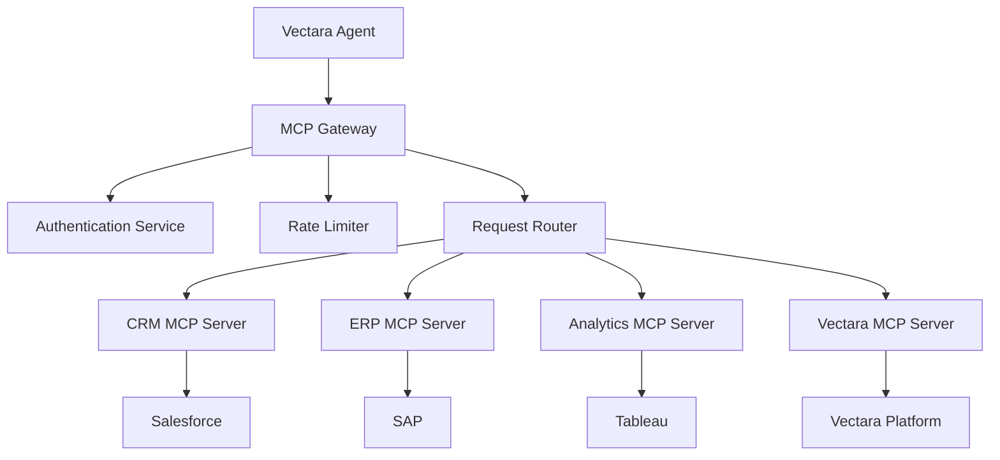

import CodePanel from '@site/src/theme/CodePanel';

The Model Context Protocol (MCP) is an revolutionary open standard that acts 
as a "USB-C port for AI applications," providing a standardized way to connect 
Large Language Models (LLMs) to diverse data sources, tools, and enterprise 
systems. Created by Anthropic and adopted broadly across the AI ecosystem, MCP 
enables seamless, secure, and scalable interactions between AI agents and the 
complex infrastructure that powers modern businesses.

### Core MCP concepts

**Standardized Integration**: MCP eliminates the need for custom integrations by providing a universal protocol that any AI system can use to access external capabilities. Instead of building point-to-point connections between each AI tool and data source, MCP creates a standardized interface that works across different LLM providers and enterprise systems.

**Client-Server Architecture**: MCP follows a clean client-server model where:
- **MCP Hosts** are programs that want to access external data and tools
- **MCP Clients** maintain protocol connections and handle communication
- **MCP Servers** are lightweight programs that expose specific capabilities
- **Data Sources** can be local (files, databases) or remote (APIs, cloud services)

**Tool and Resource Abstraction**: MCP provides two primary abstraction layers:
- **Tools**: Actions that agents can perform (search databases, send emails, create tickets)
- **Resources**: Information sources that agents can access (documents, customer records, system status)

## How Vectara agents use MCP

Vectara's agentic platform leverages MCP as the foundational protocol for enterprise tool integration, creating a powerful ecosystem where AI agents can seamlessly access and manipulate business-critical systems while maintaining security and governance controls.

### Agent-MCP integration architecture

```
┌─────────────────┐    ┌──────────────────┐    ┌─────────────────────┐
│   Vectara       │    │   MCP Protocol   │    │   Enterprise        │
│   Agent         │◄──►│   Layer          │◄──►│   Systems           │
└─────────────────┘    └──────────────────┘    └─────────────────────┘
│                      │                      │
├─ Reasoning Engine    ├─ Tool Discovery      ├─ CRM Systems
├─ Context Management  ├─ Schema Validation   ├─ ERP Platforms  
├─ Response Generation ├─ Security Controls   ├─ Document Stores
└─ Conversation Flow   └─ Error Handling      └─ API Services
```

1. Vectara agents use MCP's tool discovery capabilities to automatically 
   identify and catalog available enterprise tools.
2. During conversations, Vectara agents leverage MCP tools through a 
   sophisticated execution pipeline
3. MCP enables Vectara agents to maintain rich enterprise context across
   interactions.

## Vectara's MCP strategy

Vectara's approach to MCP represents a strategic investment in creating the most comprehensive and enterprise-ready agentic platform in the market. This strategy encompasses multiple dimensions designed to address the unique challenges of enterprise AI deployment.

### 1. Native MCP Integration

**Built-in Protocol Support**: Unlike solutions that add MCP as an afterthought, Vectara's agent platform is architected from the ground up with native MCP support. This means:
- Zero-configuration tool discovery and integration
- Automatic schema validation and type safety
- Built-in security and governance controls
- Seamless scaling from development to production

**Vectara-MCP Server**: Vectara provides its own MCP server implementation that exposes core platform capabilities:
- **ask_vectara Tool**: Enables any MCP-compatible AI system to perform RAGs queries with generation
- **search_vectara Tool**: Provides semantic search capabilities without generation
- **Trusted RAG Access**: Reduces hallucination through Vectara's hallucination evaluation model (HHEM)

### 2. Enterprise-First MCP Implementation

**Security and Compliance**: Vectara's MCP implementation prioritizes enterprise security requirements:
- **Authentication Integration**: Support for enterprise SSO, API keys, and OAuth flows
- **Network Security**: HTTPS-only communication with certificate validation
- **Data Classification**: Automatic handling of sensitive data based on enterprise policies
- **Audit Logging**: Comprehensive audit trails for all MCP interactions

**Scalability and Reliability**: Enterprise-grade infrastructure ensures MCP operations can scale:
- **Connection Pooling**: Efficient management of MCP server connections
- **Load Balancing**: Automatic distribution of tool requests across server instances
- **Fault Tolerance**: Graceful handling of server failures with automatic retry logic
- **Performance Monitoring**: Real-time monitoring of MCP server health and response times

### 3. Ecosystem Development Strategy

**Open Standards Commitment**: Vectara actively contributes to MCP standard development:
- **Protocol Enhancement**: Contributing features needed for enterprise deployments
- **Best Practices**: Sharing implementation patterns and security guidelines
- **Community Building**: Supporting broader MCP adoption across the enterprise AI ecosystem

**Partner Integration**: Strategic partnerships with enterprise software providers:
- **Pre-built Connectors**: Ready-to-use MCP servers for popular enterprise systems
- **Certified Integrations**: Validated and supported MCP implementations
- **Integration Marketplace**: Ecosystem of third-party MCP servers and tools

## MCP Best Practices for Enterprise Deployment

### Security and Governance

**1. Authentication and Authorization**
```json
{
  "server_config": {
    "authentication": {
      "type": "oauth2",
      "client_id": "${ENTERPRISE_CLIENT_ID}",
      "client_secret": "${ENTERPRISE_CLIENT_SECRET}",
      "scope": ["read:customers", "write:tickets"]
    },
    "authorization": {
      "role_based_access": true,
      "resource_permissions": ["crm:read", "support:write"]
    }
  }
}
```

**2. Data Classification and Handling**
- Implement automatic data classification for sensitive information
- Use encryption in transit and at rest for all MCP communications
- Apply data retention policies based on enterprise requirements
- Ensure GDPR, HIPAA, and other regulatory compliance

**3. Audit and Monitoring**
```json
{
  "audit_config": {
    "log_all_requests": true,
    "include_parameters": true,
    "retention_days": 2555,
    "compliance_framework": ["SOX", "GDPR"],
    "alert_on_sensitive_access": true
  }
}
```

### Performance and Reliability

**1. Connection Management**
- Use connection pooling to minimize overhead
- Implement circuit breakers for failing MCP servers
- Set appropriate timeouts for different tool types
- Monitor and alert on connection health

**2. Error Handling and Resilience**
```python
# Example error handling pattern
class MCPToolExecutor:
    def execute_tool(self, tool_name, parameters):
        try:
            result = self.mcp_client.call_tool(tool_name, parameters)
            return self.validate_result(result)
        except MCPConnectionError:
            return self.handle_connection_failure(tool_name)
        except MCPTimeoutError:
            return self.handle_timeout(tool_name, parameters)
        except MCPValidationError as e:
            return self.handle_validation_error(e)
```

**3. Schema Management**
- Validate all tool schemas during server registration
- Implement version compatibility checking
- Cache schemas for performance optimization
- Handle schema evolution gracefully

### Development and Operations

**1. MCP Server Development Standards**
```yaml
mcp_server_standards:
  naming_conventions:
    tools: "verb_noun format (e.g., search_customers)"
    parameters: "snake_case with clear descriptions"
  
  documentation:
    required_fields: ["description", "parameters", "examples"]
    schema_validation: "JSON Schema v7 minimum"
  
  testing:
    unit_tests: "All tool functions"
    integration_tests: "End-to-end workflows"
    performance_tests: "Response time benchmarks"
```

**2. Deployment and Configuration**
- Use infrastructure as code for MCP server deployments
- Implement blue-green deployments for zero-downtime updates
- Configure monitoring and alerting for all MCP endpoints
- Establish clear rollback procedures

**3. Tool Design Principles**
- **Single Responsibility**: Each tool should have one clear purpose
- **Idempotency**: Tools should be safe to retry
- **Parameter Validation**: Strict input validation and clear error messages
- **Output Consistency**: Standardized response formats across similar tools

## Vectara's MCP Server Implementation

Vectara provides a reference MCP server implementation that showcases best practices and provides immediate value to the enterprise AI ecosystem.

### Core Capabilities

**ask_vectara Tool**: 
- Performs retrieval-augmented generation queries
- Integrates Vectara's Trusted RAG capabilities
- Reduces hallucination through HHEM integration
- Supports custom prompt engineering and context control

**search_vectara Tool**:
- Provides semantic search without generation
- Returns ranked results with relevance scores
- Supports filtering and faceted search
- Enables hybrid search with lexical and semantic matching

### Integration Examples

**Claude Desktop Integration**:
```json
{
  "mcp": {
    "servers": {
      "vectara": {
        "command": "vectara-mcp",
        "env": {
          "VECTARA_API_KEY": "your-api-key",
          "VECTARA_CORPUS_KEY": "your-corpus-key"
        }
      }
    }
  }
}
```

**Enterprise Workflow Integration**:
```python
# Example: Customer support agent using Vectara MCP
async def handle_support_query(user_question):
    # Use Vectara's ask_vectara tool for intelligent response
    response = await mcp.call_tool("ask_vectara", {
        "query": user_question,
        "corpus_key": "support_documentation",
        "context_sentences": 3,
        "summarize": True
    })
    
    # Combine with other enterprise tools
    if "billing" in user_question.lower():
        billing_data = await mcp.call_tool("crm_lookup", {
            "customer_id": extract_customer_id(user_question)
        })
        response = enrich_with_billing_context(response, billing_data)
    
    return response
```

## MCP Architecture Patterns for Enterprise Scale

### Microservices Pattern

Implement MCP servers as microservices for scalability and maintainability:

```yaml
architecture:
  mcp_gateway:
    role: "Central routing and authentication"
    responsibilities: ["auth", "routing", "rate_limiting"]
  
  specialized_servers:
    crm_server:
      tools: ["customer_search", "opportunity_lookup", "contact_management"]
      scaling: "horizontal with load balancer"
    
    analytics_server:
      tools: ["generate_report", "query_metrics", "create_dashboard"]
      scaling: "vertical for compute-intensive operations"
    
    workflow_server:
      tools: ["create_ticket", "approve_request", "send_notification"]
      scaling: "event-driven with queue processing"
```

### Enterprise Integration Pattern



### Security Boundary Pattern

Implement security boundaries at multiple levels:

```yaml
security_layers:
  network_level:
    - "VPC isolation for MCP servers"
    - "Firewall rules restricting access"
    - "TLS 1.3 for all communications"
  
  application_level:
    - "JWT tokens for authentication"
    - "Role-based access control"
    - "Parameter validation and sanitization"
  
  data_level:
    - "Encryption at rest for sensitive data"
    - "Field-level access controls"
    - "Audit logging for all data access"
```

## Future of MCP and Vectara

### Emerging Capabilities

**1. Advanced Tool Composition**
- Automatic chaining of related tools for complex workflows
- Intelligent parameter mapping between tool calls
- Context preservation across multi-step operations

**2. Intelligent Tool Selection**
- Machine learning models to optimize tool selection
- Performance-based routing and load balancing
- Predictive pre-loading of frequently used tools

**3. Enhanced Security Features**
- Zero-trust architecture for MCP communications
- Advanced threat detection and response
- Automated compliance reporting and validation

### Industry Impact

**Standardization Benefits**:
- Reduced integration costs across the enterprise AI ecosystem
- Faster time-to-market for AI-powered business applications
- Greater interoperability between different AI platforms and tools

**Innovation Acceleration**:
- Lower barriers to entry for enterprise AI adoption
- Increased focus on business logic rather than integration complexity
- Rapid iteration and experimentation with AI capabilities

**Ecosystem Growth**:
- Proliferation of specialized MCP servers for vertical industries
- Community-driven development of common enterprise integrations
- Emergence of MCP-native enterprise software solutions

## Conclusion

Vectara's strategic embrace of the Model Context Protocol represents more than just another integration method—it's a fundamental architectural decision that positions the platform for the future of enterprise AI. By building native MCP support, contributing to open standards, and providing reference implementations, Vectara is helping to shape a more connected, secure, and capable enterprise AI ecosystem.

The combination of Vectara's Trusted RAG capabilities with MCP's standardized integration framework creates unprecedented opportunities for enterprises to deploy intelligent agents that can seamlessly work across their entire technology stack. As MCP continues to evolve and gain broader adoption, organizations using Vectara will benefit from an ever-expanding ecosystem of tools and integrations, all built on a foundation of security, reliability, and enterprise-grade performance.

For enterprises beginning their AI journey, MCP provides a future-proof integration strategy that grows with their needs. For those already deploying AI solutions, MCP offers a path to greater standardization, reduced complexity, and enhanced capabilities. In both cases, Vectara's MCP-native approach ensures that organizations can realize these benefits immediately while building toward an even more capable and integrated future.


---

# Model Context Protocol Architecture

The Vectara Agent Platform is built with full Model Context Protocol (MCP) compatibility, ensuring standardized tool integration and positioning your enterprise AI infrastructure within the rapidly expanding ecosystem of MCP-compliant services. This standards-based approach provides immediate architectural benefits while establishing a foundation for scalable agent deployments.

MCP compatibility delivers consistent tool orchestration patterns, reliable integration capabilities, and enterprise-grade security through standardized protocols. By implementing MCP standards throughout the platform architecture, Vectara agents provide predictable behavior and seamless tool interaction across diverse enterprise systems.

## MCP Implementation Benefits

**Standardized Tool Interface**
The Agent Platform implements MCP protocols for all tool interactions, ensuring consistent behavior patterns and reliable integration capabilities. This standardization simplifies agent development, reduces integration complexity, and provides predictable tool orchestration across enterprise systems while maintaining compatibility with MCP ecosystem standards.

**Enterprise Security Integration**
MCP implementation within the Vectara platform maintains enterprise security standards through controlled tool access, comprehensive audit logging, and secure communication protocols. The platform's MCP architecture includes built-in security controls that ensure tool interactions meet enterprise governance requirements while supporting standard protocol operations.

**Architectural Consistency**
Native MCP compatibility provides consistent interaction patterns across all platform components, from agent-to-tool communication to session management and event tracking. This consistency reduces development complexity and ensures reliable agent behavior across different deployment scenarios and enterprise environments.

## Platform Architecture

**Internal MCP Orchestration**
The Vectara Agent Platform implements MCP standards for internal tool orchestration and agent-to-system communication. This provides a robust architectural foundation that ensures reliable, secure agent operations within enterprise environments while maintaining full protocol compatibility.

**Controlled Integration Framework**
The platform focuses on curated, enterprise-validated tool integration through managed tool server architecture. This approach ensures security, compliance, and reliability while maintaining full MCP protocol compatibility throughout the tool discovery, registration, and execution processes.

**Security and Access Control**
MCP operations within the platform are governed by comprehensive access control mechanisms that authenticate tool requests, authorize specific operations, and maintain detailed audit trails. These security measures ensure that MCP compatibility enhances rather than compromises enterprise security postures and regulatory compliance requirements.

## Enterprise Deployment Advantages

**Standards-Based Integration**
MCP compatibility reduces integration complexity by providing standardized interfaces for tool discovery, authentication, and execution. This standards-based approach ensures consistent behavior across different enterprise systems while supporting diverse tool types and operational requirements.

**Investment Protection**
The MCP-compatible architecture protects agent development investments by providing stable, standardized interfaces that remain consistent as the platform evolves. This approach ensures that current agent configurations and tool integrations continue to function reliably over time.

**Scalable Foundation**
MCP implementation supports efficient scaling across enterprise deployments, from single-agent implementations to complex multi-agent orchestrations. The standardized protocol ensures consistent behavior and security controls regardless of deployment size or complexity.

The Vectara Agent Platform's MCP compatibility establishes a strategic foundation for enterprise AI automation, providing immediate benefits through standardized architecture while ensuring alignment with evolving industry standards and best practices.
