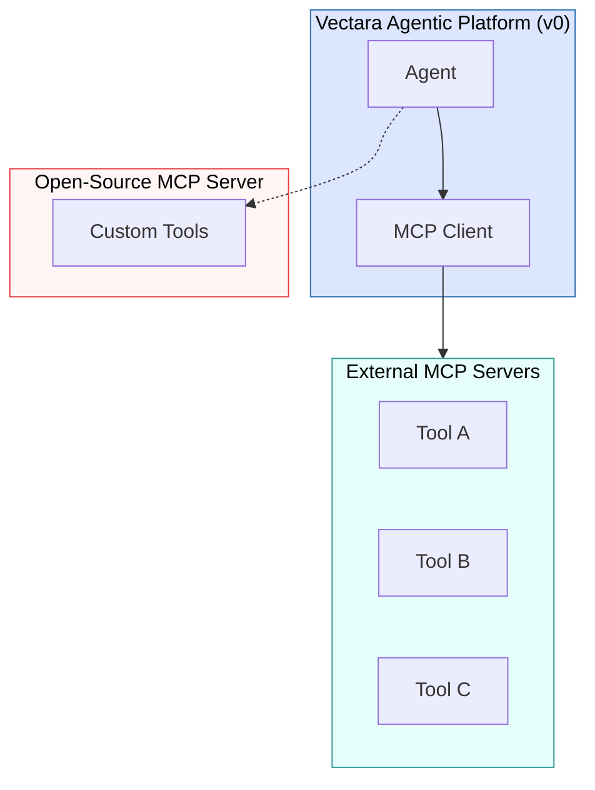

import CodePanel from '@site/src/theme/CodePanel';

The Model Context Protocol (MCP) is an emerging and rapidly changing standard 
for communication between agents and tools. Introduced by Anthropic and now 
adopted across multiple agentic ecosystems. MCP defines a structured way for 
agents to invoke external tools, pass contextual input, and receive structured 
responses. MCP acts as a universal connector between AI agents and enterprise 
services.

In the tech preview of the Agentic Platform, Vectara only supports MCP as a 
client. This means Vectara agents can call MCP-enabled tools and services 
hosted on external MCP servers. We do not yet support MCP server capabilities 
in the platform itself. We currently have an open source Vectara MCP project 
that is not part of the platform.

## Why MCP is important

MCP eliminates the need for custom integrations by providing a universal 
protocol that any AI system can use to access external capabilities. 
Instead of building custom integrations for every tool or service, MCP 
creates a standardized interface that works across different LLM providers 
and enterprise systems. MCP provides the following benefits:

| Benefit | Description | 
| ------ | ------- | 
| Standardized tool access | Access tools through a common schema and interface.
| Dynamic tool discovery | Agents can discover tools available at a registered MCP server.
| Enterprise integration | Tools can represent internal APIs, RAG systems, databases, or even other agents.
| Auditability and security | Permissions and access control can be managed per tool, enabling secure orchestration.
| Model-agnostic | MCP works across agent platforms (Vectara, Claude, OpenAI SDK, Google Gemini, and so on).

