import CodePanel from '@site/src/theme/CodePanel';
import { Spacer } from "@site/src/components/ui/Spacer";

The sub-agent tool enables your agent to delegate specialized tasks to existing 
agents that work independently and reduce the load and context bloat for the 
main agent. Think of them as isolated domain experts that your parent 
agent can invoke as subordinates for specific tasks.

Each sub-agent maintains its own tools, instructions, and conversation history 
that enables it to complete tasks independently before returning the final 
response to the parent agent.

```mermaid
flowchart TB
  %% User
  User["👤 User"]

  %% Parent Agent
  ParentAgent["Parent Agent"]

  %% Sub-agents
  SubAgent1["🔧 Sub-agent 1"]
  SubAgent2["💳 Sub-agent 2"]
  SubAgent3["👤 Sub-agent 3"]

  %% Flow
  User -->|"Query"| ParentAgent

  ParentAgent <-.-> SubAgent1
  ParentAgent <-.-> SubAgent2
  ParentAgent <-.-> SubAgent3

  ParentAgent -->|"Response"| User

  %% Styling
  classDef userStyle fill:#182033,color:#fff,stroke:#fff,stroke-width:2px;
  classDef parentStyle fill:#4A90E2,color:#fff,stroke:#4A90E2,stroke-width:2px;
  classDef subagentStyle fill:#EEF2F8,color:#182033,stroke:#787878,stroke-width:2px;

  class User userStyle;
  class ParentAgent parentStyle;
  class SubAgent1,SubAgent2,SubAgent3 subagentStyle;
```

<Spacer size="l" />

Use sub-agents when tasks require distinct areas of expertise that benefit 
from specialized instructions and tools, or when a single agent has become too 
complex. For example, a document processing system needs legal review, technical 
accuracy checks, and content reformatting. Each of these tasks requires 
different instructions and tools.

:::note
A sub-agent should have a clear purpose. The parent agent must also tell the 
sub-agent exactly what to do with precise instructions. For more information 
about writing good instructions, see [**Instructions**](/docs/agents/instructions).
:::

## How sub-agents work

When a parent agent invokes a `sub_agent` tool:
1. The sub-agent tool creates a new session, or resumes a previous one using a 
   `session_key`.
2. The sub-agent tool calls the referenced agent (identified by `agent_key`) with the input message:
     * The sub-agent processes this request using its own instructions, tools, and memory.
     * The sub-agent can only access its own tools.
     * The parent agent cannot access the sub-agent's tools.
4. The sub-agent tool returns the `session_key` and `sub_agent_response` (the sub-agent's 
   final output) to the parent agent.

:::tip Tips
* The sub-agent tool always returns **only the final response** of the sub-agent. Activity 
inside the sub-agent is not returned to the parent agent. Ensure that you write 
sub-agent instructions so that the final message is self-contained.
* Sub-agents operate in isolated workspaces. They do not share memory, history, 
or tool state with the parent unless configured with artifact sharing.
:::

## Add a sub-agent with the UI

The easiest way to add a subagent is with the UI when you create or update 
an agent.

1. In the agent creation wizard, go to the **Tools** tab.
2. Click **Add tool**.  
3. Find the Sub Agent tool in the list.
    
4. Enter a name for your sub agent, add a description, and enter the 
   `agent_key`.
   
5. Click **Update agent**.

## Configure a sub-agent tool

You can also configure the sub-agent tool inline when creating or 
updating an agent with the API. The configuration defines which agent to invoke (`agent_key`), 
optional session behavior, and optional `argument_override`.

`argument_override` lets you hardcode values for fields exposed to the LLM of the 
sub-agent tool (`message` and `session_tti_minutes`). The LLM cannot modify 
overridden fields or see the values that were supplied.

You can also use dynamic references inside `argument_override`. These values are 
resolved at runtime using `$ref` syntax and can read from:

- `session.metadata.*`
- `agent.metadata.*`

### Session modes

The sub-agent tool supports three session modes that control whether sessions 
are resumed or created fresh each time:

* `llm_controlled`: (Default) The model decides when to resume a previous session 
  or start a new one.  
  If the LLM provides a `session_key`, the session resumes. If not, a new session 
  starts.
* `persistent`: The sub-agent tool always reuses the same session created on first 
  invocation.  
  Use this for agents that build knowledge across multiple invocations, such as 
  research or iterative drafting workflows.
* `ephemeral`: The sub-agent tool always starts fresh. Each call creates a new session.  
  Use this when you want strict isolation and do not want state to carry across 
  invocations.

## Invoke a sub-agent

After configuring a sub-agent tool, the parent agent can invoke it by passing a 
task message. The sub-agent tool then calls the referenced sub-agent with this 
message. The `message` field is exposed to the LLM and defines the specific 
task the sub-agent must perform.

## Session management

The sub-agent tool maintains sessions for sub-agents across invocations using 
a `session_key`.

* If the parent agent does not provide a `session_key`, the sub-agent tool 
  creates a new session.
* If the parent agent retains the `session_key` of the sub-agent, the sub-agent 
  tool resumes that session.

Sub-agent sessions are owned by the parent agent. No other agent can access
them. If a parent attempts to resume a session it did not create, the request
is rejected.

## Artifact sharing

Parent agents can share artifacts with sub-agents through the sub-agent tool. 
The sub-agent tool passes the artifact to the sub-agent's workspace using the 
`artifact_id`.

:::note
The parent must own the artifact before sharing it. If the artifact does not
exist in the parent’s workspace, the system returns an error.
:::

## Sub-agent patterns

**Single task:** Use when tasks do not require any context to carry over.

<CodePanel
  title="Single task"
  layout="stacked"
  snippets={[
    {
      language: "json",
      code: `{
  "type": "sub_agent",
  "message": "Summarize the attached document for key findings."
}`
    }
  ]}
/>

**Persistent sub-agent sessions:** When when tasks have multiple steps, such as
  iterative reviews or content generation.

<CodePanel
  title="Persistent sub-agent sessions"
  layout="stacked"
  snippets={[
    {
      language: "json",
      code: `{
  "type": "sub_agent",
  "session_key": "analysis_session_42",
  "message": "Add details about emerging 2024 research trends."
}`
    }
  ]}
/>

**Multiple specialized sub-agents:** Assign different sub-agents for a variety of tasks.

<CodePanel
  title="Multiple specialized sub-agents"
  layout="stacked"
  snippets={[
    {
      language: "json",
      code: `{
  "tools": [
    {
      "type": "sub_agent",
      "name": "data_analyst",
      "sub_agent_configuration": { "agent_key": "data_analysis_agent" }
    },
    {
      "type": "sub_agent",
      "name": "writer",
      "sub_agent_configuration": { "agent_key": "content_writer_agent" }
    }
   ]
}`
    }
  ]}
/>

### Example: Inline code review sub-agent

<CodePanel
  title="Inline code review sub-agent"
  layout="stacked"
  snippets={[
    {
      language: "curl",
      code: `curl -X POST https://api.vectara.io/v2/agents \\
  -H "Authorization: Bearer YOUR_API_KEY" \\
  -H "Content-Type: application/json" \\
  -d '{
    "name": "main_agent",
    "description": "Agent that delegates code review to a specialized sub-agent.",
    "tools": [
      {
        "type": "sub_agent",
        "name": "code_review_tool",
        "description": "Invoke a specialized code review sub-agent.",
        "argument_override": {
          "session_tti_minutes": 60
        },
        "sub_agent_configuration": {
          "agent_key": "code-review-agent",
          "session_mode": "llm_controlled"
        }
      }
    ]
  }'`
    }
  ]}
/>

