import CodePanel from '@site/src/theme/CodePanel';

Using our APIs enable application developers and data engineers to seamlessly
integrate the <Config v="names.product"/> semantic search capabilities into
your applications. After you review this section, you can
check out our [API Reference](/docs/rest-api/vectara-rest-api-v-2) to experiment with Vectara's REST APIs directly
from your browser!

The Vectara Console and our APIs work hand-in-hand as part of the app development
process. For example, a builder uses this following workflow:

- Fine-tune a query's lexical interpolation and filters until the answer quality is just
  right.
- Copy the request directly from the Vectara Console and paste it into your IDE.
- Copy the customer ID and API key from the Vectara Console to further configure
  the request.
- Test out the software and then verify that requests are hitting your
  corpus by checking the querying graph on the Overview tab.

Ready to build? The examples below show you how to get started in minutes.

## What you will learn

We'll show you several example API recipes that include queries with some
values in the parameters, and then display example responses:

```mermaid
flowchart LR
    A["🗂️ Create Corpus<br/><small>POST /v2/corpora</small>"] --> B["📄 Add Content"]
    B --> C["📁 Upload Files"]
    B --> D["📝 Index Documents"]
    C --> E["🔍 Search Data"]
    D --> E
    E --> F["🤖 Get AI Answers"]
    
    style A fill:#6366f1,color:#ffffff,stroke:#4f46e5,stroke-width:2px
    style B fill:#10b981,color:#ffffff,stroke:#059669,stroke-width:2px
    style C fill:#0ea5e9,color:#ffffff,stroke:#0284c7,stroke-width:2px
    style D fill:#0ea5e9,color:#ffffff,stroke:#0284c7,stroke-width:2px
    style E fill:#f59e0b,color:#ffffff,stroke:#d97706,stroke-width:2px
    style F fill:#8b5cf6,color:#ffffff,stroke:#7c3aed,stroke-width:2px
```

---

### Search for answers in a corpus

In this example, you have a corpus with uploaded data from an Employee
Handbook. Now you want to ask, _“How much PTO is offered to employees each
year?”_

To issue the cURL command in the example, you input the following
field values:

- `x-api-key` = `YOUR_API_KEY`
- `corpus_key` = `employee-handbook`
- `query` = How much PTO is offered to employees each year?

#### Example cURL command

This example queries the corpus with the question about annual PTO.

<CodePanel
  snippets={[
    {
      language: 'bash',
      code: `curl -L -X POST 'https://api.vectara.io/v2/corpora/employee-handbook/query' \\
-H 'Content-Type: application/json' \\
-H 'Accept: application/json' \\
-H 'x-api-key: YOUR_API_KEY' \\
-d '{
    "query": "How much PTO is offered to employees each year?",
    "stream_response": false,
    "search": {
      "limit": 20,
      "context_configuration": {
        "sentences_before": 3,
        "sentences_after": 3,
        "start_tag": "<b>",
        "end_tag": "</b>"
      },
      "metadata_filter": "part.lang = \'eng\'",
      "lexical_interpolation": 0.005,
    },
    "generation": [
      {
        "generation_preset_name": "mockingbird-2.0",
        "max_used_search_results": 20
      }
    ]
  }'`
    }
  ]}
  title="Vectara API Query"
  annotations={{
    bash: [
      { line: 4, text: 'Replace with your actual API key.' },
      { line: 9, text: 'Limits summarization to 20 results.' },
      { line: 21, text: 'Specifies Mockingbird 2.0 as the generation preset.' }
    ]
  }}
  layout="stacked"
/>

#### Example JSON response

Let’s take a closer look at the first response:

<CodePanel
  snippets={[
    {
      language: 'json',
      code: `{
    "summary": "Employee Handbook PTO is 20 days a year for all new employees. \n<b>Employees earn more vacation days per year of service up to 5 extra days.\n</b> Example: Once you begin your 5th year, you now have 25 vacation days.",
    "summary_language": "eng",
    "search_results": [
      {
       "text": "Employee Handbook PTO is 20 days a year for all new employees. \n<b>Employees earn more vacation days per year of service up to 5 extra days.\n</b> Example: Once you begin your 5th year, you now have 25 vacation days.",
       "score": 4.30505,
       "part_metadata": {
         "lang": "eng",
         "section": "1",
         "offset": "63",
         "len": "73"
       },
       "document_metadata": {},
       "document_id": "doc_123456789",
       "request_corpora_index": 0
     }
   ]
   // More results....
}`
    }]}
  title="Example JSON Response"
  annotations={{
    json: [
      { line: 2, text: 'Summary of the query result with highlighted text.' },
      { line: 5, text: 'Detailed search result with metadata.' }
    ]
  }}
  layout="stacked"
/>

The example API call provided the following response:

_"Employee Handbook PTO is 20 days a year for all new employees. <b>Employees
earn more vacation days per year of service up to 5 extra days.</b>
Example: Once you begin your 5th year, you now have 25 vacation days."_

The result answers the question and returns additional details about the
query, such as the language, section, and offset.

Let's take a look at some other API calls that you can make.

---

### Add content to the corpus

If you want to add a file to an existing corpus, you can upload a new file with
a simple command. Alternatively, if you don't have a file to upload, you can
index a document directly with text content using the indexing API.

You need to input the following information:

- `x-api-key`
- `corpus_key` 
- File path (for file upload) or document content (for direct indexing)

#### Option 1: Upload a file

In this example, you have a local `doc.rtf` file that you want to
upload the corpus with the `corpus_key` as `employee-handbook`:

<CodePanel
  title="Upload File to Corpus"
  snippets={[
    {
      language: 'bash',
      code: `curl -L -X POST 'https://api.vectara.io/v2/corpora/employee-handbook/upload_file' \\
-H 'Content-Type: multipart/form-data' \\
-H 'Accept: application/json' \\
-H 'x-api-key: YOUR_API_KEY' \\
-F 'file=@"//Users/username/Documents/tmp/doc.rtf"'`
    }
  ]}
  annotations={{
    bash: [
      { line: 4, text: 'Replace with your actual API key.' },
      { line: 5, text: 'Path to the file to upload; adjust as needed.' }
    ]
  }}
  layout="stacked"
/>

#### Example JSON response

The file uploads successfully and you get the following response:

<CodePanel
  title="Upload File Response"
  snippets={[
    {
      language: 'json',
      code: `{
  "document": {
    "id": "doc.rtf",
    "title": "Sample Document",
    "sections": [{
      "id": 1,
      "text": "Simple test doc. Lorem ipsum dolor sit amet..."
    }]
  },
  "status": "indexed"
}`
    }]}  
  annotations={{
    json: [
      { line: 4, text: 'Document identifier and title' },
      { line: 8, text: 'Extracted and processed content' }
    ]
  }}
  layout="stacked"
/>

#### Option 2: Index a document directly

If you don't have a file to upload, you can create a document directly with text content:

<CodePanel
  title="Index Document with Content"
  snippets={[
    {
      language: 'bash',
      code: `curl -X POST 'https://api.vectara.io/v2/corpora/employee-handbook/documents' \\
-H 'Content-Type: application/json' \\
-H 'x-api-key: YOUR_API_KEY' \\
-d '{
  "id": "pto-policy",
  "title": "PTO Policy",
  "sections": [{
    "text": "All new employees receive 20 days of PTO annually. Employees earn additional vacation days based on years of service, up to 5 extra days. After 5 years of service, employees have 25 vacation days total."
  }]
}'`
    }
  ]}
  annotations={{
    bash: [
      { line: 3, text: 'Your API key' },
      { line: 5, text: 'Document identifier' },
      { line: 8, text: 'The content to make searchable' }
    ]
  }}
  layout="stacked"
/>

---

### Issue a query and return a specific number of results

In this query, you want to search for the term "technology" and then return
only the first 50 results.

#### Example cURL command

<CodePanel
  snippets={[
    {
      language: 'bash',
      code: `curl -L -X POST 'https://api.vectara.io/v2/corpora/technology-corpus/query' \\
-H 'Content-Type: application/json' \\
-H 'Accept: application/json' \\
-H 'x-api-key: YOUR_API_KEY' \\
-d '{
      "query": "Technology",
      "stream_response": false,
      "search": {
        "limit": 50,
        "metadata_filter": "part.lang = \'eng\'",
        "lexical_interpolation": 0.005,
        "semantics": "default"
      },
      "generation": {
        "generation_preset_name": "vectara-summary-ext-24-05-med-omni",
        "max_used_search_results": 50
      }
    }'`
    }
  ]}
  title="Query with 50 Results"
  annotations={{
    bash: [
      { line: 4, text: 'Replace with your actual API key.' },
      { line: 9, text: 'Limits the number of results to 50.' },
      { line: 15, text: 'Specifies the GPT-4o generation preset.' }
    ]
  }}
  layout="stacked"
/>

#### Example JSON response with 5 results

<CodePanel
  snippets={[
    {
      language: 'json',
      code: `{
  "summary": "The future of technology is AI. Technology is evolving rapidly, with
    generative AI technology being revolutionary. While technology has its pros and cons,
    it plays a significant role in modern society.",
  "summary_language": "eng",
  "search_results": [
    {
      "text": "The future of technology is AI.",
      "score": 0.98,
      "document_id": "doc_1",
      "request_corpora_index": 0
    },
    {
      "text": "Technology is evolving rapidly.",
      "score": 0.95,
      "document_id": "doc_2",
      "request_corpora_index": 0
    },
    {
      "text": "Generative AI technology is revolutionary.",
      "score": 0.92,
      "document_id": "doc_3",
      "request_corpora_index": 0
    },
    {
      "text": "Technology has its pros and cons.",
      "score": 0.90,
      "document_id": "doc_4",
      "request_corpora_index": 0
    },
    {
      "text": "The role of technology in modern society.",
      "score": 0.88,
      "document_id": "doc_5",
      "request_corpora_index": 0
    }
  ]
}`
    }
  ]}
  title="Response with 5 Results"
  annotations={{
    json: [
      { line: 2, text: 'Summary of the search results.' },
      { line: 5, text: 'First of the five returned results.' }
    ]
  }}
  layout="stacked"
/>

---

### List all corpora and delete a specific corpus

In this example, you want to list all corpora that contain the word "handbook" in
the name.

1. Execute the following curl command to list the corpora:  

<CodePanel
  snippets={[
    {
      language: 'bash',
      code: `curl -L -X GET 'https://api.vectara.io/v2/corpora?limit=8&filter=handbook' \\
   -H 'Content-Type: application/json' \\
   -H 'Accept: application/json' \\
   -H 'x-api-key: abc_12345defg67890hij09876'`
    }
  ]}
  title="List Corpora with Filter"
  annotations={{
    bash: [
      { line: 4, text: 'Replace with your actual API key.' },
      { line: 1, text: 'Filters corpora containing "handbook" and limits to 8.' }
    ]
  }}
  layout="stacked"
/>

   You get the following response:

   <CodePanel
  snippets={[
    {
      language: 'json',
      code: `{
 "corpus": [
   {
   "id": 6,
   "key": "Employee handbook",
   "description": "Employee guidelines from HR",
   "enabled": true,
   "queries_are_answers": false,
   "documents_are_questions": false,
   "encoder_id": "enc_0",
   },
  {
   "id": 11,
   "name": "Employee Handbook",
   "description": "Pet Policy",
   "enabled": true,
   "queries_are_answers": false,
   "documents_are_questions": false,
   "encoder_id": "enc_0",
  },
  {
   "id": 13,
   "name": "2025 handbook",
   "description": "",
   "enabled": true,
   "queries_are_answers": false,
   "documents_are_questions": false,
   "encoder_id": "enc_0",
 }
],
"metadata": {
 "page_key": ""
}
}`
    }
  ]}
  title="List Corpora Response"
  annotations={{
    json: [
      { line: 3, text: 'First corpus in the list.' },
      { line: 12, text: 'Second corpus with a different description.' }
    ]
  }}
  layout="stacked"
/>

2. Execute the following curl command to delete a specific corpus with `corpus_key` = `2025-handbook`.

<CodePanel
  snippets={[
    {
      language: 'bash',
      code: `curl -L -X DELETE 'https://api.vectara.io/v2/corpora/2025-handbook' \\
  -H 'Content-Type: application/json' \\
  -H 'Accept: application/json' \\
  -H 'x-api-key: abc_12345defg67890hij09876'`
    }
  ]}
  title="Delete Corpus"
  annotations={{
    bash: [
      { line: 1, text: 'Specifies the corpus to delete ("2025-handbook").' },
      { line: 4, text: 'Replace with your actual API key.' }
    ]
  }}
  layout="stacked"
/>

You get the following response:

<CodePanel
  snippets={[
    {
      language: 'json',
      code: `{
 "status": 204,
 "message": "Corpus deleted successfully"
}`
    }
  ]}
  title="Delete Corpus Response"
  annotations={{
    json: [
      { line: 2, text: 'HTTP status code 204 indicates success.' }
    ]
  }}
  layout="stacked"
/>

3. Execute the curl command from Step 1 again and the corpus you deleted
   no longer exists.

This API recipes section provided a variety of query examples that you can leverage
as you start building with <Config v="names.product"/>.

## What's next?

Now that you've tried the basic API operations, explore more advanced features:

- **[Authentication with OAuth 2.0](/docs/deploy-and-scale/authentication/oauth-2)** - Set up OAuth for production applications
- **[File upload formats](/docs/data-management/supported-file-formats)** - See all supported document types
- **[Metadata filtering](/docs/learn/metadata-search-filtering/using-metadata-filters)** - Add powerful search filters
- **[Python SDK](/docs/vectara-python-sdk)** - Use our official Python client library

**Need help?** Visit our [API reference](/docs/api-reference/overview) or check out [GitHub examples](https://github.com/vectara).

