This section provides a step-by-step procedure for creating a custom AI agent 
in the Vectara platform. Agents are configurable AI entities that can leverage 
models, instructions, and tools to handle queries intelligently. You can 
create agents with the Vectara Console or programmatically through the API. 
The Console is ideal for quick setups, while the API suits automation or advanced integrations.

```mermaid
flowchart LR
    A[➕ Add Agent] --> B[📝 General Info<br/>Name & Description]
    B --> C[🤖 Model Selection<br/>Choose LLM & Parameters]
    C --> D[📋 Instructions<br/>Define Agent Behavior]
    D --> E[🔧 Tools Setup<br/>Enable Capabilities]
    E --> F[🎉 Agent Created<br/>💬 Start Chatting]
    
    classDef startNode fill:#16A34A,stroke:#15803D,stroke-width:2px,color:#fff,padding:10px
    classDef configNode fill:#2563EB,stroke:#1E40AF,stroke-width:2px,color:#fff,padding:10px
    classDef endNode fill:#DC2626,stroke:#B91C1C,stroke-width:2px,color:#fff,padding:10px
    
    class A startNode
    class B,C,D,E configNode
    class F endNode
```

## Prerequisites

* Access to a Vectara account with appropriate permissions.
* For RAG tool usage: At least one populated corpus (uploaded documents or data sources).
* Familiarity with JSON for overrides and parameters.
* Supported models ("gpt-4o", "claude-sonnet-4").

The agent creation process follows a linear flow in the UI:

1. Access the **Agents** page from the sidebar.
2. Click **Add Agent**.  
   
3. **General**: Define initial information about the agent.
    * Enter a **Name** like *My Custom Agent* or *Chatbot*.
    * Add a **Description** like "Handles queries on internal data".  
  
1. **Model**: Choose the LLM that you want to associate with this agent.
    * Select a **Model name** such as *gpt-4o*.
    * Configure **Parameters** in JSON for response control. For example:  
  `{ "temperature": 0.5, "max_completion_tokens": 1024 }` 
  
1. **Instructions**: Set the behavior for the agent
    * Add at least one **Instruction** like “Respond concisely and use tools when 
  relevant. Prioritize RAG for internal knowledge”
    * Optionally add more instructions from the library.  
    
1. **Tools**: Enable capabilities for the agent.  
    
    * Add tools like Corpus Search `tol_corpus_search` and Web Search `tol_web_search`
    * For each tool, set **Input overrides** in JSON.  
  `{ "search": { "corpora": [ { "corpus_key": "my-corpus" } ] } }`  
  
1. **Advanced**: Fine-tune the agent with custom metadata.
    * Add **Metadata** in JSON.  
  `{ "team": "support" }` or `{ "team": "engineering" }`
    * Click **Create Agent** to finish.  
  

After creating the agent, test it in the Vectara chat interface. For detailed 
instructions on testing and chatting with your agent, see [Use Agents](/docs/console-ui/agents/use-agents).

## Quick start example

Check out our [Agent Quick Start](/docs/agents/agents-quickstart) for a walkthrough 
including API equivalents.
