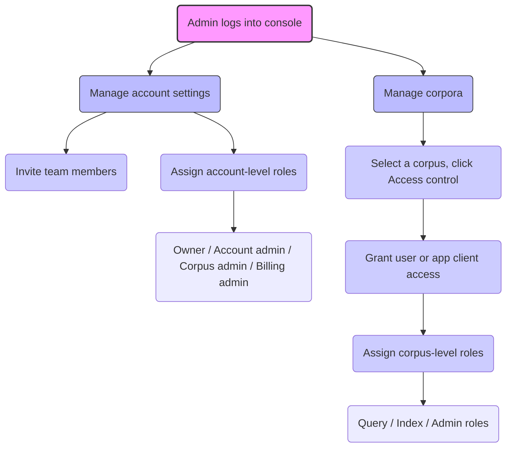

import CodePanel from '@site/src/theme/CodePanel';

This guide helps you configure account, billing, and corpus permissions in 
Vectara using Role-Based Access Control (RBAC). Assign precise account and 
corpus-level access for users and Client Apps.

RBAC defines what actions an authenticated entity (a user or app client 
verified by a JWT token) can perform through **permissions** (such as querying 
a corpus or managing users). Vectara groups permissions into **roles**, assigned 
through the Vectara Console. Admins can also set **default permissions** (such 
as default Query access) to simplify access to corpora.

## Configure account and billing permissions

Admins manage account-wide settings (users, API keys) and billing tasks using 
account-level roles, ideal for oversight without direct data access.

### Account-level roles
- **Owner**: Initial role granted to the account creator. Grants 
  full permissions including account deletion.
- **Account admin**: Manages all actions except billing (users, API keys, corpora).
- **Corpus admin**: Manages corpora across the account.
- **Billing admin**: Views and edits billing activity only. This role is 
  specialized for financial tasks.

### Assign account-level roles

1. Go to **Team** in the Vectara Console.
2. Click **Invite team member**.
3. Add a user by email, entering a description, and selecting **Account Admin**,
   **Corpus Admin**, or **Billing Admin**.  
4. Click **Send invitation**.
5. Go to **Authorization** to [manage API keys](/docs/deploy-and-scale/authentication/api-key-management) or [OAuth 2.0 app clients](/docs/deploy-and-scale/authentication/oauth-2).

**Use Case:** An owner assigns an Account Admin role to a team member to oversee 
corpora without billing access.

:::note
Account-level roles do not provide document-level access. Use corpus-level 
roles for data interactions.
:::

## Configure corpus permissions

Admins and Developers control access to specific corpora for querying, 
indexing, or administration, ensuring secure data interactions.

### Corpus-level roles

* **Query (QRY)**: Permits read-only searches. This is ideal for developers or 
  end users through Client Apps.
* **Indexing (IDX)**: Enables adding data and querying, used by developers indexing 
  content.
* **Administrator (ADM)**: Grants control (query, index, reset, delete, manage 
  permissions) for Admins managing a corpus.

### Assign corpus-level roles

1. Navigate to Corpora in the Vectara Console and select a corpus.
2. Click the **gear icon** in the top-right corner to open the Settings page.
3. Click the **Access control** tab.
4. Click **Grant user access**.
5. Select a user.
6. Select **Query**, **Index, Query** and **index**, or **Admin**.
7. Add a description for the user.
8. Click **Grant access**.

**Use Case:** A developer assigns Query permissions to a client app for read-only 
access to a customer support corpus.

:::note
Each corpus requires separate role assignments. There is no automatic 
cross-corpus access unless explicitly granted.
:::

## Best practices

* ✅ Use the **principle of least privilege**: assign only needed roles.
* ✅ Review role assignments when rotating keys or changing team structure
* ✅ Separate roles for production versus development corpora
* ❌ Do not give Admin roles to Client Apps unless essential

## Common issues and solutions

| **Symptom**                    | **Cause**                            | **Solution**                                 |
|--------------------------------|---------------------------------------|----------------------------------------------|
| 403 Forbidden (API key)        | Missing corpus role assignment        | Assign QRY or IDX—Admins check               |
| OAuth token returns empty data | App client lacks Query permission     | Assign QRY to app client—Developers note     |
| Index fails with QRY role      | Wrong role assigned                   | Switch to IDX or Admin—Developers adjust     |

In addition to role-based permissions, Vectara offers account-wide feature 
controls.

## Understand account features (beyond roles)

Account features, unlike roles, apply account-wide and are tied to your account 
tier, often configured by Admins:
1. Custom dimensions
2. Maximum corpora per query
3. Score retrieval. Whether or not downstream systems have access to the raw
   answer score. Advanced applications can utilize this information for
   thresholding, and for incorporation into downstream machine-learning systems.
4. Encoder swapping. Whether the indexing and querying encoders be swapped to
   support semantic similarity matching in addition to question-answer matching.
5. User rate limit. Whether per-user rate limits can be defined.
6. Corpus rate limit. Whether per-corpus rate limits can be defined.
7. Corpus encryption key. Whether every corpus uses a separate encryption key
   for maximum security. Currently this feature is enabled for all accounts and
   cannot be disabled.
8. Customer managed encryption key. Whether the account may use a customer
   managed master encryption key. This is an advanced feature that gives the
   customer total control over their data. By revoking access to the master
   key, the account will become inaccessible within minutes to the entire
   platform.
9. Document metadata. Specifies whether document level metadata may be stored
   while indexing. This is currently enabled for all accounts.
10. Document part metadata. Specifies whether part level metadata may be stored
   while indexing. This is currently enabled for all accounts.

## Example role assignments

| **Scenario**                      | **Assigned Role** | **Scope**        |
|-----------------------------------|-------------------|------------------|
| Frontend search app (read-only)   | QRY               | Specific corpus  |
| Backend service indexing data     | IDX               | Specific corpus  |
| Admin user managing all corpora   | Owner             | Account-wide     |
| OAuth client with query rights    | QRY               | One or more corpora |

## ✅ Quick Checklist: Configure RBAC in Vectara

Follow this checklist to set up secure, least-privilege access across accounts 
and corpora.

### 🔐 Account Permissions
- [ ] Invite team members via the **Team** page
- [ ] Assign **Owner**, **Account admin**, or **Billing admin** roles
- [ ] Avoid giving full account access unless required
- [ ] Use **OAuth 2.0 and MFA** for the most secure access

### 📂 Corpus Access
- [ ] Navigate to the **Corpus** page → **Access control**
- [ ] Assign roles:
  - [ ] **Query** – Read-only
  - [ ] **Index** – Write and query
  - [ ] **Admin** – Full access
- [ ] Scope access per corpus—**no cross-corpus by default**

### 🛡️ Best Practices
- [ ] Use the **least privilege principle**
- [ ] Use separate API keys per environment (dev/prod)
- [ ] Rotate keys regularly and monitor usage
- [ ] Re-audit access when staff or project roles change
