import {vars} from '@site/static/variables.json';
import CodePanel from '@site/src/theme/CodePanel';

This guide explains how to enable Single Sign-On (SSO) to the Vectara Platform 
using Okta via OpenID Connect (OIDC). At a high level, you provide your tenant 
domain, standard OIDC parameters from Okta, and a permissions mapping. Vectara 
will confirm the redirect (callback) URL(s) and implement the mapping on your 
behalf.

## Overview

The Okta OIDC integration involves two phases:

```mermaid
flowchart TB
    subgraph Setup["🔧 **One-time setup**"]
        S1[Admin creates<br/>OIDC app in Okta]
        S2[Share credentials<br/>with Vectara]
        S3[Receive<br/>callback URL]
        S4[Configure<br/>in Okta]
        S1 --> S2
        S2 --> S3
        S3 --> S4
    end
    
    Setup -.->|🔐 **Ready for SSO**| Login
    
    subgraph Login["🚀 **User login flow**"]
        L1[User visits<br/>Vectara platform]
        L2[Redirect to<br/>Okta SSO]
        L3[Authenticate<br/>with Okta]
        L4[Return with<br/>claims/groups]
        L5[Map to<br/>Vectara roles]
        L6[Access<br/>granted ✓]
        L1 --> L2
        L2 --> L3
        L3 --> L4
        L4 --> L5
        L5 --> L6
    end
    
    style Setup fill:#1a1a2e,stroke:#0066ff,stroke-width:3px,color:#fff
    style Login fill:#e3f2fd,stroke:#0066ff,stroke-width:3px,color:#000
    
    style S1 fill:#2d3748,stroke:#4a5568,stroke-width:2px,color:#e2e8f0
    style S2 fill:#2d3748,stroke:#4a5568,stroke-width:2px,color:#e2e8f0
    style S3 fill:#2d3748,stroke:#4a5568,stroke-width:2px,color:#e2e8f0
    style S4 fill:#2d3748,stroke:#4a5568,stroke-width:2px,color:#e2e8f0
    
    style L1 fill:#1e40af,stroke:#3b82f6,stroke-width:2px,color:#e0e7ff
    style L2 fill:#1e40af,stroke:#3b82f6,stroke-width:2px,color:#e0e7ff
    style L3 fill:#1e40af,stroke:#3b82f6,stroke-width:2px,color:#e0e7ff
    style L4 fill:#1e40af,stroke:#3b82f6,stroke-width:2px,color:#e0e7ff
    style L5 fill:#1e40af,stroke:#3b82f6,stroke-width:2px,color:#e0e7ff
    style L6 fill:#059669,stroke:#10b981,stroke-width:2px,color:#d1fae5
```



### Setup process (one-time)
1. **Create OIDC app** - Admin creates an OIDC Web application in Okta
2. **Share credentials** - Provide Client ID, Client Secret, and Issuer URL to Vectara
3. **Configure redirect** - Add Vectara's callback URL to your Okta app
4. **Map permissions** - Complete the permissions worksheet to map Okta groups/claims to Vectara roles

### User login process (runtime)
1. **Access platform** - User navigates to your Vectara tenant domain
2. **SSO redirect** - Automatically redirected to Okta for authentication
3. **Authenticate** - User enters credentials in Okta
4. **Token exchange** - Okta returns user identity with claims/groups
5. **Permission mapping** - Vectara maps the claims to tenant and corpus roles
6. **Platform access** - User is logged in with appropriate permissions

## Prerequisites

- An Okta organization with permissions to create an OIDC Web application.
- A secure channel to share the OIDC parameters and the completed 
  **Permissions mapping worksheet** with Vectara
- A chosen tenant domain name such as `vectara.company.com`. We use this domain in 
  the examples below.
- Your Okta OIDC app details (Client ID, Client Secret, Issuer/Discovery URL, 
  scopes/claims)
- Your intended permissions mapping (how Okta claims or groups map to Vectara 
  tenant and corpus permissions)

## What you provide to Vctara

You provide the following standard OIDC parameters from your Okta app:

| Parameter     | Example Value | Notes |
|---------------|---------------|-------|
| Client ID     | `0oa1abcdEFGH2I3JK4l6` | From your Okta OIDC app |
| Client Secret | `******` | Send through a secure channel |
| Issuer URL    | `https://your-org.okta.com/oauth2/default` | Or your custom Authorization Server issuer |
| Discovery URL (optional) | `https://your-org.okta.com/oauth2/default/.well-known/openid-configuration` | Helpful for endpoint discovery |
| Requested Scopes | `openid profile email groups` | At minimum `openid` is required |
| Provider ID suggestion | `okta` | Stable identifier used in the callback path |

If you intend to use group-based access, confirm the claim name (usually `groups`) and any filtering you apply in Okta.

---

## What Vctara provides to you

- Redirect/callback URI(s) for your tenant. These follow the Kratos OIDC callback 
  pattern under `/ory/` on your domain, typically:  
  `https://<your-domain>/ory/self-service/methods/oidc/callback/<provider-id>`
- Exact string(s) for your environment (and any post-logout URL, if applicable)
- Internal mapping implementation from your Okta claims to Vectara identity traits and permissions
  - You **do not** need to write or maintain any mapping code
  - **Network note:** Okta just needs the URL string registered as an allowed redirect in the app config


## Vectara permission model (overview)

- **Platform admin role**: Has admin access across the whole private deployment
- **Tenancy**: Each user belongs to a Vectara tenant (customer), identified by an unsigned 
  integer customer ID (e.g., `12345`).  
- **Tenant-level roles**:  
  - `admin` — full tenant administrative access 
  - `developer` — build and operate apps, manage corpora and integrations as permitted 
  by tenant policy 
- **Corpus-level roles**:  
  - `query` — perform search/retrieval 
  - `index` — ingest/update content and manage indexing 

Users can have either or both corpus roles on any number of corpora. If you 
already use different labels, list them in the worksheet and define their meaning.

---

## How your claims drive permissions

You can supply either (or both) of these sources in the ID Token:

1. **Groups claim** (recommended for group-centric RBAC)  
   - Provide `groups` (array of strings)  
   - Suggested pattern:  
     ```
     vectara:tenant:<TENANT_ID>:admin
     vectara:tenant:<TENANT_ID>:developer
     vectara:tenant:<TENANT_ID>:corpus:<CORPUS_KEY>:query
     vectara:tenant:<TENANT_ID>:corpus:<CORPUS_KEY>:index
     ```

2. **Custom claims** (explicit fields)  
   - `vectara_tenant_id` → unsigned integer (e.g., `12345`)  
   - `vectara_role` → string (`admin` | `developer`)  
   - Corpus roles (choose one format):  
     - **Enumerated entries**:  
       ```json
       { "corpus_key": "<CORPUS_KEY>", "role": "query" }
       { "corpus_key": "<CORPUS_KEY>", "role": "index" }
       ```
     - **Permissions list**:  
       ```json
       { "corpus_key": "<CORPUS_KEY>", "permissions": ["query", "index"] }
       ```

**Minimum useful claims:**  
- `sub` — stable user ID  
- `email` — preferred login/display identifier  
- One of: `groups` or custom claims above to drive permissions

## Permissions mapping worksheet (fill & return)

Provide this as a document or spreadsheet and send via your secure channel.

### A) Global
- Tenant ID (unsigned integer): `__________` (e.g., `12345`)  
- Provider ID (for callback path): `__________` (e.g., `okta`)  
- Claims source: `groups` | `custom` | `both`  

### B) Tenant-level role mapping
If using groups:  

| Okta group | Vectara tenant ID | Vectara role |
|------------|-------------------|--------------|
| vectara:tenant:12345:admin | 12345 | admin |
| vectara:tenant:12345:developer | 12345 | developer |

If using custom claims:  

| Claim | Example value | Meaning in Vectara |
|-------|---------------|---------------------|
| vectara_tenant_id | 12345 | Tenant ID |
| vectara_role | admin | Tenant role |

### C) Corpus-level role mapping
If using groups:  

| Okta group | Corpus key | Query? | Index? |
|------------|------------|--------|--------|
| vectara:tenant:12345:corpus:kb001:query | kb001 | ✅ | ☐ |
| vectara:tenant:12345:corpus:kb001:index | kb001 | ☐ | ✅ |

If using custom claims:  

**Enumerated entries example:**  
```json
{ "corpus_key": "kb001", "role": "query" }
{ "corpus_key": "kb001", "role": "index" }
```

**Permissions list example:**  
```json
{ "corpus_key": "kb001", "permissions": ["query", "index"] }
```

## Okta configuration steps

1. Create an OIDC Web application in Okta (Grant type: Authorization Code)  
2. Under **Sign-in redirect URIs**, paste the Vectara-provided URI(s):  
   ```
   https://vectara.company.com/ory/self-service/methods/oidc/callback/okta
   ```
3. (Optional) Add a Sign-out redirect URI if Vectara provides one  
4. Assign the app to the users/groups who should have access  
5. Copy the Client ID, Client Secret, and Issuer URL and send them to Vectara 
   (with the completed worksheet)

## Example values

- **Your domain:** `vectara.company.com`  
- **Vectara-provided redirect URI:**  
  ```
  https://vectara.company.com/ory/self-service/methods/oidc/callback/okta
  ```
- **Okta app details to share with Vectara:**  
  - Client ID: `0oa1abcdEFGH2I3JK4l6`  
  - Client Secret: `************************`  
  - Issuer URL: `https://acme.okta.com/oauth2/default`  
  - Scopes: `openid profile email groups`  
  - Provider ID: `okta`

## Support

Share your OIDC parameters plus the completed Permissions Mapping Worksheet, 
and Vectara will confirm the callback URL(s) and configure the mapping 
internally.
