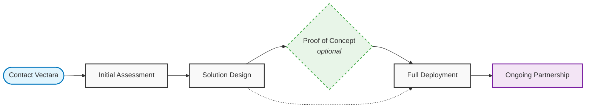

import CodePanel from '@site/src/theme/CodePanel';

Ready to explore how a private deployment of Vectara can transform your 
organization's AI capabilities while maintaining complete control over your 
data and infrastructure? [Contact us](https://www.vectara.com/contact-us) and book a demo.

## Deployment process overview

Deploying a private deployment of Vectara begins with understanding your 
unique requirements. Our enterprise sales and solutions engineering teams 
will work closely with you through a structured process:

### 1. Initial assessment

Our team will work with you to understand:

- **Use cases**: Your specific AI and search requirements
- **Performance needs**: Expected data volume, query load, and response time requirements
- **Infrastructure environment**: Current hardware, cloud, or hybrid setup
- **Security requirements**: Compliance needs, air-gap requirements, data sensitivity
- **Integration points**: Existing systems, authentication, monitoring tools

### 2. Solution design

Based on your assessment, we'll provide:

- **Architecture recommendations**: Optimal deployment design for your environment
- **Technical specifications**: Detailed hardware and software requirements
- **Implementation timeline**: Realistic project timeline and milestones
- **Resource planning**: Required personnel and skill sets for deployment
- **Integration strategy**: How Vectara will work with your existing systems

### 3. Proof of concept (optional)

For qualified organizations, we offer:

- **Limited scope deployment**: Test Vectara with a subset of your data
- **Performance validation**: Verify performance meets your requirements
- **Integration testing**: Validate compatibility with your systems
- **User acceptance testing**: Allow key stakeholders to evaluate the solution
- **ROI assessment**: Measure potential business impact

### 4. Full deployment

Once you're ready to proceed:

- **Professional installation**: Our team guides you through the deployment process
- **Configuration and setup**: Optimize settings for your specific requirements
- **Integration support**: Connect with your authentication, monitoring, and other systems
- **Testing and validation**: Comprehensive testing to ensure everything works correctly
- **Go-live support**: Assistance during the transition to production

### 5. Ongoing partnership

After deployment, we provide:

- **Regular updates**: Security patches and feature updates
- **Technical support**: Ongoing support for any issues or questions
- **Best practices guidance**: Optimization recommendations and usage patterns
- **Training**: Ensure your team can effectively manage and use the platform
