import CodePanel from '@site/src/theme/CodePanel';

Build your first RAG application with Vectara in 5 minutes. You'll upload a d
ocument, query it, and get AI-generated answers with citations.

Before you begin, you need: 
- A Vectara account ([sign up free](https://console.vectara.com/signup) - 30-day trial)
- An API key (created in step 1)

### What you will build

Follow this workflow to create your first RAG application:

```mermaid
flowchart LR
    A["🗂️ Create Corpus<br/><small>POST /v2/corpora</small>"] --> B["📄 Upload Document<br/><small>POST /documents</small>"]
    B --> C["🔍 Query Data<br/><small>POST /v2/query</small>"]
    C --> D["🤖 Get AI Answers<br/><small>with citations</small>"]

    style A fill:#6366f1,color:#ffffff,stroke:#4f46e5,stroke-width:2px
    style B fill:#0ea5e9,color:#ffffff,stroke:#0284c7,stroke-width:2px
    style C fill:#f59e0b,color:#ffffff,stroke:#d97706,stroke-width:2px
    style D fill:#8b5cf6,color:#ffffff,stroke:#7c3aed,stroke-width:2px
```



## Step 1: Get your API key

1. Log in to the [Vectara Console](https://console.vectara.com).
2. Navigate to **Authorization**, **API Keys**.
3. Copy your Personal API key.

**Set the API key as an environment variable:**

```bash
export VECTARA_API_KEY="your_api_key_here"
```

:::caution
Keep your API key secure. Don't commit it to version control or share it publicly.
:::

## Step 2: Create a corpus

A corpus is a container for your documents. Create one with a single API call:

<CodePanel
  snippets={[
    {
      language: 'bash',
      code: `curl -X POST https://api.vectara.io/v2/corpora \\
  -H "x-api-key: $VECTARA_API_KEY" \\
  -H "Content-Type: application/json" \\
  -d '{
    "key": "quickstart-corpus",
    "name": "Quickstart Corpus",
    "description": "My first corpus"
  }'`
    }
  ]}
  title="Create Corpus"
  annotations={{
    bash: [
      { line: 2, text: 'Uses your API key from Step 1' },
      { line: 5, text: 'Unique identifier for this corpus' }
    ]
  }}
  layout="stacked"
/>

**Expected response:**

<CodePanel
  snippets={[
    {
      language: 'json',
      code: `{
  "key": "quickstart-corpus",
  "name": "Quickstart Corpus",
  "description": "My first corpus",
  "enabled": true,
  "created_at": "2025-01-15T10:30:00Z"
}`
    }
  ]}
  title="Response"
  layout="stacked"
/>

You now have a corpus ready to store documents.

## Step 3: Upload a document

Upload your first document. We'll create a simple structured document:

<CodePanel
  snippets={[
    {
      language: 'bash',
      code: `curl -X POST https://api.vectara.io/v2/corpora/quickstart-corpus/documents \\
  -H "x-api-key: $VECTARA_API_KEY" \\
  -H "Content-Type: application/json" \\
  -d '{
    "type": "structured",
    "id": "doc-1",
    "title": "Vectara Overview",
    "sections": [
      {
        "text": "Vectara is an Agent Operating System for trusted enterprise AI. It provides RAG capabilities with built-in governance, grounded responses, and factual consistency enforcement."
      },
      {
        "text": "Vectara agents deliver answers with source citations, audit trails, and real-time policy enforcement. This enables teams to ship faster with lower risk."
      }
    ]
  }'`
    }
  ]}
  title="Upload Document"
  annotations={{
    bash: [
      { line: 5, text: 'Structured document format with sections' },
      { line: 6, text: 'Unique document identifier' },
      { line: 9, text: 'Document content to be indexed and searched' }
    ]
  }}
  layout="stacked"
/>

**Expected response:**

<CodePanel
  snippets={[
    {
      language: 'json',
      code: `{
  "id": "doc-1",
  "status": "indexed"
}`
    }
  ]}
  title="Response"
  layout="stacked"
/>

Your document is now indexed and searchable.

:::tip Upload files instead
You can also upload files directly (PDF, Word, PowerPoint, etc.) without structuring them:

```bash
curl -X POST https://api.vectara.io/v2/corpora/quickstart-corpus/upload \
  -H "x-api-key: $VECTARA_API_KEY" \
  -F "file=@document.pdf"
```

[Learn more about file uploads →](/docs/rest-api/upload-file)
:::

## Step 4: Query your data

Now query your document and get an AI-generated answer with citations:

<CodePanel
  snippets={[
    {
      language: 'bash',
      code: `curl -X POST https://api.vectara.io/v2/query \\
  -H "x-api-key: $VECTARA_API_KEY" \\
  -H "Content-Type: application/json" \\
  -d '{
    "query": "What is Vectara?",
    "search": {
      "corpora": [
        {
          "corpus_key": "quickstart-corpus"
        }
      ],
      "limit": 5
    },
    "generation": {
      "generation_preset_name": "mockingbird-2.0",
      "max_used_search_results": 5
    }
  }'`
    }
  ]}
  title="Query with RAG"
  annotations={{
    bash: [
      { line: 5, text: 'Your natural language question' },
      { line: 9, text: 'Which corpus to search' },
      { line: 15, text: 'Mockingbird 2.0 generates the answer' }
    ]
  }}
  layout="stacked"
/>

**Response:**

<CodePanel
  snippets={[
    {
      language: 'json',
      code: `{
  "summary": "Vectara is an Agent Operating System for trusted enterprise AI [1]. It provides RAG capabilities with built-in governance, grounded responses, and factual consistency enforcement [1]. Vectara agents deliver answers with source citations, audit trails, and real-time policy enforcement [2].",
  "search_results": [
    {
      "text": "Vectara is an Agent Operating System for trusted enterprise AI...",
      "score": 0.89,
      "document_id": "doc-1",
      "document_metadata": {
        "title": "Vectara Overview"
      }
    },
    {
      "text": "Vectara agents deliver answers with source citations...",
      "score": 0.82,
      "document_id": "doc-1"
    }
  ],
  "factual_consistency_score": 0.95
}`
    }
  ]}
  title="Response with Citations"
  annotations={{
    json: [
      { line: 2, text: 'AI-generated answer with citation numbers [1], [2]' },
      { line: 3, text: 'Source text snippets matched to citations' },
      { line: 18, text: 'Score indicating answer accuracy (0.0-1.0)' }
    ]
  }}
  layout="stacked"
/>

Notice:
- **Citations** (`[1]`, `[2]`) link answers to source documents
- **Search results** show the matched text snippets
- **Factual consistency score** (0.95) indicates high accuracy

**Done!** You just built a working RAG application in 4 API calls.

## What you just built

In less than 5 minutes, you:
1. Created a corpus to store documents
2. Indexed a document with searchable text
3. Queried your data with natural language
4. Got an AI-generated answer with citations

This is the foundation of every Vectara application, from simple Q&A to 
complex AI agents.

## Next steps

### Upload real documents

**Upload a PDF, Word doc, or text file:**

<CodePanel snippets={[{language: "bash", code: `curl -X POST https://api.vectara.io/v2/corpora/quickstart-corpus/upload \\
  -H "x-api-key: $VECTARA_API_KEY" \\
  -F "file=@my-document.pdf"`}]} title="Upload a file" layout="stacked" />

**Learn more:**
- [Supported file formats](/docs/build/data-ingestion#supported-file-formats)
- [Working with tables in PDFs](/docs/build/working-with-tables)
- [Add metadata for filtering](/docs/build/prepare-data/metadata-filters)

### Build with agents

Transform your RAG application into an intelligent agent:

<CodePanel snippets={[{language: "bash", code: `curl -X POST https://api.vectara.io/v2/agents \\
  -H "x-api-key: $VECTARA_API_KEY" \\
  -H "Content-Type: application/json" \\
  -d '{
    "name": "My First Agent",
    "description": "An agent that answers questions about my data",
    "instructions": "You are a helpful assistant. Answer questions based on the provided documents.",
    "tools": [
      {
        "type": "corpora_search",
        "corpus_key": "quickstart-corpus"
      }
    ]
  }'`}]} title="Create an agent" layout="stacked" />

**Learn more:**
- [Agent quickstart](/docs/agent-os/agents-quickstart)
- [Agent instructions](/docs/rest-api/instructions)
- [Agent tools](/docs/rest-api/tools)

---

### Improve search quality

**Add a reranker to improve relevance:**

<CodePanel snippets={[{language: "bash", code: `curl -X POST https://api.vectara.io/v2/query \\
  -H "x-api-key: $VECTARA_API_KEY" \\
  -H "Content-Type: application/json" \\
  -d '{
    "query": "What is Vectara?",
    "search": {
      "corpora": [{"corpus_key": "quickstart-corpus"}],
      "limit": 25,
      "reranker": {
        "type": "customer_reranker",
        "reranker_name": "Rerank_Multilingual_v1",
        "limit": 5
      }
    },
    "generation": {
      "generation_preset_name": "mockingbird-2.0"
    }
  }'`}]} title="Query with reranker" layout="stacked" />

**Learn more:**
- [Reranking strategies](/docs/search-and-retrieval/reranking)
- [Hybrid search](/docs/search-and-retrieval#hybrid-search)
- [Custom prompts](/docs/prompts/vectara-prompt-engine)

## Full example script

Copy this complete script to test everything at once:

<CodePanel snippets={[{language: "bash", code: `#!/bin/bash

# Set your API key
export VECTARA_API_KEY="your_api_key_here"

# Step 1: Create corpus
echo "Creating corpus..."
curl -X POST https://api.vectara.io/v2/corpora \\
  -H "x-api-key: $VECTARA_API_KEY" \\
  -H "Content-Type: application/json" \\
  -d '{
    "key": "quickstart-corpus",
    "name": "Quickstart Corpus",
    "description": "My first corpus"
  }'

echo -e "\\n"

# Step 2: Upload document
echo "Uploading document..."
curl -X POST https://api.vectara.io/v2/corpora/quickstart-corpus/documents \\
  -H "x-api-key: $VECTARA_API_KEY" \\
  -H "Content-Type: application/json" \\
  -d '{
    "type": "structured",
    "id": "doc-1",
    "title": "Vectara Overview",
    "sections": [
      {
        "text": "Vectara is an Agent Operating System for trusted enterprise AI. It provides \nRAG capabilities with built-in governance, grounded responses, and factual consistency enforcement."
      }
    ]
  }'

echo -e "\\n"

# Step 3: Query
echo "Querying data..."
curl -X POST https://api.vectara.io/v2/query \\
  -H "x-api-key: $VECTARA_API_KEY" \\
  -H "Content-Type: application/json" \\
  -d '{
    "query": "What is Vectara?",
    "search": {
      "corpora": [{"corpus_key": "quickstart-corpus"}],
      "limit": 5
    },
    "generation": {
      "generation_preset_name": "mockingbird-2.0",
      "max_used_search_results": 5
    }
  }'`}]} title="Complete quickstart script" layout="stacked" />

Save as `vectara-quickstart.sh`, make it executable with `chmod +x vectara-quickstart.sh`, and run it!

