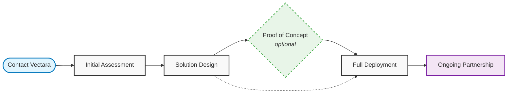

# Private Deployment Documentation Project Summary

## Project Overview

This session involved creating and refining comprehensive documentation for Vectara's Private Deployment offering, transforming it from internal-only documentation to appropriate public-facing content while maintaining security guidelines.

## Key Accomplishments

### 1. Documentation Structure Created
- **Private Deployment Overview** (`vectara-on-prem-overview.md`) - Main landing page
- **Use Cases & Industries** (`use-cases.md`) - Target industries and business scenarios
- **Deployment Options** (`deployment-options.md`) - Infrastructure flexibility and models
- **Evaluation Process** (`onprem-evaluation-process.md`) - Sales and implementation process
- **FAQ** (`faq.md`) - Comprehensive frequently asked questions

### 2. Docusaurus Integration
- Added Private Deployment section to main sidebar between "Getting Started" and "Data Management"
- Configured proper navigation structure in `sidebars.ts`
- Integrated with existing documentation architecture

### 3. Homepage Integration
- Added strategic private deployment mentions to `welcome.mdx`
- Created callout box highlighting private deployment options
- Included references in "Not sure where to start?" section

### 4. Terminology Evolution
- **Initial**: "On Premises" / "On Prem"
- **Final**: "Private Deployment" (better represents VPC, hybrid, and air-gapped deployments)
- Maintained URL structure for SEO considerations

### 5. Process Flow Visualization
- Created Mermaid diagram for evaluation process
- Iteratively refined based on feedback (simplified from complex to clean flow)
- Final version shows: Contact → Assessment → Design → PoC (optional) → Deployment → Partnership

### 6. Capitalization Standards
- Applied sentence case to all headings (H2, H3, H4)
- Updated all bold bullet list items to sentence case
- Consistent formatting across all documentation

## File Locations

### Documentation Files
```
/Users/paulwozniczka/Documents/GitHub/vectara-docs/www/docs/on-prem/
├── vectara-on-prem-overview.md
├── use-cases.md
├── deployment-options.md
├── onprem-evaluation-process.md
├── faq.md
└── SESSION_SUMMARY.md (this file)
```

### Configuration Files
```
/Users/paulwozniczka/Documents/GitHub/vectara-docs/www/
├── sidebars.ts (Private Deployment section added)
└── docs/welcome.mdx (private deployment mentions added)
```

## Navigation Structure

```
Private Deployment (main category)
├── Overview (landing page)
├── Use Cases
├── Deployment Options
├── Evaluation Process
└── FAQ
```

## Security Guidelines Followed

- **Public-facing only**: No sensitive technical details exposed
- **Sales-directed**: All detailed information requires enterprise sales contact
- **Compliance-aware**: References regulatory requirements without specifics
- **Internal separation**: Clear distinction between public and internal documentation

## Key Features Documented

### Deployment Models
- Traditional on-premises
- Private cloud (VPC) - AWS, Google Cloud, Azure
- Hybrid configurations
- Air-gapped environments

### Infrastructure Support
- Kubernetes environments (OpenShift, Tanzu, EKS, GKE, AKS)
- GPU acceleration support
- Storage flexibility
- Monitoring integration

### Target Industries
- Financial services
- Healthcare and life sciences
- Government and defense
- Regulated industries

## Mermaid Diagram (Final Version)



## Contact Information Standardized

- **Email**: enterprise@vectara.com
- **Phone**: 1-800-VECTARA
- **Web**: [vectara.com/contact-sales](https://vectara.com/contact-sales)

## Content Strategy

### What's Included
- Business value and benefits
- High-level technical capabilities
- Industry use cases and compliance frameworks
- Process overview and timelines
- Contact information for detailed discussions

### What's Excluded (Internal Only)
- Specific technical requirements
- Detailed architecture diagrams
- Pricing information
- Installation procedures
- Security implementation details

## Timeline References

- **Initial Contact to Deployment**: 30-90 days typical
- **Proof of Concept**: 1-2 weeks
- **Simple Deployments**: 2-4 weeks
- **Complex Deployments**: 8-12 weeks

## Quality Assurance Completed

- ✅ All headings use sentence case
- ✅ All bold bullet items use sentence case
- ✅ Consistent terminology throughout
- ✅ Proper Docusaurus formatting
- ✅ Working navigation structure
- ✅ Homepage integration complete
- ✅ Mermaid diagram renders correctly

## Future Maintenance Notes

1. **URL Structure**: Keep current URLs for SEO even if terminology evolves
2. **Content Updates**: Any detailed technical information should remain in internal documentation
3. **Sales Alignment**: Ensure content changes align with sales process and messaging
4. **Compliance**: Regular review to ensure ongoing compliance with security guidelines

## Related Documentation

- Internal requirements document: `/Users/paulwozniczka/Documents/cc/9-4-25/on-prem/vectara-on-prem-system-requirements-and-install.md`
- Guidelines document: `/Users/paulwozniczka/Documents/cc/9-4-25/on-prem/ON_PREM_DOC_INSTRUCTIONS.md`
- Product overview: `/Users/paulwozniczka/Documents/cc/9-4-25/on-prem/VECTARA_PRODUCT_OVERVIEW.md`

---

*This summary was created on [current date] to document the comprehensive private deployment documentation project. All files are checked into the Vectara documentation repository and live on the public documentation site.*