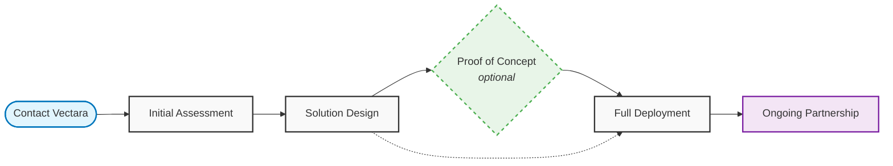

import CodePanel from '@site/src/theme/CodePanel';

Ready to explore how a private deployment of Vectara can transform your organization's AI capabilities while maintaining complete control over your data and infrastructure?

## Deployment process overview

Deploying a private deployment of Vectara begins with understanding your unique requirements. Our enterprise sales and solutions engineering teams will work closely with you through a structured process:

### 1. Initial assessment

Our team will work with you to understand:

- **Use cases**: Your specific AI and search requirements
- **Performance needs**: Expected data volume, query load, and response time requirements
- **Infrastructure environment**: Current hardware, cloud, or hybrid setup
- **Security requirements**: Compliance needs, air-gap requirements, data sensitivity
- **Integration points**: Existing systems, authentication, monitoring tools

### 2. Solution design

Based on your assessment, we'll provide:

- **Architecture recommendations**: Optimal deployment design for your environment
- **Technical specifications**: Detailed hardware and software requirements
- **Implementation timeline**: Realistic project timeline and milestones
- **Resource planning**: Required personnel and skill sets for deployment
- **Integration strategy**: How Vectara will work with your existing systems

### 3. Proof of concept (optional)

For qualified organizations, we offer:

- **Limited scope deployment**: Test Vectara with a subset of your data
- **Performance validation**: Verify performance meets your requirements
- **Integration testing**: Validate compatibility with your systems
- **User acceptance testing**: Allow key stakeholders to evaluate the solution
- **ROI assessment**: Measure potential business impact

### 4. Full deployment

Once you're ready to proceed:

- **Professional installation**: Our team guides you through the deployment process
- **Configuration and setup**: Optimize settings for your specific requirements
- **Integration support**: Connect with your authentication, monitoring, and other systems
- **Testing and validation**: Comprehensive testing to ensure everything works correctly
- **Go-live support**: Assistance during the transition to production

### 5. Ongoing partnership

After deployment, we provide:

- **Regular updates**: Security patches and feature updates
- **Technical support**: Ongoing support for any issues or questions
- **Best practices guidance**: Optimization recommendations and usage patterns
- **Training**: Ensure your team can effectively manage and use the platform

## Contact our enterprise team

**Get started:**
- **Email**: enterprise@vectara.com
- **Phone**: 1-800-VECTARA
- **Web**: [vectara.com/contact-sales](https://vectara.com/contact-sales)

### Information to have ready

When you contact our sales team, please have the following information ready to help us understand your needs:

**Business requirements:**
- Your industry and specific compliance requirements
- Primary use cases for AI and search capabilities
- Expected number of users and usage patterns
- Timeline for implementation and any critical deadlines

**Technical environment:**
- Current infrastructure setup (on premises, cloud, hybrid)
- Kubernetes or container platform preferences
- Estimated data volume to be indexed
- Expected query load and performance requirements
- Integration requirements with existing systems

**Organizational context:**
- Decision-making process and key stakeholders
- Budget considerations and procurement processes
- Internal technical resources and skill sets
- Any specific security or compliance constraints

## What happens next?

When you contact our sales team, here's what you can expect:

### Initial consultation (Week 1)
- **Discovery call**: 30-60 minute call to understand your requirements
- **Stakeholder identification**: Identify key technical and business stakeholders  
- **Use case validation**: Confirm private deployment is the right fit
- **Next steps planning**: Outline the evaluation and decision process

### Technical deep dive (Week 2-3)
- **Solution architecture session**: Detailed technical discussion with our solutions engineers
- **Requirements documentation**: Formal documentation of your technical and business requirements
- **Custom proposal**: Tailored proposal including architecture, pricing, and timeline
- **Reference customer connections**: Speak with similar organizations already using Vectara

### Decision and implementation (Week 4+)
- **Contract and procurement**: Work through your procurement and legal processes
- **Implementation planning**: Detailed project planning and resource allocation
- **Proof of concept setup** (if applicable): Limited scope deployment for validation
- **Full deployment**: Professional implementation with ongoing support

## Frequently asked questions

**Q: How long does the entire process typically take?**  
A: From initial contact to production deployment, the process typically takes 30-90 days, depending on your requirements, procurement processes, and technical complexity.

**Q: Do you provide training for our team?**  
A: Yes, we provide comprehensive training for both technical administrators and end users to ensure successful adoption of the platform.

**Q: What kind of ongoing support is included?**  
A: Our support includes regular updates, technical assistance, best practices guidance, and access to our customer success team.

**Q: Can we start with a small deployment and expand later?**  
A: Absolutely. Many organizations start with a specific use case or department and expand based on success and requirements.

## Ready to get started?

Don't let data sovereignty concerns prevent you from leveraging the power of AI. Contact our enterprise team today to learn how a private deployment of Vectara can provide cutting-edge AI capabilities while maintaining complete control over your data and infrastructure.

---

*A private deployment of Vectara is designed for organizations with specific infrastructure, security, or compliance requirements. Contact our enterprise sales team to determine if a private deployment is the right choice for your organization.*