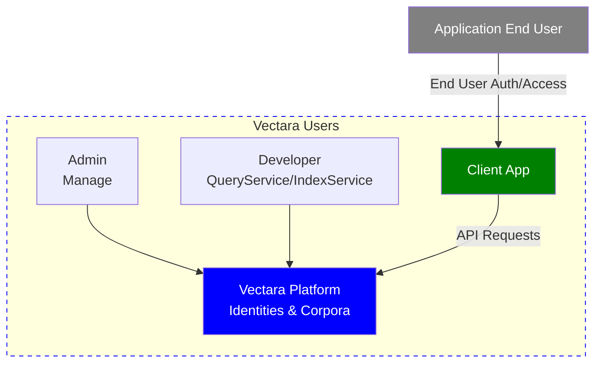

import Tabs from '@theme/Tabs';
import TabItem from '@theme/TabItem';
import {Config} from '@site/docs/definitions.md';
import vars from '@site/static/variables.json';
import { Grid } from "@site/src/components/ui/Grid";
import { Spacer } from "@site/src/components/ui/Spacer";
import { TopicButton } from "@site/src/components/ui/TopicButton";

import CodePanel from '@site/src/theme/CodePanel';

Vectara's authentication and authorization framework secures access to our
platform and its data. Whether you are an admin configuring corpora, a
developer integrating APIs, or an end user querying data through an
application, this section provides the tools and strategies to control access
and manage data effectively. From API keys for quick setups to OAuth 2.0 for
enterprise-grade security, and corpus-level permissions for precise data
control, Vectara balances usability with robust protection.

## Who uses Vectara?

Admins manage the platform, developers build and test integrations, and end
users access data through apps. This blueprint guides their needs:

*Admins and developers interact with Vectara directly, end users connect to
client apps.*

Review the following key topics, guiding you through Vectara access patterns
that we recommend for enterprises, concepts, and practical steps.

<Grid columns={3}>
  <TopicButton title="Enterprise Access Patterns" href="/docs/security/authorization/vectara-personas-and-access-patterns">
    <Spacer size="l" />
    Introduces Admins, Developer, and End User access patterns.
    <Spacer size="l" />
    Clarifies who needs what access, grounding your authentication and authorization strategy.
    <Spacer size="l" />
  </TopicButton>
  <TopicButton title="Authentication and Authorization Overview" href="/docs/security/authentication/overview">
    <Spacer size="l" />
    Outlines Vectara's authentication mechanisms (API keys, OAuth 2.0) and authorization models (RBAC, ABAC).
    <Spacer size="l" />
    Builds a technical foundation for understanding Vectara's security model.
  </TopicButton>
  <TopicButton title="Choose the Right Authentication Method" href="/docs/security/authentication/choose-auth-method">
    <Spacer size="l" />
    Compares API keys and OAuth 2.0 for different situations.
    <Spacer size="l" />
    Helps you select the best authentication method for your scenario.
    <Spacer size="l" />
  </TopicButton>
  <TopicButton title="Create and Use API Keys" href="/docs/security/authentication/api-key-management">
    <Spacer size="l" />
    Guides you through generating and using API keys (Personal, QueryService, IndexService).
    <Spacer size="l" />
    Enables fast, secure integration for common tasks.
    <Spacer size="l" />
  </TopicButton>
  <TopicButton title="Use OAuth 2.0" href="/docs/security/authentication/oauth">
    <Spacer size="l" />
    Explains setting up OAuth 2.0 for production-ready access.
    <Spacer size="l" />
    Provides scalable, secure auth with expiring tokens.
  </TopicButton>
  <TopicButton title="Set Up Account and Corpus Permissions (RBAC)" href="/docs/security/authorization/role-based-access-control">
    <Spacer size="l" />
    Details assigning Role-Based Access Control roles (QueryService, IndexService).
    <Spacer size="l" />
    Ensures precise permissions for users and apps.
    <Spacer size="l" />
  </TopicButton>
  <TopicButton title="Apply Metadata Filters for Attribute-Based Access Control" href="/docs/security/authorization/attribute-based-access-control">
    <Spacer size="l" />
    Shows how to use metadata filters for more granular access.
    <Spacer size="l" />
    Adds flexibility to control visibility within corpora.
    <Spacer size="l" />
  </TopicButton>
  <TopicButton title="Isolate Tenants with Corpora" href="/docs/security/authorization/multi-tenant-corpus-isolation">
    <Spacer size="l" />
    Explains dedicating corpora to tenants for secure, scalable multi-tenant applications.
    <Spacer size="l" />
    Simplifies access control and monitoring by isolating customer or team data.
    <Spacer size="l" />
  </TopicButton>
  <TopicButton title="Combine Access Control with Application Filters" href="/docs/security/authorization/combine-access-control-with-app-filters">
    <Spacer size="l" />
    Demonstrates layering ABAC with app-specific filters.
    <Spacer size="l" />
    Integrates security and functionality for real-world use.
    <Spacer size="l" />
  </TopicButton>
  <Spacer size="l" />
</Grid>

## Next steps

1. New to Vectara? Start with **[Enterprise Access Patterns](/docs/security/authorization/vectara-personas-and-access-patterns)** to
   identify your role.
2. Read **[Authentication and Authorization Overview](/docs/security/authentication/overview)** for the basics.
3. Read about how to **[Choose the Right Authentication Method](/docs/security/authentication/choose-auth-method)**.
4. Dive into practical guides like **[Create and Use API Keys](/docs/security/authentication/api-key-management)** or
   **[Use OAuth 2.0](/docs/security/authentication/oauth)** based on your implementation needs.
