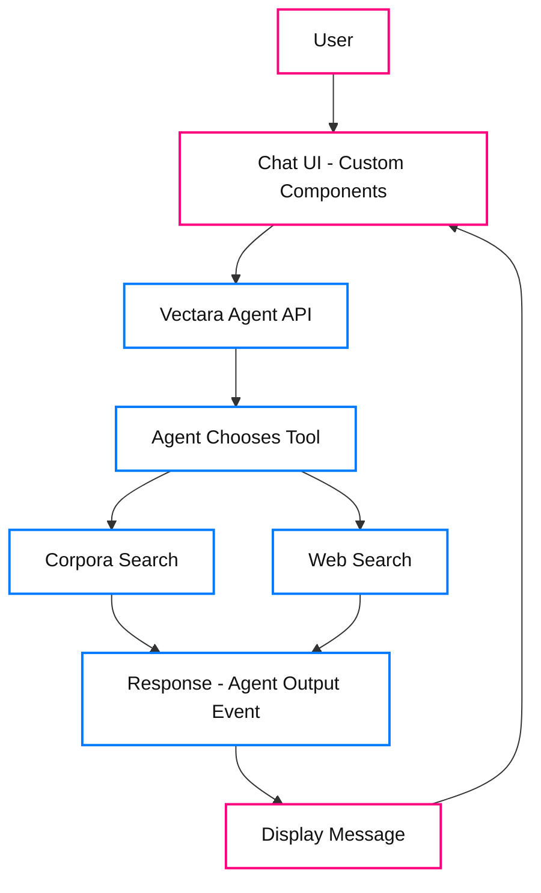

import CodePanel from '@site/src/theme/CodePanel';

Learn how to build a chatbot using our Agent APIs. In this tutorial, we 
create an onboarding assistant for a manufacturing use case. This chatbot 
answers employee questions from uploaded documents that contain 
safety protocols and equipment manuals. This example may provide 
inspiration for your specific use case.

## What you will build

A single-page web app with a clean chat interface, powered by React for the
frontend and Vectara's Agent APIs for the backend. The agent uses corpora 
and web search tools to provide beginner-friendly answers in Markdown format. 
The application has the following features:

The chatbot will look like this example:

## Prerequisites

Before starting this tutorial, ensure you have the following:

- Basic knowledge of React and TypeScript.
- **Vectara account**: [Sign up](https://console.vectara.com) and get an API key with
  query and indexing permissions, or use your Personal API key.
- Install the latest releases of Node.js and npm.

This tutorial includes complete instructions for creating a corpus with sample 
manufacturing data, so no existing data is required.

## Chatbot build overview

Follow this process to create the chatbot.

1. Set up your Vectara corpus.
2. Create an agent with search tools.
3. Create a new React project.
4. Install required dependencies.
5. Create the project structure and components.
6. Test your chatbot.

## Step 1. Set up your corpus with sample data

Create a corpus and populate it with sample manufacturing data. This example 
shows you how to create a corpus with the API.

### Create the corpus

<CodePanel
  title="Create corpus"
  snippets={[
    {
      language: 'bash',
      code: `curl -X POST "https://api.vectara.io/v2/corpora" \\
  -H "Authorization: Bearer YOUR_API_KEY" \\
  -H "Content-Type: application/json" \\
  -d '{
    "key": "acme_onboarding",
    "name": "ACME Manufacturing Onboarding",
    "description": "Employee onboarding documents for ACME Manufacturing"
  }'`
    }
  ]}
  layout="stacked"
  collapsible={false}
/>

### Add sample documents

Index sample documents to populate your corpus. Here are example documents you can add:

**Safety protocol document**

<CodePanel
  title="Index safety protocol document"
  snippets={[
    {
      language: 'bash',
      code: `curl -X POST "https://api.vectara.io/v2/corpora/acme_onboarding/documents" \\
  -H "Authorization: Bearer YOUR_API_KEY" \\
  -H "Content-Type: application/json" \\
  -d '{
    "id": "safety_protocol_001",
    "type": "core",
    "metadata": {
      "document_type": "safety_protocol",
      "equipment": "CNC_Machine_X",
      "safety_category": "operation"
    },
    "document_parts": [
      {
        "text": "CNC Machine X Safety Protocols\\n\\n1. Personal Protective Equipment (PPE):\\n- Safety \nglasses must be worn at all times\\n- Steel-toed boots are required in the machine shop\\n- Hearing \nprotection required when machine is operating\\n- No loose clothing or jewelry\\n\\n2. Machine \nOperation:\\n- Never operate the machine without proper training\\n- Always perform pre-operation \nsafety checks\\n- Emergency stop button is located on the front panel\\n- Keep work area clean and free \nof debris\\n\\n3. Maintenance:\\n- Only certified technicians may perform maintenance\\n- Machine must be \npowered off and locked out during maintenance\\n- Report any unusual sounds or vibrations immediately",
        "metadata": {
          "section": "safety"
        }
      }
    ]
  }'`
    }
  ]}
  layout="stacked"
  collapsible={false}
/>

**Equipment manual document**

<CodePanel
  title="Index equipment manual document"
  snippets={[
    {
      language: 'bash',
      code: `curl -X POST "https://api.vectara.io/v2/corpora/acme_onboarding/documents" \\
  -H "Authorization: Bearer YOUR_API_KEY" \\
  -H "Content-Type: application/json" \\
  -d '{
    "id": "equipment_manual_001",
    "type": "core",
    "metadata": {
      "document_type": "equipment_manual",
      "equipment": "CNC_Machine_X",
      "process": "machining"
    },
    "document_parts": [
      {
        "text": "CNC Machine X Operating Manual\\n\\nStartup Procedure:\\n1. Perform visual inspection of \nmachine\\n2. Check coolant levels\\n3. Verify all safety guards are in place\\n4. Power on the main control \npanel\\n5. Run homing sequence\\n6. Load program from control interface\\n\\nDaily Maintenance:\\n- Clean \nmachine bed and surrounding area\\n- Check and refill coolant as needed\\n- Inspect cutting tools \nfor wear\\n- Lubricate moving parts per schedule\\n\\nTroubleshooting:\\n- If machine fails to home: \nCheck limit switches\\n- If spindle won't start: Verify emergency stop is released\\n- For error \ncodes, consult technical manual section 7",
        "metadata": {
          "section": "operation"
        }
      }
    ]
  }'`
    }
  ]}
  layout="stacked"
  collapsible={false}
/>

**Onboarding guide document**

<CodePanel
  title="Index onboarding guide document"
  snippets={[
    {
      language: 'bash',
      code: `curl -X POST "https://api.vectara.io/v2/corpora/acme_onboarding/documents" \\
  -H "Authorization: Bearer YOUR_API_KEY" \\
  -H "Content-Type: application/json" \\
  -d '{
    "id": "onboarding_guide_001",
    "type": "core",
    "metadata": {
      "document_type": "onboarding_guide",
      "process": "general"
    },
    "document_parts": [
      {
        "text": "New Employee Onboarding Guide\\n\\nFirst Week Checklist:\\n1. Complete safety orientation \n(mandatory)\\n2. Receive and review employee handbook\\n3. Get ID badge and access credentials\\n4. Tour \nmanufacturing facility\\n5. Meet your supervisor and team\\n6. Review emergency procedures\\n\\nTraining \nRequirements:\\n- General safety training: 8 hours\\n- Equipment-specific training: 16 hours\\n- Quality \ncontrol procedures: 4 hours\\n- Emergency response: 2 hours\\n\\nImportant Contacts:\\n- Safety Officer: \next. 2100\\n- HR Department: ext. 2200\\n- Facilities: ext. 2300\\n- IT Support: ext. 2400",
        "metadata": {
          "section": "onboarding"
        }
      }
    ]
  }'`
    }
  ]}
  layout="stacked"
  collapsible={false}
/>

After adding these documents, your corpus will be ready for the agent to search.

## Step 2. Create an agent with multiple search tools

Before building the frontend, create an agent that will power your chatbot. This agent
will have access to both your corpus and web search as a backup for questions outside
your corpus. If you want, you can omit the web search tool and only use the 
corpora search.

<CodePanel
  title="Create agent with multiple tools"
  snippets={[
    {
      language: 'bash',
      code: `curl -X POST "https://api.vectara.io/v2/agents" \\
  -H "Authorization: Bearer YOUR_API_KEY" \\
  -H "Content-Type: application/json" \\
  -d '{
    "key": "factory-friend",
    "name": "Factory Friend",
    "description": "Manufacturing knowledge assistant for new employees",
    "tool_configurations": {
      "search_onboarding": {
        "type": "corpora_search",
        "description_template": "Search the ACME Manufacturing onboarding documents for company-specific \ninformation about safety protocols, equipment operation, and factory policies.",
        "query_configuration": {
          "search": {
            "corpora": [
              {
                "corpus_key": "acme_onboarding",
                "lexical_interpolation": 0.01
              }
            ],
            "limit": 10,
            "context_configuration": {
              "sentences_before": 2,
              "sentences_after": 2
            },
            "reranker": {
              "type": "customer_reranker",
              "reranker_id": "rnk_272725719"
            }
          }
        }
      },
      "web_search": {
        "type": "web_search",
        "description_template": "Search the web for general manufacturing information, industry standards, or topics not covered in the company documents. Use this when the corpus search does not have relevant information."
      }
    },
    "first_step": {
      "type": "conversational",
      "instructions": [
        {
          "type": "inline",
          "name": "Factory Assistant Instructions",
          "template": "You are Factory Friend, a helpful assistant for manufacturing employees at ACME Manufacturing.\\n\\nIMPORTANT - Tool Usage:\\n- ALWAYS try the search_onboarding tool FIRST for questions about ACME-specific safety protocols, equipment, procedures, and policies\\n- Only use web_search if the corpus search returns no relevant results or for general manufacturing questions not specific to ACME\\n- When using information from the corpus, ALWAYS cite the source\\n- When using web search results, indicate that the information is from external sources\\n\\nResponse Style:\\n- Be clear, concise, and beginner-friendly\\n- Use numbered lists when appropriate\\n- Prioritize safety information\\n- If you are unsure or the information is not available, say so clearly"
        }
      ],
      "output_parser": {
        "type": "default"
      }
    },
    "model": {
      "name": "gpt-4o",
      "parameters": {
        "temperature": 0.3,
        "max_tokens": 1000
      }
    }
  }'`
    }
  ]}
  layout="stacked"
  collapsible={false}
/>

This creates an agent with:
- **Corpora search tool**: Searches your `acme_onboarding` corpus for 
  company-specific information.
- **Web search tool**: Falls back to web search for general questions, or 
  when the corpus lacks information.
- **Smart instructions**: The agent knows to try internal documents first, 
  then web search as backup.
- **Conversational step**: Responds naturally to user input with proper 
  tool selection.

The agent chooses the appropriate tool automatically based on the 
question. For example:
- "What are the safety protocols for CNC Machine X?" - Uses corpus search
- "What is Six Sigma?" - May use web search if not in your corpus
- "How do I get my ID badge?" - Uses corpus search

Save the `agent_key` (in this example: `factory-friend`) for use in your 
application.

## Step 3. Create a new React project with Vite

<CodePanel
  title="Initialize React project"
  snippets={[
    {
      language: 'bash',
      code: `npm create vite@latest factory-friend -- --template react-ts
cd factory-friend
npm install`
    }
  ]}
  layout="stacked"
  collapsible={false}
/>

## Step 4. Install required dependencies

<CodePanel
  title="Install dependencies"
  snippets={[
    {
      language: 'bash',
      code: `npm install react-markdown uuid lucide-react remark-gfm
npm install -D @types/uuid`
    }
  ]}
  layout="stacked"
  collapsible={false}
/>

## Step 5. Create the project structure and components

Create the following directory structure:

<CodePanel
  title="Project structure"
  snippets={[
    {
      language: 'bash',
      code: `factory-friend/
├── src/
│   ├── components/
│   │   ├── ApiKeyForm.tsx
│   │   ├── ChatContainer.tsx
│   │   ├── ChatInput.tsx
│   │   ├── ChatMessage.tsx
│   ├── pages/
│   │   ├── Index.tsx
│   ├── services/
│   │   ├── vectaraApi.ts
│   ├── App.tsx
│   ├── main.tsx
│   ├── index.css`
    }
  ]}
  layout="stacked"
  collapsible={false}
/>

Now let's create each file with the proper implementation.

### Update global styles

Set up the base styles for the application, including the font family and
consistent spacing and button states across all components.

<CodePanel
  title="src/index.css"
  snippets={[
    {
      language: 'css',
      code: `@import url('https://fonts.googleapis.com/css2?family=Inter:wght@400;500;600;700&display=swap');

* {
  box-sizing: border-box;
  margin: 0;
  padding: 0;
}

body {
  font-family: Inter, system-ui, sans-serif;
  background-color: #f8f9fc;
}

button {
  cursor: pointer;
}

button:disabled {
  cursor: not-allowed;
  opacity: 0.7;
}`
    }
  ]}
  layout="stacked"
  collapsible={false}
/>

### Create the API service

This service manages communication with the Agent API, including session
creation, message sending, and error handling. It maintains session state across
multiple messages for conversation continuity.

<CodePanel
  title="src/services/vectaraApi.ts"
  snippets={[
    {
      language: 'typescript',
      code: `const BASE_URL = 'https://api.vectara.io/v2';
let currentSessionKey: string | null = null;

export const resetSession = () => {
  currentSessionKey = null;
};

export const sendAgentInput = async (
  message: string,
  apiKey: string,
  agentKey: string = 'factory-friend'
): Promise<string> => {
  try {
    // Create session if needed
    if (!currentSessionKey) {
      const sessionResponse = await fetch(\`\${BASE_URL}/agents/\${agentKey}/sessions\`, {
        method: 'POST',
        headers: {
          'Content-Type': 'application/json',
          'Authorization': \`Bearer \${apiKey}\`,
        },
        body: JSON.stringify({ name: \`Session \${Date.now()}\` })
      });

      if (!sessionResponse.ok) {
        throw new Error('Failed to create session');
      }

      const session = await sessionResponse.json();
      currentSessionKey = session.key;
    }

    // Send message
    const response = await fetch(
      \`\${BASE_URL}/agents/\${agentKey}/sessions/\${currentSessionKey}/events\`,
      {
        method: 'POST',
        headers: {
          'Content-Type': 'application/json',
          'Authorization': \`Bearer \${apiKey}\`,
        },
        body: JSON.stringify({
          type: 'input_message',
          messages: [{ type: 'text', content: message }],
          stream_response: false
        })
      }
    );

    if (!response.ok) {
      if (response.status === 404) {
        currentSessionKey = null;
        return sendAgentInput(message, apiKey, agentKey);
      }
      throw new Error('Failed to send message');
    }

    const data = await response.json();
    const outputEvent = data.events?.find((e: any) => e.type === 'agent_output');
    return outputEvent?.content || 'No response generated.';
  } catch (error) {
    console.error('Error:', error);
    return 'Sorry, I encountered an error. Please try again.';
  }
};`
    }
  ]}
  layout="stacked"
  collapsible={false}
/>

### Create message types and component

Define the message data structure and create a component that displays individual
chat messages.

<CodePanel
  title="src/components/ChatMessage.tsx"
  snippets={[
    {
      language: 'tsx',
      code: `import ReactMarkdown from "react-markdown";
import remarkGfm from "remark-gfm";

export type MessageRole = "user" | "assistant";

export interface Message {
  id: string;
  role: MessageRole;
  content: string;
  timestamp: Date;
}

interface ChatMessageProps {
  message: Message;
}

export function ChatMessage({ message }: ChatMessageProps) {
  const isUser = message.role === "user";

  return (
    

      

        

          <ReactMarkdown remarkPlugins={[remarkGfm]}>
            {message.content}
          </ReactMarkdown>
          

            {message.timestamp.toLocaleTimeString([], { hour: "2-digit", minute: "2-digit" })}
          

        

      

    

  );
}`
    }
  ]}
  layout="stacked"
  collapsible={false}
/>

### Create input component

Build a text input component with a send button that handles message submission,
input validation, and disabled states during API calls.

<CodePanel
  title="src/components/ChatInput.tsx"
  snippets={[
    {
      language: 'tsx',
      code: `import { useState, type FormEvent } from "react";
import { Send } from "lucide-react";

interface ChatInputProps {
  onSendMessage: (message: string) => void;
  disabled?: boolean;
}

export function ChatInput({ onSendMessage, disabled = false }: ChatInputProps) {
  const [message, setMessage] = useState("");

  const handleSubmit = (e: FormEvent) => {
    e.preventDefault();
    const trimmedMessage = message.trim();
    if (trimmedMessage && !disabled) {
      onSendMessage(trimmedMessage);
      setMessage("");
    }
  };

  return (
    

      <form onSubmit={handleSubmit} style={{
        display: 'flex',
        alignItems: 'center',
        gap: '12px',
        width: '100%'
      }}>
        <input
          placeholder="Ask a question about the factory..."
          value={message}
          onChange={(e) => setMessage(e.target.value)}
          disabled={disabled}
          style={{
            flex: 1,
            border: '1px solid #e2e8f0',
            borderRadius: '30px',
            padding: '25px',
            fontSize: '15px',
            outline: 'none',
            fontFamily: 'inherit'
          }}
        />
        <button
          type="submit"
          disabled={disabled || !message.trim()}
          style={{
            width: '40px',
            height: '40px',
            borderRadius: '50%',
            backgroundColor: disabled || !message.trim() ? '#ffb380' : '#ff9500',
            border: 'none',
            cursor: disabled || !message.trim() ? 'not-allowed' : 'pointer',
            display: 'flex',
            alignItems: 'center',
            justifyContent: 'center',
            flexShrink: 0
          }}
          aria-label="Send message"
        >
          <Send size={18} style={{ color: 'white' }} />
        </button>
      </form>
    

  );
}`
    }
  ]}
  layout="stacked"
  collapsible={false}
/>

### Create chat container

Assemble the main chat interface that manages message state, handles sending and
receiving messages through the API service, and orchestrates the header, message
list, and input components.

<CodePanel
  title="src/components/ChatContainer.tsx"
  snippets={[
    {
      language: 'tsx',
      code: `import { useState, useRef, useEffect } from "react";
import { v4 as uuidv4 } from "uuid";
import { ChatMessage, type Message } from "./ChatMessage";
import { ChatInput } from "./ChatInput";
import { sendAgentInput, resetSession } from "../services/vectaraApi";

export function ChatContainer({ apiKey }: { apiKey: string }) {
  const [messages, setMessages] = useState<Message[]>([
    {
      id: "welcome-message",
      role: "assistant",
      content: "👋 Hello! I'm your Factory Friend. Ask me any questions about safety procedures, equipment operation, or general factory policies.",
      timestamp: new Date(),
    },
  ]);
  const [isLoading, setIsLoading] = useState(false);
  const messagesEndRef = useRef<HTMLDivElement>(null);

  useEffect(() => {
    messagesEndRef.current?.scrollIntoView({ behavior: "smooth" });
  }, [messages]);

  useEffect(() => {
    return () => resetSession();
  }, []);

  async function handleSendMessage(content: string) {
    const userMessage: Message = {
      id: uuidv4(),
      role: "user",
      content,
      timestamp: new Date(),
    };

    setMessages((prev) => [...prev, userMessage]);
    setIsLoading(true);

    try {
      const response = await sendAgentInput(content, apiKey);

      const assistantMessage: Message = {
        id: uuidv4(),
        role: "assistant",
        content: response,
        timestamp: new Date(),
      };

      setMessages((prev) => [...prev, assistantMessage]);
    } catch (error) {
      console.error("Error getting response:", error);
      const errorMessage: Message = {
        id: uuidv4(),
        role: "assistant",
        content: "Sorry, I encountered an error. Please try again.",
        timestamp: new Date(),
      };
      setMessages((prev) => [...prev, errorMessage]);
    } finally {
      setIsLoading(false);
    }
  }

  return (
    <>
      {/* Header */}
      

        <h1 style={{
          color: 'white',
          fontSize: '28px',
          fontWeight: 'bold',
          marginBottom: '4px'
        }}>Factory Friend</h1>
        
Your manufacturing assistant

      

      {/* Messages */}
      

        {messages.map((message) => (
          <ChatMessage key={message.id} message={message} />
        ))}

        {isLoading && (
          

            

              Thinking...
            

          

        )}

        

      

      {/* Input */}
      <ChatInput onSendMessage={handleSendMessage} disabled={isLoading} />
    </>
  );
}`
    }
  ]}
  layout="stacked"
  collapsible={false}
/>

### Create API key form

Build a simple form component that prompts users to enter their Vectara API key
before accessing the chatbot. This handles input validation and submission.

<CodePanel
  title="src/components/ApiKeyForm.tsx"
  snippets={[
    {
      language: 'tsx',
      code: `import { useState } from "react";

interface ApiKeyFormProps {
  onApiKeySubmit: (apiKey: string) => void;
}

export function ApiKeyForm({ onApiKeySubmit }: ApiKeyFormProps) {
  const [apiKey, setApiKey] = useState("");

  const handleSubmit = (e: React.FormEvent) => {
    e.preventDefault();
    if (apiKey.trim()) {
      onApiKeySubmit(apiKey.trim());
    }
  };

  return (
    

      <h2 style={{ fontSize: '20px', fontWeight: 'bold', marginBottom: '16px' }}>
        Welcome to Factory Friend
      </h2>
      

        Enter your Vectara API key to connect to your agent.
      

      <form onSubmit={handleSubmit}>
        

          <label htmlFor="apiKey" style={{
            display: 'block',
            fontSize: '14px',
            fontWeight: 500,
            color: '#333',
            marginBottom: '4px'
          }}>
            Vectara API Key
          </label>
          <input
            id="apiKey"
            type="text"
            placeholder="Enter your API key..."
            value={apiKey}
            onChange={(e) => setApiKey(e.target.value)}
            style={{
              width: '100%',
              border: '1px solid #e2e8f0',
              borderRadius: '6px',
              padding: '12px',
              fontSize: '15px'
            }}
          />
        

        

          <button
            type="submit"
            disabled={!apiKey.trim()}
            style={{
              padding: '12px 24px',
              backgroundColor: !apiKey.trim() ? '#ccc' : '#3b5998',
              color: 'white',
              border: 'none',
              borderRadius: '6px',
              fontSize: '15px',
              cursor: !apiKey.trim() ? 'not-allowed' : 'pointer'
            }}
          >
            Connect
          </button>
        

      </form>
    

  );
}`
    }
  ]}
  layout="stacked"
  collapsible={false}
/>

### Create main page

Create the main application page that manages API key storage in `localStorage` 
and conditionally renders either the API key form or the chat interface.

<CodePanel
  title="src/pages/Index.tsx"
  snippets={[
    {
      language: 'tsx',
      code: `import { useState, useEffect } from "react";
import { ChatContainer } from "../components/ChatContainer";
import { ApiKeyForm } from "../components/ApiKeyForm";

const API_KEY_STORAGE_KEY = "vectara-api-key";

const Index = () => {
  const [apiKey, setApiKey] = useState<string | null>(null);
  const [isLoading, setIsLoading] = useState(true);

  useEffect(() => {
    const storedApiKey = localStorage.getItem(API_KEY_STORAGE_KEY);
    setApiKey(storedApiKey);
    setIsLoading(false);
  }, []);

  const handleApiKeySubmit = (newApiKey: string) => {
    if (newApiKey) {
      localStorage.setItem(API_KEY_STORAGE_KEY, newApiKey);
      setApiKey(newApiKey);
    }
  };

  if (isLoading) {
    return (
      

        
Loading...

      

    );
  }

  if (apiKey === null) {
    return (
      

        

          <h1 style={{ fontSize: '36px', fontWeight: 'bold', color: '#0f1b3a', marginBottom: '8px' }}>
            Factory Friend
          </h1>
          

            Manufacturing knowledge assistant for new employees
          

        

        <ApiKeyForm onApiKeySubmit={handleApiKeySubmit} />
      

    );
  }

  return (
    

      

        <ChatContainer apiKey={apiKey} />
      

    

  );
};

export default Index;`
    }
  ]}
  layout="stacked"
  collapsible={false}
/>

### Create App component

Define the root application component that renders the Index page.

<CodePanel
  title="src/App.tsx"
  snippets={[
    {
      language: 'tsx',
      code: `import Index from "./pages/Index";

const App = () => <Index />;

export default App;`
    }
  ]}
  layout="stacked"
  collapsible={false}
/>

### Update main entry point

Set up the React application entry point that mounts the App component to the DOM
with StrictMode enabled for development warnings.

<CodePanel
  title="src/main.tsx"
  snippets={[
    {
      language: 'tsx',
      code: `import { StrictMode } from 'react';
import { createRoot } from 'react-dom/client';
import App from './App';
import './index.css';

createRoot(document.getElementById('root')!).render(
  <StrictMode>
    <App />
  </StrictMode>
);`
    }
  ]}
  layout="stacked"
  collapsible={false}
/>

## Step 6. Run and test your chatbot

Start the development server:

<CodePanel
  title="Start development server"
  snippets={[
    {
      language: 'bash',
      code: `npm run dev`
    }
  ]}
  layout="stacked"
  collapsible={false}
/>

## Step 7. Test your chatbot

To verify your chatbot works:

1. Open the app in your browser (for example: `http://localhost:5173` after running 
   `npm run dev`).
2. Enter your Vectara API key when prompted.
3. Try these sample questions:
   **Questions that should use corpus search:**
   - "What are the safety protocols for operating CNC Machine X?"
   - "How do I maintain the equipment?"
   - "What is the onboarding process for new employees?"
   - "What PPE do I need in the machine shop?"
   **Questions that will probably use web search (data not in corpus):**
   - "What is Six Sigma methodology?"
   - "What are the latest ISO manufacturing standards?"
   - "Who invented the assembly line?"
4. Check that responses include Markdown formatting (numbered lists, citations).
5. Verify the agent correctly chooses which tool to use based on the question.
6. Test the conversation history - sessions maintain context across messages automatically.

You can upload your own data and test the agent responses, and use other 
[agent tools](/docs/agent-os/agent-tools).

---

## Move your chatbot to production

Production environments introduce new requirements for reliability, security,
scalability, compliance, and maintainability. After building and validating
your chatbot with the Vectara Agent API, take additional steps to prepare your
application for production use.

This section highlights key changes from the tutorial environment and provides
tips in a real-world environment. Here is a summary of the key changes:

* **API security:** Move secrets out of source code and implement secure storage
  and transmission for API keys.
* **Error handling & monitoring:** Add advanced error handling, logging, and
  real-time monitoring.
* **Scalability:** Optimize for concurrent usage, rate limits, and backend
  scaling.
* **Authentication and authorization:** Implement user authentication and RBAC.
* **Environment management:** Use environment variables and configuration files for deployment environments.
* **Compliance:** Address privacy, audit, and compliance requirements relevant to
  your organization, such as SOC2.
* **Testing and quality:** Add integration, unit, and load testing for critical
  workflows.
* **Deployment:** Automate build, test, and deployment processes.
* **Observability:** Instrument the app for metrics, tracing, and alerting.
* **Internal documentation:** Update onboarding, support, and maintenance documentation
  for internal teams.

### Secure API keys and configuration

Instead of manually inputting API key or storing in `localStorage`:
* Store API keys and secrets in a secure vault, such as AWS Secrets Manager,
  Azure Key Vault, or HashiCorp Vault.
* Never expose API keys to the client and browser.
* Route all API traffic through a backend to enable API key protection,
  rate limiting, and custom business logic such as query postprocessing.
* Use `.env` files and server-side environment variables for secrets and
  sensitive configuration.

### Error handling and logging

Instead of basic logs and inline error messages:
* Implement centralized logging.
* Send application errors and unhandled promise rejections to an observability
  service.
* Mask sensitive information in logs.

### User authentication and access control

Instead of opening the chatbot to all visitors:
* Integrate authentication, such as OAuth2, SAML, Auth0, Okta, Azure AD.
* Implement authorization rules for different user groups.
* Restrict access to chat or sensitive endpoints as appropriate.

### Environment-specific configuration

Instead of hardcoding the configuration in source files:
* Move all environment-dependent values (API endpoints, agent keys, feature
  flags) to environment variables or configuration management tools.
* Support separate configurations for development, staging, and production
  environments.

### Test for quality

Instead of manual browser tests:
* Add automated testing through unit tests, integration tests, and load/stress
  tests.
* Add a CI pipeline to enforce testing and code quality.

### CI/CD and automated deployments

Instead of manual `npm run dev` and local-only builds:
* Use a CI/CD tool to automate build, test, and deployment steps.
* Deploy to cloud infrastructure (Vercel, Netlify, AWS, Azure, GCP) or internal
  servers.
* Maintain separate environments for staging and production.

### Metrics and alerts

Instead of having no monitoring or alerting:
* Set up your backend and frontend for metrics (API response times, error
  rates, user activity).
* Use an APM solution for tracing and health checks.
* Set up alerts for failures and performance regressions.

### Compliance

* Document data retention policies and then enforce these policies.
* Implement audit logging for user interactions with sensitive data.
* Ensure you meet internal and external privacy and compliance standards.

### Documentation and support

* Create internal documentation for deployment, monitoring, and support
  processes.
* Provide user-facing help and troubleshooting guides.
