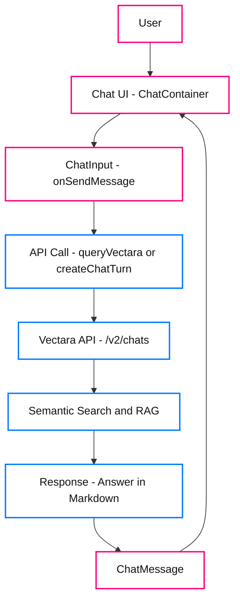

This tutorial guides you through creating a web-based chatbot application 
using Vectara’s `/v2/chats` API. In this example, a fictional manufacturing 
company has a corpus with onboarding data, answering employee questions 
grounded in factual content from uploaded documents. This data includes safety 
protocols and equipment manuals. This example may provide inspiration for 
your specific use case.

## What you will build

A single-page web app with a clean chat interface, powered by React for the 
frontend and Vectara’s Chat API for backend query processing. It provides 
beginner-friendly answers in Markdown format with numbered lists and clickable 
links. The application has the following features:

* **Accepts user input**: Users type questions in a text field.
* **Queries Vectara**: Sends questions to the `/v2/chats` API, using metadata 
  filters to target relevant documents.
* **Displays responses**: Shows answers in a chat format with numbered lists and Markdown 
  links (for example, [Source](https://support.acme.com)).
* **Maintains conversation**: Tracks chat sessions for follow-up questions.

After you complete the tutorial, the chatbot will look like this 
example:
  


## Prerequisites

Before starting this tutorial, ensure you have the following:

- Basic knowledge of React and TypeScript
- **Vectara account**: [Sign up](https://console.vectara.com) and get an API key with serving 
  permissions, or use your Personal API key.
- **Corpus**: Create a corpus like (`acme_onboarding`) and upload documents with 
  manufacturing information.  
  If you do not have this information available, use LLMs to generate data for 
  testing purposes. You can 
  also set metadata fields for each document like `safety_category`, `equipment`, 
  `process`, and `document_type`. 
- Install the latest releases of Node.js and npm

## Chatbot build overview


Follow this process to create the chatbot. 

1. Set up your Vectara corpus.
2. Create a new React project.
3. Install required dependencies.
4. Configure the Tailwind CSS file.
5. Create the project file structure.
6. Create the core chatbot files.
7. Create a basic CSS file to style the application.
8. Update the configuration and run the development server.
9. Test your chatbot.

## Step 1. Set Up Your Vectara Corpus

To use the chatbot, you need a Vectara corpus with relevant documents. Follow 
these steps:

1. Log in to the [Vectara Console](https://console.vectara.com).
2. Create a new corpus named `acme_onboarding`.
3. Upload documents (such as PDFs or text files) containing safety protocols 
   and equipment manuals.
4. Add metadata fields during upload or via the API, such as:
   ```json
   {
     "document_id": "cnc_manual_001",
     "equipment": "CNC_Machine_X",
     "document_type": "equipment_manual",
     "safety_category": "operation",
     "process": "machining"
   }

## Step 2. Create a new React project with Vite
 
```
npm create vite@latest factory-friend -- --template react-ts
cd factory-friend
npm install
```

## Step 3. Install required dependencies

```
npm install react-router-dom @tanstack/react-query react-markdown uuid lucide-react clsx tailwind-merge remark-gfm
npm install -D tailwindcss postcss autoprefixer
npx tailwindcss init -p
```
## Step 4. Configure Tailwind CSS

1. Create `tailwind.config.js`
    ```css
    /** @type {import('tailwindcss').Config} */
    module.exports = {
      content: ["./src/**/*.{js,jsx,ts,tsx}"],
      theme: {
        extend: {},
      },
      plugins: [],
    };
    ```
2. Update src/index.css to include Tailwind directives:
   ```css
   @tailwind base;
   @tailwind components;
   @tailwind utilities;

   @import url('https://fonts.googleapis.com/css2?family=Inter:wght@400;500;600;700&display=swap');

    :root {
      font-family: Inter, system-ui, sans-serif;
    }

    * {
      box-sizing: border-box;
      margin: 0;
      padding: 0;
    }

    body {
      background-color: #f3f4f6;
    }

    button {
      cursor: pointer;
    }

    button:disabled {
      cursor: not-allowed;
      opacity: 0.7;
    }
   ```

## Step 5. Create the file structure

Create the following files and directories:

```
factory-friend/
├── src/
│   ├── components/
│   │   ├── ApiKeyForm.tsx
│   │   ├── ChatContainer.tsx
│   │   ├── ChatInput.tsx
│   │   ├── ChatMessage.tsx
│   ├── lib/
│   │   ├── utils.ts
│   ├── pages/
│   │   ├── Index.tsx
│   │   ├── NotFound.tsx
│   ├── services/
│   │   ├── vectara/
│   │   │   ├── api.ts
│   │   │   ├── config.ts
│   │   │   ├── types.ts
│   │   │   ├── utils.ts
│   │   ├── vectaraApi.ts
│   ├── App.tsx
│   ├── main.tsx
```

## Step 6. Create the core files that you need for this chatbot

In this step, you create the essential files for the chatbot, including 
utilities, API services, React components, pages, and the main application. 
Let's go through each file with its purpose and code.

### Set up types and interfaces

`src/lib/utils.ts`

Contains helper functions, including the `cn` function that combines Tailwind 
CSS classes using the clsx and tailwind-merge libraries for handling 
conditional class application throughout the application.

```ts
export function cn(...classes: string[]) {
  return classes.filter(Boolean).join(' ');
}
```

### Configure interfaces

`src/services/vectara/types.ts`

Defines TypeScript interfaces for the Vectara API request (`VectaraRequestBody`), 
response (`VectaraResponse`), and configuration (`VectaraConfig`), ensuring type 
safety for API interactions.

```ts
export interface VectaraRequestBody {
  query: string;
  search: {
    corpora: Array<{
      corpus_key: string;
      metadata_filter?: string;
      lexical_interpolation?: number;
    }>;
    limit?: number;
    context_configuration?: {
      sentences_before: number;
      sentences_after: number;
      start_tag?: string;
      end_tag?: string;
    };
    reranker?: {
      type: string;
      reranker_id: string;
    };
  };
  generation?: {
    max_used_search_results?: number;
    response_language?: string;
    generation_preset_name?: string;
    model_parameters?: {
      llm_name?: string;
    };
    enable_factual_consistency_score?: boolean;
  };
  stream_response?: boolean;
  chat?: {
    store?: boolean;
  };
}

export interface VectaraResponse {
  chat_id?: string;
  turn_id?: string;
  answer: string;
  factual_consistency_score?: number;
  search_results?: {
    text: string;
    score: number;
    document_id?: string;
  }[];
}

export interface VectaraConfig {
  apiKey: string;
  corpusKey: string;
}
```

### Configure API settings

`src/services/vectara/config.ts`

Manages configuration settings for the Vectara API, including default values 
and chat session management. It provides functions to track the chat state as 
users interact with the application.

```ts
import { VectaraConfig } from './types';

// Default config values - replace with your own API key
export const DEFAULT_CONFIG: VectaraConfig = {
  apiKey: '', // Will be provided by user
  corpusKey: 'your_corpus_key'
};

// Store the current chat ID
let _currentChatId: string | null = null;

export const getCurrentChatId = (): string | null => {
  return _currentChatId;
};

export const setCurrentChatId = (chatId: string | null): void => {
  _currentChatId = chatId;
  console.log('Chat ID updated:', chatId);
};

export const resetChatSession = (): void => {
  _currentChatId = null;
  console.log('Chat session reset.');
};
```
### Create API utilities

`src/services/vectara/utils.ts`

Contains helper functions that enhance the Vectara API integration, including 
metadata filtering based on query content and consistent error handling to 
improve the user experience.

```ts
export const generateMetadataFilter = (question: string): string => {
  const lowerQuestion = question.toLowerCase();
  if (lowerQuestion.includes('machine') || lowerQuestion.includes('equipment')) {
    return "doc.equipment = 'CNC_Machine_X'";
  } else if (lowerQuestion.includes('safety') || lowerQuestion.includes('protection')) {
    return "doc.document_type = 'safety_protocol'";
  } else if (lowerQuestion.includes('onboarding') || lowerQuestion.includes('new employee')) {
    return "doc.document_type = 'onboarding_guide'";
  } else if (lowerQuestion.includes('machining')) {
    return "doc.process = 'machining'";
  }
  return '';
};

export const handleApiError = (error: Error): string => {
  console.error('Error querying Vectara:', error);
  if (error.message.includes('401')) {
    return '⚠️ Invalid API key. Please verify your Vectara API key and try again.';
  } else if (error.message.includes('429')) {
    return '⚠️ Rate limit exceeded. Please wait and try again later.';
  }
  return `⚠️ Error: ${error.message}`;
};
```
#### Customization options
* **Metadata filters**: Modify the `generateMetadataFilter` function in 
* `src/services/vectara/utils.ts` to match your corpus’s metadata fields. For 
* example, add filters for `document_type` or `process` to narrow searches:
  ```ts
  if (lowerQuestion.includes('onboarding')) {
    return "doc.document_type = 'onboarding_guide'";
  }
Use filters to improve response accuracy by targeting specific document 
subsets, especially in large corpora.

### Implement API communication

`src/services/vectara/api.ts`

Implements communication with Vectara’s `/v2/chats` and `/v2/chats/:chatId/turns` 
endpoints. The `queryVectara` function starts new chat sessions, while 
`createChatTurn` handles follow-up questions, with error handling and fallback 
logic for failed requests.

```ts
import { VectaraRequestBody, VectaraResponse } from './types';
import { DEFAULT_CONFIG, getCurrentChatId, setCurrentChatId } from './config';
import { generateMetadataFilter, handleApiError } from './utils';

export const queryVectara = async (
  question: string,
  apiKey: string = DEFAULT_CONFIG.apiKey,
  corpusKey: string = DEFAULT_CONFIG.corpusKey
): Promise<string> => {
  try {
    if (!apiKey) {
      return "⚠️ No API key configured. Please check the setup.";
    }

    const url = 'https://api.vectara.io/v2/chats';
    const metadataFilter = generateMetadataFilter(question);

    const body: VectaraRequestBody = {
      query: question,
      search: {
        corpora: [
          {
            corpus_key: corpusKey,
            ...(metadataFilter ? { metadata_filter: metadataFilter } : {}),
            lexical_interpolation: 0.01
          }
        ],
        limit: 10,
        context_configuration: {
          sentences_before: 2,
          sentences_after: 2,
          start_tag: "%START_SNIPPET%",
          end_tag: "%END_SNIPPET%"
        },
        reranker: {
          type: "customer_reranker",
          reranker_id: "rnk_272725719"
        }
      },
      generation: {
        generation_preset_name: "mockingbird-2.0",
        max_used_search_results: 5,
        response_language: "eng",
        model_parameters: {
          llm_name: "mockingbird-2.0"
        },
        enable_factual_consistency_score: true
      },
      stream_response: false,
      chat: {
        store: true
      }
    };
    
    const response = await fetch(url, {
      method: 'POST',
      headers: {
        'Content-Type': 'application/json',
        'Authorization': `Bearer ${apiKey}`,
        'Accept': 'application/json'
      },
      body: JSON.stringify(body)
    });

    if (!response.ok) {
      const errorText = await response.text();
      
      // Fallback with simpler request if needed
      if (response.status === 400) {
        const simpleBody = {
          query: question,
          search: { corpora: [{ corpus_key: corpusKey }] },
          stream_response: false,
          chat: { store: true }
        };
        
        const retryResponse = await fetch(url, {
          method: 'POST',
          headers: {
            'Content-Type': 'application/json',
            'Authorization': `Bearer ${apiKey}`,
            'Accept': 'application/json'
          },
          body: JSON.stringify(simpleBody)
        });
        
        if (!retryResponse.ok) {
          throw new Error(`API error: ${await retryResponse.text()}`);
        }
        
        const retryData: VectaraResponse = await retryResponse.json();
        
        if (retryData.chat_id) {
          setCurrentChatId(retryData.chat_id);
        }
        
        return retryData.answer || "No answer found.";
      }
      
      throw new Error(`API error: ${errorText}`);
    }

    const data: VectaraResponse = await response.json();
    
    if (data.chat_id) {
      setCurrentChatId(data.chat_id);
    }

    return data.answer || "No answer found.";
  } catch (error) {
    return handleApiError(error as Error);
  }
};

export const createChatTurn = async (
  question: string,
  apiKey: string = DEFAULT_CONFIG.apiKey,
  corpusKey: string = DEFAULT_CONFIG.corpusKey
): Promise<string> => {
  const chatId = getCurrentChatId();
  
  if (!chatId) {
    return queryVectara(question, apiKey, corpusKey);
  }

  try {
    const url = `https://api.vectara.io/v2/chats/${chatId}/turns`;
    const metadataFilter = generateMetadataFilter(question);

    const body = {
      query: question,
      search: {
        corpora: [
          {
            corpus_key: corpusKey,
            ...(metadataFilter ? { metadata_filter: metadataFilter } : {}),
            lexical_interpolation: 0.01
          }
        ],
        limit: 10,
        context_configuration: {
          sentences_before: 2,
          sentences_after: 2
        }
      },
      generation: {
        max_used_search_results: 5,
        response_language: "eng"
      },
      stream_response: false
    };
    
    const response = await fetch(url, {
      method: 'POST',
      headers: {
        'Content-Type': 'application/json',
        'Authorization': `Bearer ${apiKey}`,
        'Accept': 'application/json'
      },
      body: JSON.stringify(body)
    });

    if (!response.ok) {
      // Handle chat session expiry
      if (response.status === 404) {
        setCurrentChatId(null);
        return queryVectara(question, apiKey, corpusKey);
      }
      
      throw new Error(`API error: ${await response.text()}`);
    }

    const data: VectaraResponse = await response.json();
    return data.answer || "No answer found.";
  } catch (error) {
    return handleApiError(error as Error);
  }
};
```
### Create API facade

Provides a simplified interface to the Vectara services by re-exporting the 
necessary functions, making them easier to import and use elsewhere in the 
application.

`src/services/vectaraApi.ts`

```ts
export { queryVectara, createChatTurn } from './vectara/api';
export { resetChatSession, getCurrentChatId, setCurrentChatId } from './vectara/config';
```

### Build the message component 

`src/components/ChatMessage.tsx`

Defines how individual chat messages are displayed, handling both user and 
assistant messages with appropriate styling and Markdown formatting for rich 
text responses.

```tsx
import React from "react";
import ReactMarkdown from "react-markdown";
import remarkGfm from "remark-gfm";

export type MessageRole = "user" | "assistant" | "system";

export interface Message {
  id: string;
  role: MessageRole;
  content: string;
  timestamp: Date;
}

interface ChatMessageProps {
  message: Message;
}

export function ChatMessage({ message }: ChatMessageProps) {
  const isUser = message.role === "user";

  return (
    <div className={`flex w-full gap-3 p-4 ${isUser ? "justify-end" : "justify-start"}`}>
      <div
        className={`flex max-w-[80%] flex-col rounded-lg px-4 py-3 
          ${isUser 
            ? "bg-blue-600 text-white rounded-br-none" 
            : "bg-gray-100 text-gray-800 rounded-bl-none border border-gray-200"}`
        }
      >
        <ReactMarkdown
          className="whitespace-pre-wrap"
          remarkPlugins={[remarkGfm]}
          components={{
            a: ({ href, children }) => (
              <a
                href={href}
                className={isUser ? "text-blue-200 underline" : "text-blue-600 underline"}
                target="_blank"
                rel="noopener noreferrer"
              >
                {children}
              </a>
            ),
            ul: ({ children }) => <ul className="list-disc pl-5">{children}</ul>,
            ol: ({ children }) => <ol className="list-decimal pl-5">{children}</ol>,
          }}
        >
          {message.content}
        </ReactMarkdown>
        <div className={`mt-1 text-right text-xs ${isUser ? "text-blue-200" : "text-gray-500"}`}>
          {message.timestamp.toLocaleTimeString([], { hour: "2-digit", minute: "2-digit" })}
        </div>
      </div>
    </div>
  );
}
```

### Create the chat input component

`src/components/ChatInput.tsx`

Provides the chat input field where users type their questions, including 
form handling and submission to send queries to the Vectara API.

```ts
import React, { useState, FormEvent } from "react";

interface ChatInputProps {
  onSendMessage: (message: string) => void;
  disabled?: boolean;
}

export function ChatInput({ onSendMessage, disabled = false }: ChatInputProps) {
  const [message, setMessage] = useState("");

  const handleSubmit = (e: FormEvent) => {
    e.preventDefault();
    
    const trimmedMessage = message.trim();
    if (trimmedMessage && !disabled) {
      onSendMessage(trimmedMessage);
      setMessage("");
    }
  };

  return (
    <form
      onSubmit={handleSubmit}
      className="flex items-center gap-2 border-t border-gray-200 bg-white p-4 sticky bottom-0 w-full"
    >
      <input
        placeholder="Ask a question about the factory..."
        value={message}
        onChange={(e) => setMessage(e.target.value)}
        disabled={disabled}
        className="flex-1 border border-gray-300 rounded px-3 py-2"
      />
      <button 
        type="submit" 
        disabled={disabled || !message.trim()} 
        className="bg-orange-500 text-white px-4 py-2 rounded disabled:opacity-50"
      >
        Send
      </button>
    </form>
  );
}
```

### Build the chat container

`src/components/ChatContainer.tsx`

Integrates all chat components into a functioning conversation interface, 
managing the message state, API requests, and auto-scrolling as new messages 
appear.

```tsx
import React, { useState, useRef, useEffect } from "react";
import { v4 as uuidv4 } from "uuid";
import { ChatMessage, Message } from "./ChatMessage";
import { ChatInput } from "./ChatInput";
import { queryVectara, createChatTurn, resetChatSession } from "../services/vectaraApi";

export function ChatContainer({ apiKey }: { apiKey: string }) {
  const [messages, setMessages] = useState<Message[]>([
    {
      id: "welcome-message",
      role: "assistant",
      content: "👋 Hello! I'm your Factory Friend. Ask me any questions about safety procedures, equipment operation, or general factory policies.",
      timestamp: new Date(),
    },
  ]);
  const [isLoading, setIsLoading] = useState(false);
  const messagesEndRef = useRef<HTMLDivElement>(null);
  
  // Auto-scroll to bottom when messages update
  useEffect(() => {
    messagesEndRef.current?.scrollIntoView({ behavior: "smooth" });
  }, [messages]);

  // Reset chat session when component unmounts
  useEffect(() => {
    return () => {
      resetChatSession();
    };
  }, []);

  async function handleSendMessage(content: string) {
    // Add user message
    const userMessage: Message = {
      id: uuidv4(),
      role: "user",
      content,
      timestamp: new Date(),
    };
    
    setMessages((prev) => [...prev, userMessage]);
    setIsLoading(true);

    try {
      // Get response from Vectara API
      const corpusKey = 'your_corpus_key'; // Replace with your corpus key
      let response;
      
      // Use messages.length to determine if this is the first message or not
      if (messages.length === 1) { // Only welcome message, so this is first user query
        response = await queryVectara(content, apiKey, corpusKey);
      } else {
        response = await createChatTurn(content, apiKey, corpusKey);
      }
      
      // Add assistant response
      const assistantMessage: Message = {
        id: uuidv4(),
        role: "assistant",
        content: response,
        timestamp: new Date(),
      };
      
      setMessages((prev) => [...prev, assistantMessage]);
    } catch (error) {
      console.error("Error getting response:", error);
      // Show error message
      const errorMessage: Message = {
        id: uuidv4(),
        role: "assistant",
        content: "Sorry, I encountered an error. Please try again.",
        timestamp: new Date(),
      };
      setMessages((prev) => [...prev, errorMessage]);
    } finally {
      setIsLoading(false);
    }
  }

  return (
    <div className="flex flex-col h-[500px] bg-white rounded-lg shadow-md border border-gray-200">
      <div className="p-4 bg-blue-600 text-white rounded-t-lg">
        <h2 className="text-xl font-bold">Factory Friend</h2>
        <p className="text-sm text-blue-100">Your manufacturing assistant</p>
      </div>
      
      <div className="flex-1 overflow-y-auto p-2">
        {messages.map((message) => (
          <ChatMessage key={message.id} message={message} />
        ))}
        
        {isLoading && (
          <div className="flex items-center p-4">
            <div className="bg-gray-100 rounded-lg p-3">
              <div className="flex items-center gap-2">
                <div className="h-2 w-2 bg-blue-600 rounded-full animate-pulse"></div>
                <div className="h-2 w-2 bg-blue-600 rounded-full animate-pulse delay-150"></div>
                <div className="h-2 w-2 bg-blue-600 rounded-full animate-pulse delay-300"></div>
                <span className="text-sm text-gray-500 ml-1">Thinking...</span>
              </div>
            </div>
          </div>
        )}
        
        <div ref={messagesEndRef} />
      </div>
      
      <ChatInput onSendMessage={handleSendMessage} disabled={isLoading} />
    </div>
  );
}
```
### Implement the API key form

`src/components/ApiKeyForm.tsx`

Creates a form for users to input their Vectara API key, storing it in 
localStorage for persistence across sessions.

```tsx
import React, { useState } from "react";

interface ApiKeyFormProps {
  onApiKeySubmit: (apiKey: string) => void;
}

export function ApiKeyForm({ onApiKeySubmit }: ApiKeyFormProps) {
  const [apiKey, setApiKey] = useState("");

  const handleSubmit = (e: React.FormEvent) => {
    e.preventDefault();
    
    if (apiKey.trim()) {
      onApiKeySubmit(apiKey.trim());
    }
  };

  return (
    <div className="w-full max-w-md mx-auto bg-white p-6 rounded-lg shadow-md">
      <h2 className="text-xl font-bold mb-4">Welcome to Factory Friend</h2>
      <p className="text-gray-600 mb-4">
        Enter your Vectara API key to connect to your knowledge base.
      </p>
      
      <form onSubmit={handleSubmit}>
        <div className="mb-4">
          <label htmlFor="apiKey" className="block text-sm font-medium text-gray-700 mb-1">
            Vectara API Key
          </label>
          <input
            id="apiKey"
            type="text"
            placeholder="Enter your API key..."
            value={apiKey}
            onChange={(e) => setApiKey(e.target.value)}
            className="w-full border border-gray-300 rounded px-3 py-2"
          />
        </div>
        
        <div className="flex justify-end">
          <button
            type="submit"
            className="px-4 py-2 bg-blue-600 text-white rounded"
            disabled={!apiKey.trim()}
          >
            Connect
          </button>
        </div>
      </form>
    </div>
  );
}
```
### Create the main page

`src/pages/Index.tsx`

Serves as the main page, conditionally rendering the API key form or chat 
container based on the stored API key, and managing key persistence in 
localStorage.

```tsx
import React, { useState, useEffect } from "react";
import { ChatContainer } from "../components/ChatContainer";
import { ApiKeyForm } from "../components/ApiKeyForm";

// Storage key for the API key
const API_KEY_STORAGE_KEY = "vectara-api-key";

const Index = () => {
  const [apiKey, setApiKey] = useState<string | null>(null);
  const [isLoading, setIsLoading] = useState(true);

  // Check for stored API key on mount
  useEffect(() => {
    const storedApiKey = localStorage.getItem(API_KEY_STORAGE_KEY);
    setApiKey(storedApiKey);
    setIsLoading(false);
  }, []);

  const handleApiKeySubmit = (newApiKey: string) => {
    if (newApiKey) {
      localStorage.setItem(API_KEY_STORAGE_KEY, newApiKey);
      alert("API Key Saved");
      setApiKey(newApiKey);
    }
  };

  const resetApiKey = () => {
    localStorage.removeItem(API_KEY_STORAGE_KEY);
    setApiKey(null);
    alert("API Key Removed");
  };

  if (isLoading) {
    return <div className="text-center p-8">Loading...</div>;
  }

  return (
    <div className="min-h-screen bg-gray-100 p-4">
      <div className="max-w-3xl mx-auto space-y-6">
        <header className="text-center mb-6">
          <h1 className="text-3xl font-bold text-blue-600">Factory Friend</h1>
          <p className="text-lg text-gray-600 mt-2">
            Manufacturing knowledge assistant for new employees
          </p>
        </header>

        {apiKey === null ? (
          <ApiKeyForm onApiKeySubmit={handleApiKeySubmit} />
        ) : (
          <div className="space-y-4">
            <ChatContainer apiKey={apiKey} />
            
            <div className="text-center">
              <button
                onClick={resetApiKey}
                className="text-sm text-gray-500 hover:text-blue-600 underline"
              >
                Reset API Key
              </button>
            </div>
          </div>
        )}

        <footer className="mt-8 text-center text-sm text-gray-500">
          <p>
            © {new Date().getFullYear()} Factory Friend - An AI assistant for
            manufacturing staff
          </p>
        </footer>
      </div>
    </div>
  );
}

export default Index;
```
### Create a 404 page

`src/pages/NotFound.tsx`

Displays a 404 error page for invalid routes, with a link to return to the home 
page.

```tsx
import React from "react";
import { Link } from "react-router-dom";

const NotFound = () => {
  return (
    <div className="min-h-screen flex items-center justify-center bg-gray-100">
      <div className="text-center">
        <h1 className="text-4xl font-bold text-red-500 mb-4">404</h1>
        <h2 className="text-2xl font-medium mb-6">Page Not Found</h2>
        <p className="text-gray-600 mb-8">
          The page you're looking for doesn't exist.
        </p>
        <Link 
          to="/" 
          className="px-4 py-2 bg-blue-600 text-white rounded hover:bg-blue-700"
        >
          Return to Home
        </Link>
      </div>
    </div>
  );
};

export default NotFound;
```
### Create the main application

`src/App.tsx`

Sets up the application routing and global providers, integrating all 
components into a complete application structure.

```tsx
import React from "react";
import { BrowserRouter, Routes, Route } from "react-router-dom";
import Index from "./pages/Index";
import NotFound from "./pages/NotFound";

const App = () => (
  <BrowserRouter>
    <Routes>
      <Route path="/" element={<Index />} />
      <Route path="*" element={<NotFound />} />
    </Routes>
  </BrowserRouter>
);

export default App;
```

### Initialize the application

`src/main.tsx`

Bootstraps the React application, mounting it to the DOM and enabling it to 
run in the browser.

```tsx
import React from 'react';
import ReactDOM from 'react-dom/client';
import App from './App';
import './index.css';

ReactDOM.createRoot(document.getElementById('root')!).render(
  <React.StrictMode>
    <App />
  </React.StrictMode>
);
```

## Step 7. Create a basic CSS file to style the application

`src/index.css`

Provides global styles for the application, including Tailwind CSS utility 
classes and custom variables for consistent theming.

```css
@tailwind base;
@tailwind components;
@tailwind utilities;

@import url('https://fonts.googleapis.com/css2?family=Inter:wght@400;500;600;700&display=swap');

:root {
  font-family: Inter, system-ui, sans-serif;
}

* {
  box-sizing: border-box;
  margin: 0;
  padding: 0;
}

body {
  background-color: #f3f4f6;
}

button {
  cursor: pointer;
}

button:disabled {
  cursor: not-allowed;
  opacity: 0.7;
}
```
## Step 8. Update the configuration and run the development server

1. Open `src/services/vectara/config.ts` and replace the placeholder `corpus_key` with 
   your actual corpus key, such as `acme_onboarding`:
    ```ts
      export const DEFAULT_CONFIG: VectaraConfig = {
        apiKey: '', // Will be provided by user through the UI
        corpusKey: 'your_corpus_key' // Replace with your actual corpus key
      };  
    ```
2. Update the corpus key in `src/components/ChatContainer.tsx`:  
    `const corpusKey = 'your_corpus_key'; // Replace with your corpus key`
3. Run the development server:
    `npm run dev`

## Step 9. Test Your Chatbot

To verify your chatbot works:

1. Open the app in your browser (`http://localhost:5173` after running `npm run dev`).
2. Enter your Vectara API key in the form.
3. Try these sample questions (or similar questions, based on your uploaded 
   data) aligned with the `acme_onboarding` corpus:
   - "What are the safety protocols for operating CNC Machine X?"
   - "How do I maintain the equipment?"
   - "What is the onboarding process for new employees?"
4. Check that responses include Markdown formatting (numbered lists, links like `[Source](https://support.acme.com)`). Example response:

### Additional customization options

Consider these updates after completing the tutorial:

* **Metadata filters**: Modify the `generateMetadataFilter` function to match 
  your corpus structure.
* **UI styling**: Update the CSS classes to match your company's branding.
* **Welcome message**: Customize the initial greeting in `ChatContainer.tsx`.
* **Error handling**: Enhance the error messages and fallback strategies.


## Move your chatbot to production

Production environments introduce new requirements for reliability, security, 
scalability, compliance, and maintainability. After building and validating 
your chatbot with the Vectara Chat API, take additional steps to prepare your 
application for production use. 

This section highlights key changes from the tutorial environment and provides 
tips in a real-world environment. Here is a summary of the key changes:

* **API security:** Move secrets out of source code and implement secure storage 
  and transmission for API keys.
* **Error handling & monitoring:** Add advanced error handling, logging, and 
  real-time monitoring.
* **Scalability:** Optimize for concurrent usage, rate limits, and backend 
  scaling.
* **Authentication and authorization:** Implement user authentication and RBAC.
* **Environment management:** Use environment variables and configuration files for deployment environments.
* **Compliance:** Address privacy, audit, and compliance requirements relevant to 
  your organization, such as SOC2.
* **Testing and quality:** Add integration, unit, and load testing for critical 
  workflows.
* **Deployment:** Automate build, test, and deployment processes.
* **Observability:** Instrument the app for metrics, tracing, and alerting.
* **Internal documentation:** Update onboarding, support, and maintenance documentation 
  for internal teams.


### Secure API keys and configuration

Instead of manually inputting API key or storing in `localStorage`:
* Store API keys and secrets in a secure vault, such as AWS Secrets Manager, 
  Azure Key Vault, or HashiCorp Vault. 
* Never expose API keys to the client and browser.
* Route all API traffic through a backend to enable API key protection, 
  rate limiting, and custom business logic such as query postprocessing.
* Use `.env` files and server-side environment variables for secrets and 
  sensitive configuration.

### Error handling and logging

Instead of basic logs and inline error messages:
* Implement centralized logging.
* Send application errors and unhandled promise rejections to an observability 
  service.
* Mask sensitive information in logs.

### User authentication and access control

Instead of opening the chatbot to all visitors:
* Integrate authentication, such as OAuth2, SAML, Auth0, Okta, Azure AD.
* Implement authorization rules for different user groups.
* Restrict access to chat or sensitive endpoints as appropriate.

### Environment-specific configuration

Instead of hardcoding the configuration in source files:
* Move all environment-dependent values (API endpoints, corpus keys, feature 
  flags) to environment variables or configuration management tools.
* Support separate configurations for development, staging, and production 
  environments.

#### Test for quality

Instead of manual browser tests:
* Add automated testing through unit tests, integration tests, and load/stress 
  tests.
* Add a CI pipeline to enforce testing and code quality.


### CI/CD and automated deployments

Instead of manual `npm run dev` and local-only builds:
* Use a CI/CD tool to automate build, test, and deployment steps.
* Deploy to cloud infrastructure (Vercel, Netlify, AWS, Azure, GCP) or internal 
  servers.
* Maintain separate environments for staging and production.

### Metrics and alerts

Instead of having no monitoring or alerting:
* Set up your backend and frontend for metrics (API response times, error 
  rates, user activity).
* Use an APM solution for tracing and health checks.
* Set up alerts for failures and performance regressions.

### Compliance

* Document data retention policies and then enforce these policies.
* Implement audit logging for user interactions with sensitive data.
* Ensure you meet internal and external privacy and compliance standards.

### Documentation and support

* Create internal documentation for deployment, monitoring, and support 
  processes.
* Provide user-facing help and troubleshooting guides.
